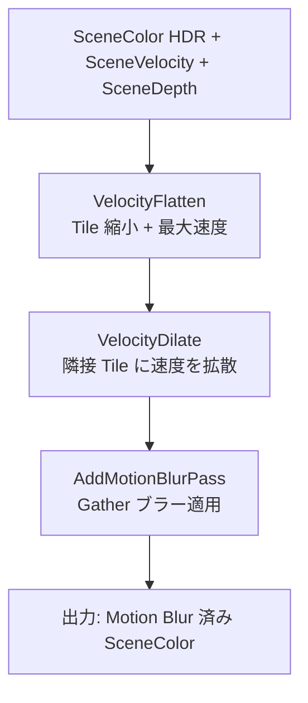

# Motion Blur GPU シェーダー詳細

- グループ: f - Motion Blur
- 上位: [[01_postprocess_gpu_overview]]
- 関連: [[detail_taa]]
- ソース: `Engine/Source/Runtime/Renderer/Private/PostProcess/PostProcessMotionBlur.h/.cpp`

## 概要

カメラ・オブジェクトの移動を **ベロシティバッファ** から読み取り、  
Tile 単位で最大速度を拡散させた後に **Scatter-as-Gather** でブラーを適用する。

| フェーズ | 処理 |
|----------|------|
| Velocity Flatten | SceneVelocity を Tile サイズに縮小し、Tile 内最大速度を計算 |
| Velocity Dilate | 隣接 Tile の速度を拡散（動体境界を正確にブラー） |
| Motion Blur | 速度方向に沿ってシーンカラーをサンプリング（Gather） |

---

## 処理フロー



---

## `FVelocityFlattenTextures`

```cpp
struct FVelocityFlattenTextures
{
    // Tile ごとの最大ベロシティ（Flatten パス出力）
    FScreenPassTexture VelocityFlatten;

    // Dilate 済みベロシティ Tile 配列
    FScreenPassTexture VelocityTileArray;
};
```

| テクスチャ | 説明 |
|------------|------|
| `VelocityFlatten` | Tile 内最大ベロシティを格納した縮小テクスチャ |
| `VelocityTileArray` | Dilate 後の Tile ベロシティ（Motion Blur Gather で参照） |

---

## `FMotionBlurInputs`

```cpp
struct FMotionBlurInputs
{
    // 必須入力
    FScreenPassTexture SceneColor;         // HDR シーンカラー
    FScreenPassTexture SceneDepth;         // シーン深度
    FScreenPassTexture SceneVelocity;      // ベロシティバッファ
    FVelocityFlattenTextures VelocityFlattenTextures; // Tile ベロシティ

    // オプション
    FRDGTextureRef LensDistortionLUT;      // レンズ歪み補正 LUT
    EMotionBlurQuality Quality;            // ブラー品質
    EMotionBlurFilter Filter;             // フィルタ方式
    float VelocityScale;                  // ベロシティスケール（デバッグ）
};
```

| 変数名 | 必須 | 説明 |
|--------|------|------|
| `SceneColor` | ✅ | HDR シーンカラー |
| `SceneDepth` | ✅ | シーン深度（前景/後景分離） |
| `SceneVelocity` | ✅ | ピクセル単位ベロシティ |
| `VelocityFlattenTextures` | ✅ | Tile 縮小ベロシティ |
| `LensDistortionLUT` | ― | レンズ歪み補正（オプション） |
| `Quality` | ✅ | `EMotionBlurQuality` |
| `Filter` | ✅ | `EMotionBlurFilter` |

---

## `FMotionBlurOutputs`

```cpp
struct FMotionBlurOutputs
{
    FScreenPassTexture MotionBlurColor; // Motion Blur 適用済みカラー
};
```

---

## 列挙型

### `EMotionBlurQuality`

```cpp
enum class EMotionBlurQuality : uint32
{
    Low,      // サンプル数少 / Tile のみ
    Medium,   // 中品質
    High,     // 高品質
    VeryHigh, // 最高品質（コスト大）
    MAX
};
```

### `EMotionBlurFilter`

```cpp
enum class EMotionBlurFilter : uint32
{
    Unified,   // 統合フィルタ（デフォルト）
    Separable, // 縦横分離フィルタ（旧方式）
};
```

---

## `AddMotionBlurPass`

```cpp
FMotionBlurOutputs AddMotionBlurPass(
    FRDGBuilder& GraphBuilder,
    const FViewInfo& View,
    const FMotionBlurInputs& Inputs);
```

`Inputs.Quality` に応じてシェーダーパーミュテーションを選択し、  
`VelocityTileArray` を参照しながら速度方向サンプリングを実行する。

---

## Scatter-as-Gather 方式

- **従来 Scatter**: 動体ピクセルが周囲に色を書き込む（書き込み競合で遅い）
- **Gather**: 各出力ピクセルが速度方向に沿って入力をサンプリング（GPU 効率的）
- Tile ベロシティで「このピクセルがどこから来るか」を近似してサンプル経路を決定

---

## 主要 CVar

| CVar | デフォルト | 説明 |
|------|----------|------|
| `r.MotionBlur.Amount` | 1.0 | ブラー強度スケール |
| `r.MotionBlur.Max` | 0 | 最大ベロシティ（0=制限なし） |
| `r.MotionBlur.TargetFPS` | 0 | FPS 正規化（0=無効） |
| `r.MotionBlurQuality` | 4 | 0=無効, 1=Low, 2=Medium, 3=High, 4=VeryHigh |
| `r.MotionBlur.Filter` | 0 | 0=Unified, 1=Separable |
| `r.MotionBlur.SampleCount` | 0 | サンプル数オーバーライド（0=品質依存） |

---

## 関連リファレンス

| リファレンス | 対象ソース |
|------------|----------|
| [[ref_motion_blur]] | `PostProcessMotionBlur.h/.cpp` エントリポイント全関数 |
