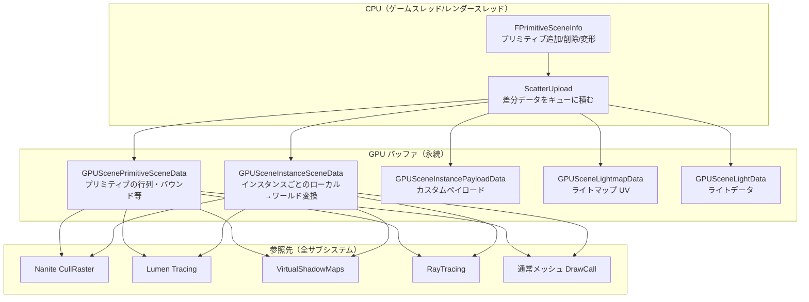

# GPUScene 全体概要

- 取得日: 2026-04-10
- 対象: `D:\UnrealEngine\Engine\Source\Runtime\Renderer\Private\GPUScene.h/.cpp`
- 上位: [[01_rendering_overview]]

---

## GPUScene とは

**シーン内の全プリミティブ・インスタンスデータを GPU バッファに保持する**システム。  
Nanite・Lumen・VSM・RayTracing など全てのレンダリングサブシステムが  
このバッファを共通の真実源（Source of Truth）として参照する。

| 従来の問題 | GPUScene の解法 |
|-----------|--------------|
| Draw Call ごとに CPU からデータを送っていた | 永続 GPU バッファを差分更新（Scatter Upload） |
| GPU Driven レンダリングができなかった | GPU 上でプリミティブデータを直接参照 |
| インスタンス情報の取得がシェーダーから難しかった | `GPUSceneInstanceSceneData` を SRV で提供 |

---

## 全体アーキテクチャ



---

## フレームの流れ（概略）

```
[A] FGPUScene::BeginRender()
    → アップロードバッファをロック（Scatter Upload の開始）

[B] プリミティブ変化の適用
    → Add/Remove/Update された FPrimitiveSceneInfo をバッファに差分書き込み
    → FGPUScenePrimitiveCollector::Commit() でダイナミックプリミティブも追加

[C] FGPUScene::EndRender()
    → GPU にアップロード実行（コンピュートシェーダーで Scatter）
    → SceneUniformBuffer を通じて全シェーダーへバインド

[D] 各サブシステムが FGPUSceneResourceParameters 経由で参照
    → GPUSceneInstanceSceneData / GPUScenePrimitiveSceneData を SRV で読み取り
```

---

## 主要クラス・構造体

```cpp
// GPU バッファの SRV（シェーダーバインド用）
BEGIN_SHADER_PARAMETER_STRUCT(FGPUSceneResourceParameters, )
    SHADER_PARAMETER_RDG_BUFFER_SRV(StructuredBuffer<float4>, GPUSceneInstanceSceneData)
    SHADER_PARAMETER_RDG_BUFFER_SRV(StructuredBuffer<float4>, GPUSceneInstancePayloadData)
    SHADER_PARAMETER_RDG_BUFFER_SRV(StructuredBuffer<float4>, GPUScenePrimitiveSceneData)
    SHADER_PARAMETER_RDG_BUFFER_SRV(StructuredBuffer<float4>, GPUSceneLightmapData)
    SHADER_PARAMETER_RDG_BUFFER_SRV(ByteAddressBuffer,        GPUSceneLightData)
    // 共通パラメータ
    SHADER_PARAMETER(uint32, GPUSceneInstanceDataSOAStride)
    SHADER_PARAMETER(uint32, GPUSceneFrameNumber)
    SHADER_PARAMETER(int32,  GPUSceneMaxAllocatedInstanceId)
    SHADER_PARAMETER(int32,  GPUSceneMaxPersistentPrimitiveIndex)
END_SHADER_PARAMETER_STRUCT()

// ダイナミックプリミティブの追加（InitViews 中に使用）
class FGPUScenePrimitiveCollector
{
    // プリミティブデータを登録
    void Add(
        const FMeshBatchDynamicPrimitiveData* MeshBatchData,
        const FPrimitiveUniformShaderParameters& Params,
        uint32 NumInstances,
        uint32& OutPrimitiveIndex,
        uint32& OutInstanceSceneDataOffset);

    // GPU バッファへのアップロードをキュー（BeginRender ブロック内で呼ぶ）
    void Commit();

    // コミット後にのみ有効
    const TRange<int32>& GetPrimitiveIdRange() const;
    int32 GetInstanceSceneDataOffset() const;
};
```

---

## 主要 CVar 一覧

| CVar | デフォルト | 説明 |
|------|----------|------|
| `r.GPUScene.UploadEveryFrame` | 0 | 毎フレーム全データを強制アップロード（デバッグ用） |
| `r.GPUScene.ParallelUpdate` | 1 | 並列タスクで更新 |
| `r.GPUScene.MaxPooledUploadBufferSize` | 256000 | アップロードバッファのプールサイズ上限（bytes） |

---

## 主要ソースファイル一覧

| ファイル | 役割 |
|---------|------|
| `GPUScene.h` | FGPUSceneResourceParameters / FGPUScenePrimitiveCollector / シェーダーバインド定義 |
| `GPUScene.cpp` | Scatter Upload 実装・BeginRender/EndRender・並列更新タスク |
