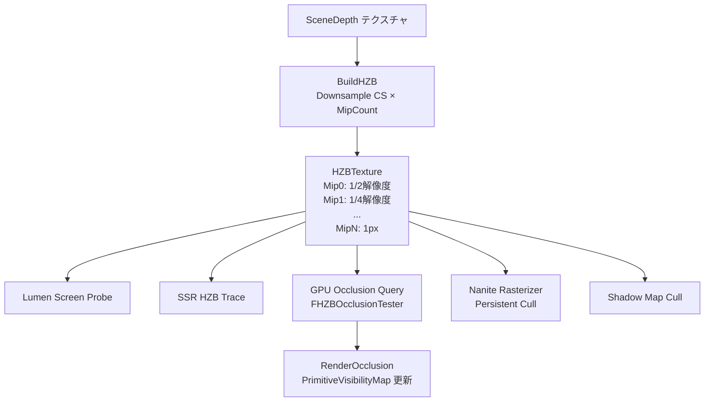

# 21: HZB（Hierarchical Z-Buffer）全体概要

- 対象ファイル: `HZB.h/.cpp` / `SceneOcclusion.h/.cpp`
- 関連: [[ref_hzb_resources]] / [[ref_hzb_occlusion]]

---

## 概要

HZB は SceneDepth から生成する**ミップ付き深度テクスチャ**。  
各ミップは下位ミップの 2×2 ブロックの Min（最近）または Max（最遠）を格納し、  
大きな AABB の遮蔽判定を少ないサンプルで高速に行える。

---

## HZB の種類

| 種別 | EHZBType | 内容 | 用途 |
|-----|----------|------|------|
| FurthestHZB | `FurthestHZB` | 各ブロックの最大深度（最も遠い）| Occlusion Culling / SSR / Lumen |
| ClosestHZB | `ClosestHZB` | 各ブロックの最小深度（最も近い）| Contact Shadow / SSGI |

---

## アーキテクチャ（Mermaid）



---

## EHZBType（HZB.h）

```cpp
enum class EHZBType : uint8
{
    Dummy        = 0,
    ClosestHZB   = 1,  // 最小深度（ビット 0）
    FurthestHZB  = 2,  // 最大深度（ビット 1）
    All          = ClosestHZB | FurthestHZB,
};
```

---

## FHZBParameters（HZB.h）

```cpp
BEGIN_SHADER_PARAMETER_STRUCT(FHZBParameters, )
    // デフォルト HZB（FurthestHZB）
    SHADER_PARAMETER_RDG_TEXTURE(Texture2D, HZBTexture)
    SHADER_PARAMETER_SAMPLER(SamplerState, HZBSampler)

    // ClosestHZB（最小深度）
    SHADER_PARAMETER_RDG_TEXTURE(Texture2D, ClosestHZBTexture)
    SHADER_PARAMETER_SAMPLER(SamplerState, ClosestHZBTextureSampler)

    // FurthestHZB（最大深度）
    SHADER_PARAMETER_RDG_TEXTURE(Texture2D, FurthestHZBTexture)
    SHADER_PARAMETER_SAMPLER(SamplerState, FurthestHZBTextureSampler)

    // 共通パラメータ
    SHADER_PARAMETER(FVector2f, HZBSize)              // HZB テクスチャサイズ
    SHADER_PARAMETER(FVector2f, HZBViewSize)          // ビュー内の HZB サイズ
    SHADER_PARAMETER(FIntRect,  HZBViewRect)          // ビューポート矩形
    SHADER_PARAMETER(FVector2f, ViewportUVToHZBBufferUV) // UV 変換
    SHADER_PARAMETER(FVector4f, HZBUvFactorAndInvFactor)
    SHADER_PARAMETER(uint32,    bIsHZBValid)
    SHADER_PARAMETER(uint32,    bIsFurthestHZBValid)
    SHADER_PARAMETER(uint32,    bIsClosestHZBValid)
END_SHADER_PARAMETER_STRUCT()
```

---

## フレームフロー

```
[HZB 構築]
BuildHZB(GraphBuilder, SceneDepthTexture, ...)    HZB.cpp
  → ClosestHZB / FurthestHZB の Mip チェーン生成
  → Mip0: SceneDepth を 1/2 にダウンサンプル
  → Mip1-N: 前ミップから Min/Max Reduce（CS）
  → FViewInfo::HZB に保存

[Occlusion Culling]
RenderOcclusion(GraphBuilder, Views, ...)         SceneOcclusion.cpp
  → HZBOcclusion.usf で各プリミティブの AABB を HZB にテスト
  → GPU Write → Readback Buffer → PrimitiveVisibilityMap 更新
  → 翌フレームの InitViews で可視フラグに反映（1フレーム遅延）

[各システムでの利用]
  SSR:     HZBTexture.SampleLevel(UV, MipLevel) で Mip トレース
  Lumen:   Screen Space Probe に HZBParameters を渡す
  Nanite:  Persistent Cull CS で HZB を参照
```

---

## 主要 CVar

| CVar | デフォルト | 説明 |
|------|----------|------|
| `r.HZBOcclusion` | 1 | HZB オクルージョンクエリ有効 |
| `r.HZB.BuildMipCount` | 0 (auto) | 生成するミップ数（0=自動）|
| `r.HZB.DownsampleCS` | 1 | CS ベースのダウンサンプル使用 |

---

## 関連リファレンス

- [[ref_hzb_resources]] — `FHZBParameters` / `FSceneHZB` / テクスチャ仕様
- [[ref_hzb_occlusion]] — `FViewOcclusionQueries` / `FOcclusionQueryVS`
