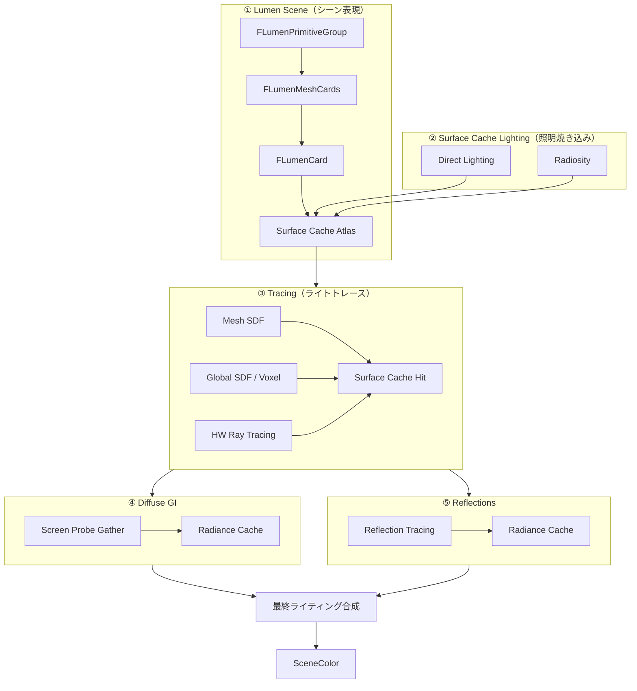

# Lumen 全体概要

- 取得日: 2026-04-05
- 対象: `D:\UnrealEngine\Engine\Source\Runtime\Renderer\Private\Lumen\`
- 上位: [[01_rendering_overview]]

---

## Lumen とは

**完全動的なグローバルイルミネーション（GI）と反射** をリアルタイムで実現するシステム。  
従来の Lightmap（静的）や SSAO（Screen Space のみ）に代わるもの。

| 従来の問題                       | Lumen の解法                           |
| --------------------------- | ----------------------------------- |
| Lightmap は静的しか対応できない        | 全てランタイム計算                           |
| SSR は画面外の情報がない              | Surface Cache で画面外もカバー              |
| Ray Tracing は全ピクセル打つとコストが高い | 低解像度 Probe でキャッシュして補間               |
| 移動するライトに GI が追随しない          | Surface Cache を差分更新（dirty だけ再キャプチャ） |
|                             |                                     |

---

## 全体アーキテクチャ



---

## 各コンポーネントの詳細記事

| # | コンポーネント | 役割 | 詳細記事 |
|---|--------------|------|---------|
| ① | Lumen Scene / Surface Cache | シーンをCardで近似・ライティング情報を焼く | [[a_lumen_surface_cache]] |
| ② | Surface Cache Lighting | 直接光・Radiosityを Surface Cache に書き込む | [[b_lumen_scene_lighting]] |
| ③ | Tracing | Mesh SDF / Global SDF / HW RT でレイトレース | [[c_lumen_tracing]] |
| ④ | Radiance Cache | 遠距離用プローブキャッシュ（Tracing から更新） | [[d_lumen_radiance_cache]] |
| ⑤ | Diffuse GI | Screen Probe Gather + Radiance Cache で間接光 | [[e_lumen_diffuse_gi]] |
| ⑥ | Reflections | Roughness別トレース + ReSTIR | [[f_lumen_reflections]] |
| ⑦ | 最終ライティング合成 | Diffuse GI + 反射 + AO → SceneColor 加算書き込み | [[g_lumen_final_composite]] |

---

## フレームの流れ（概略）

```
[A] Lumen Scene 更新    → Cardのdirty検出 → Surface Cache 再キャプチャ
[B] Surface Cache照明   → DirectLighting + Radiosity → FinalLightingAtlas
[C] Tracing             → Probe/Pixel からレイ → Surface Cache をサンプル
[D] Diffuse GI          → Screen Probe 集計 → テンポラル蓄積
[E] Reflections         → Roughness別トレース → ReSTIR → テンポラル蓄積
[F] GBuffer 合成        → 最終ピクセル出力
```

---

## コード実行フロー

### エントリポイント

Lumen の処理は `FDeferredShadingSceneRenderer::Render()`（`DeferredShadingRenderer.cpp`）から始まる。  
フレーム内で以下の順番に呼び出される。

```
FDeferredShadingSceneRenderer::Render()
  │
  ├─ [InitViews フェーズ]
  │   BeginUpdateLumenSceneTasks(GraphBuilder, FrameTemporaries)   // LumenSceneRendering.cpp:1969
  │   BeginGatherLumenLights(...)                                   // 非同期ライト収集を開始
  │
  ├─ [GBuffer 描画前]
  │   UpdateLumenScene(GraphBuilder, FrameTemporaries)              // LumenSceneRendering.cpp:2490
  │   BeginGatheringLumenSurfaceCacheFeedback(...)                  // フィードバック収集開始
  │   RenderLumenSceneLighting(GraphBuilder, FrameTemporaries, ...) // LumenSceneLighting.cpp:217
  │
  ├─ [GBuffer 描画後 / Lighting フェーズ]
  │   RenderDiffuseIndirectAndAmbientOcclusion(...)                 // IndirectLightRendering.cpp:977  → [[g_lumen_final_composite]]
  │     │
  │     ├─ [DiffuseIndirectMethod == Lumen の場合]
  │     │   RenderLumenFinalGather(...)                             // LumenScreenProbeGather.cpp:2094
  │     │     ├─ UseReSTIRGather() → RenderLumenReSTIRGather(...)
  │     │     └─ else          → RenderLumenScreenProbeGather(...)  // LumenScreenProbeGather.cpp:2156
  │     │
  │     └─ [ReflectionsMethod == Lumen の場合]
  │         RenderLumenReflections(...)                             // LumenReflections.cpp
  │
  └─ [透明オブジェクト]
      RenderLumenFrontLayerTranslucencyReflections(...)             // (透明前面の反射)
```

### フロー詳細

1. **BeginUpdateLumenSceneTasks** — InitViews フェーズで非同期タスクを起動（`LumenSceneRendering.cpp:1969`）
   ```cpp
   // DeferredShadingRenderer.cpp:1873
   BeginUpdateLumenSceneTasks(GraphBuilder, *InitViewTaskDatas.LumenFrameTemporaries);
   ```
   - `ShouldRenderLumenDiffuseGI()` で各ビューの有効判定
   - CPU タスク（`AddSetupTask`）として `UpdateLumenScenePrimitives()` → `UpdateSurfaceCacheMeshCards()` → `ProcessLumenSurfaceCacheRequests()` を非同期実行
   - 参照: [[ref_lumen_scene]] | [[ref_lumen_surface_cache]]

2. **UpdateLumenScene** — GBuffer 前に GPU 側の Scene データを更新（`LumenSceneRendering.cpp:2490`）
   ```cpp
   // DeferredShadingRenderer.cpp:2794
   UpdateLumenScene(GraphBuilder, LumenFrameTemporaries);
   ```
   - `FrameTemporaries.UpdateSceneTask.Wait()` でステップ1の CPU タスク完了を待機
   - Card Atlas の再確保・Card ページテーブルのアップロード
   - GPU Driven Update（`LumenScene::GPUDrivenUpdate`）またはメッシュ描画によるカードキャプチャを実行
   - 参照: [[ref_lumen_scene]] | [[ref_lumen_scene_gpu_driven_update]] | [[ref_lumen_scene_card_capture]]

3. **RenderLumenSceneLighting** — Surface Cache へ照明を焼き込む（`LumenSceneLighting.cpp:217`）
   ```cpp
   // DeferredShadingRenderer.cpp:2899
   RenderLumenSceneLighting(GraphBuilder, LumenFrameTemporaries, InitViewTaskDatas.LumenDirectLighting);
   ```
   - `RenderDirectLightingForLumenScene()` → `DirectLightingAtlas` に書き込み
   - `RenderRadiosityForLumenScene()` → `IndirectLightingAtlas` に書き込み
   - `FinalLightingAtlas = Direct + Indirect` に合成
   - 参照: [[ref_lumen_scene_lighting]] | [[ref_lumen_radiosity]]

4. **RenderLumenFinalGather** — Diffuse GI を計算（`LumenScreenProbeGather.cpp:2094`）
   ```cpp
   // IndirectLightRendering.cpp:1071
   DenoiserOutputs = RenderLumenFinalGather(GraphBuilder, SceneTextures, LumenFrameTemporaries, ...);
   ```
   - `UseReSTIRGather()` が true → `RenderLumenReSTIRGather()`
   - それ以外 → `RenderLumenScreenProbeGather()`（Screen Probe の配置・トレース・フィルタリング・Gather）
   - 参照: [[ref_lumen_diffuse_indirect]] | [[ref_lumen_screen_probe_gather]]

5. **RenderLumenReflections** — 反射を計算（`LumenReflections.cpp`）
   ```cpp
   // IndirectLightRendering.cpp:1097
   OutTextures.Textures[3] = RenderLumenReflections(GraphBuilder, View, SceneTextures,
       LumenFrameTemporaries, MeshSDFGridParams, RadianceCacheParams,
       ELumenReflectionPass::Opaque, LumenReflectionsConfig, ERDGPassFlags::Compute);
   ```
   - `UseHardwareRayTracedReflections()` が true → `RenderLumenHardwareRayTracingReflections()`
   - それ以外 → `TraceReflections()`（Mesh SDF → Global SDF → Resolve → テンポラル蓄積）
   - 参照: [[ref_lumen_reflections]] | [[ref_lumen_reflection_tracing]] | [[ref_lumen_reflection_hwrt]]

### 関与クラス・関数一覧

| クラス / 関数 | ファイル | 役割 |
|------------|--------|------|
| `FDeferredShadingSceneRenderer` | `DeferredShadingRenderer.cpp` | 全体の描画コントローラ |
| `FLumenSceneFrameTemporaries` | `LumenSceneRendering.h` | フレームスコープの一時 GPU リソース群 |
| `BeginUpdateLumenSceneTasks()` | `LumenSceneRendering.cpp` | CPU 非同期タスクでシーンデータを更新 |
| `UpdateLumenScene()` | `LumenSceneRendering.cpp` | GPU 側の Atlas・ページテーブル更新 |
| `RenderLumenSceneLighting()` | `LumenSceneLighting.cpp` | Surface Cache への Direct / Indirect 照明書き込み |
| `RenderLumenFinalGather()` | `LumenScreenProbeGather.cpp` | Diffuse GI のトップレベルエントリ |
| `RenderLumenScreenProbeGather()` | `LumenScreenProbeGather.cpp` | Screen Probe 配置・トレース・Gather |
| `RenderLumenReflections()` | `LumenReflections.cpp` | 反射のトップレベルエントリ |

---

## 有効化条件（`Lumen.h`）

```cpp
bool ShouldRenderLumenDiffuseGI(const FScene*, const FSceneView&, ...);
bool ShouldRenderLumenReflections(const FSceneView&, ...);
bool ShouldRenderLumenDirectLighting(const FScene*, const FSceneView&);
bool ShouldRenderAOWithLumenGI();  // LumenGI使用時はSSAO無効化
```
