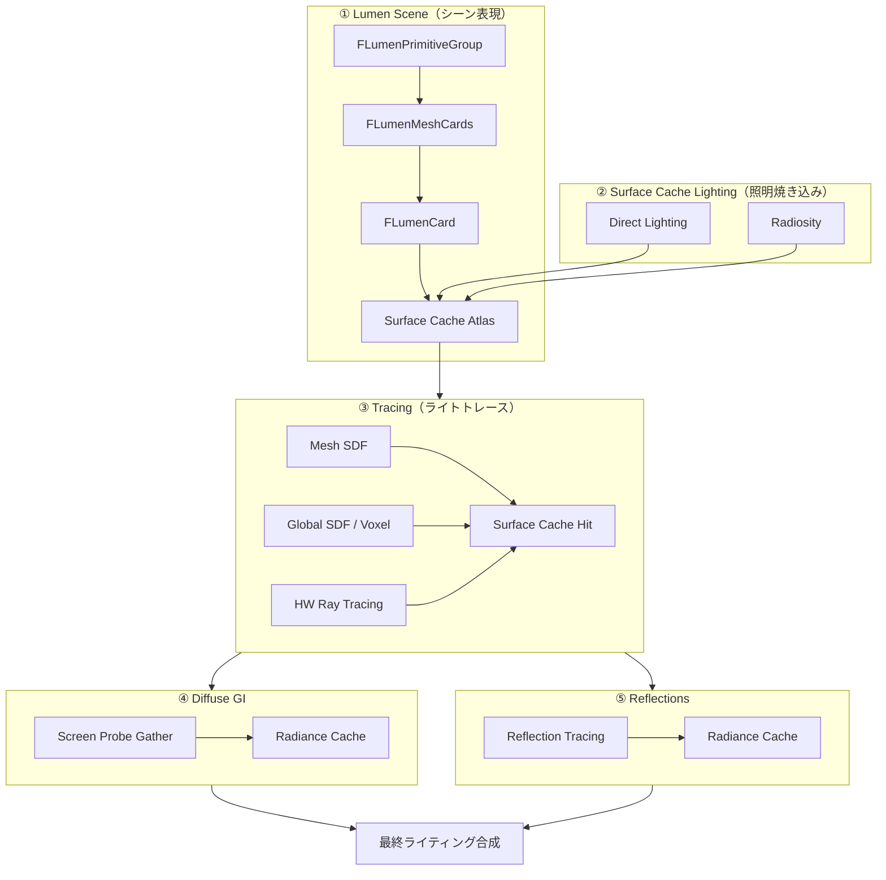

# Lumen 全体概要

- 取得日: 2026-04-05
- 対象: `D:\UnrealEngine\Engine\Source\Runtime\Renderer\Private\Lumen\`
- 上位: [[01_rendering_overview]]

---

## Lumen とは

**完全動的なグローバルイルミネーション（GI）と反射** をリアルタイムで実現するシステム。  
従来の Lightmap（静的）や SSAO（Screen Space のみ）に代わるもの。

| 従来の問題                       | Lumen の解法                           |
| --------------------------- | ----------------------------------- |
| Lightmap は静的しか対応できない        | 全てランタイム計算                           |
| SSR は画面外の情報がない              | Surface Cache で画面外もカバー              |
| Ray Tracing は全ピクセル打つとコストが高い | 低解像度 Probe でキャッシュして補間               |
| 移動するライトに GI が追随しない          | Surface Cache を差分更新（dirty だけ再キャプチャ） |
|                             |                                     |

---

## 全体アーキテクチャ



---

## 各コンポーネントの詳細記事

| # | コンポーネント | 役割 | 詳細記事 |
|---|--------------|------|---------|
| ① | Lumen Scene / Surface Cache | シーンをCardで近似・ライティング情報を焼く | [[a_lumen_surface_cache]] |
| ② | Surface Cache Lighting | 直接光・Radiosityを Surface Cache に書き込む | [[b_lumen_scene_lighting]] |
| ③ | Tracing | Mesh SDF / Global SDF / HW RT でレイトレース | [[c_lumen_tracing]] |
| ④ | Radiance Cache | 遠距離用プローブキャッシュ（Tracing から更新） | [[d_lumen_radiance_cache]] |
| ⑤ | Diffuse GI | Screen Probe Gather + Radiance Cache で間接光 | [[e_lumen_diffuse_gi]] |
| ⑥ | Reflections | Roughness別トレース + ReSTIR | [[f_lumen_reflections]] |

---

## フレームの流れ（概略）

```
[A] Lumen Scene 更新    → Cardのdirty検出 → Surface Cache 再キャプチャ
[B] Surface Cache照明   → DirectLighting + Radiosity → FinalLightingAtlas
[C] Tracing             → Probe/Pixel からレイ → Surface Cache をサンプル
[D] Diffuse GI          → Screen Probe 集計 → テンポラル蓄積
[E] Reflections         → Roughness別トレース → ReSTIR → テンポラル蓄積
[F] GBuffer 合成        → 最終ピクセル出力
```

---

## 有効化条件（`Lumen.h`）

```cpp
bool ShouldRenderLumenDiffuseGI(const FScene*, const FSceneView&, ...);
bool ShouldRenderLumenReflections(const FSceneView&, ...);
bool ShouldRenderLumenDirectLighting(const FScene*, const FSceneView&);
bool ShouldRenderAOWithLumenGI();  // LumenGI使用時はSSAO無効化
```
