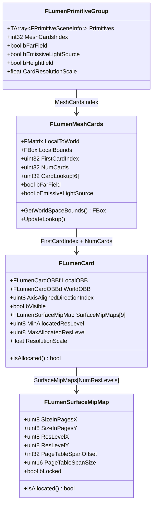

# Lumen Surface Cache（サーフェスキャッシュ）

- 上位: [[02_lumen_overview]]
- 関連: [[b_lumen_scene_lighting]] | [[c_lumen_tracing]]

---

## 概要

Lumen がシーンを表現するための独自データ構造。  
メッシュの表面を **Card（平面パッチ）** に分解し、各 Card にライティング情報を焼き込むことで、  
トレース時に安価にシーンの照明情報を参照できるようにする仕組み。

---

## クラス階層図



---

## Card とは何か

メッシュの表面を **軸平行な6方向（±X, ±Y, ±Z）** の平面パッチで近似したもの。  
各方向に1枚ずつ、有効な面のみ生成される。

```
壁メッシュ（例）
  FLumenMeshCards
   ├─ Card[0]  +X 方向面 → Surface Cache のアトラス矩形 A
   ├─ Card[1]  -X 方向面 → Surface Cache のアトラス矩形 B
   └─ Card[2]  +Z 方向面 → Surface Cache のアトラス矩形 C
```

### CardLookup

`FLumenMeshCards::CardLookup[6]` は方向インデックス（0〜5）から  
対応する `FLumenCard` のインデックスを直接引くためのルックアップテーブル。

---

## Surface Cache アトラス一覧

全Cardのデータを詰め込んだ大きな1枚テクスチャ群（アトラス）。  
シェーダーには `FLumenCardScene`（Global Shader Parameter）として渡される。

```cpp
// BEGIN_GLOBAL_SHADER_PARAMETER_STRUCT(FLumenCardScene, )
//   ↓ シェーダー側で LumenCardScene.AlbedoAtlas のようにアクセス

Texture2D AlbedoAtlas       // ベースカラー
Texture2D OpacityAtlas      // 不透明度
Texture2D NormalAtlas       // 法線（ワールド空間）
Texture2D EmissiveAtlas     // 自発光
Texture2D DepthAtlas        // 深度
```

トレーシングシェーダーが参照する完全なバインドは `FLumenCardTracingParameters`（`LumenTracingUtils.h`）：

```cpp
// ライティング済みアトラス（トレース結果の参照先）
Texture2D DirectLightingAtlas    // 直接光の計算結果
Texture2D IndirectLightingAtlas  // Radiosity の計算結果
Texture2D FinalLightingAtlas     // Direct + Indirect の合成済み
```

---

## MipMap 管理（`FLumenSurfaceMipMap`）

各 Card は複数の解像度レベルを持ち、距離に応じて適切な解像度が割り当てられる。

```
ResLevel の範囲（Lumen.h より）:
  MinResLevel = 3  → 2^3 = 8 テクセル（最低解像度）
  MaxResLevel = 11 → 2^11 = 2048 テクセル（最高解像度）
  NumResLevels = 9 段階

  PhysicalPageSize = 128 テクセル（物理ページのサイズ）
  VirtualPageSize  = 127 テクセル（0.5テクセルのボーダー込み）
```

解像度の決定フロー：
```
1. カメラとの距離 → DesiredLockedResLevel を計算
2. アトラスの空き → 実際の MinAllocatedResLevel / MaxAllocatedResLevel を割り当て
3. アトラスが満杯 → 低解像度に格下げ（DropResLevel）
```

---

## FLumenCardId（識別子）

```cpp
// 64bit パックされた識別子
union FLumenCardId {
    uint64 PackedValue;
    struct {
        uint32 ResLevelBiasX         : 4;   // X方向の解像度バイアス
        uint32 ResLevelBiasY         : 4;   // Y方向の解像度バイアス
        uint32 AxisAlignedDirectionIndex : 3; // 0〜5（方向）
        uint32 Unused                : 21;
        uint32 CustomId;                    // メッシュ固有ID
    };
};
```

---

## Surface Cache 更新サイクル

毎フレーム差分のみを更新する仕組み。

```
1. シーン変化の検出
   └─ FLumenPrimitiveGroup の追加/削除/移動 → Cardを dirty フラグ

2. キャプチャ対象の選定
   └─ 優先度（距離・更新頻度）に基づいてキャプチャするCardを決定

3. Surface Cache キャプチャ（FRasterizeToCardsVS）
   └─ Albedo/Normal/Emissive/Depth アトラスへ書き込み

4. 照明計算（→ [[b_lumen_scene_lighting]] へ）
   └─ DirectLightingAtlas / IndirectLightingAtlas → FinalLightingAtlas
```

### 主要 CVar

```
r.LumenScene.SurfaceCache.CardCapturesPerFrame = 300
    → 1フレームに最大 300 Card をキャプチャ

r.LumenScene.SurfaceCache.CardCaptureFactor = 64
    → 更新テクセル上限 = SurfaceCacheTexels / 64

r.LumenScene.SurfaceCache.CardCaptureRefreshFraction = 0.125
    → 既存Cardの再キャプチャに使えるバジェット割合（12.5%）

r.LumenScene.SurfaceCache.Freeze = 1      ← デバッグ用（更新停止）
r.LumenScene.SurfaceCache.Reset = 1       ← デバッグ用（全リセット）
r.LumenScene.PrimitivesPerTask = 128      ← 並列タスクあたりのプリミティブ数
r.LumenScene.FastCameraMode = 0           ← 高速カメラ時の低品質モード
```

---

## Surface Cache Feedback（フィードバックループ）

トレースシェーダーが **どの Card が参照されたか** を GPU バッファに記録し、  
CPU 側でフィードバックを読んでアトラスの解像度を動的に調整する。

```cpp
// FLumenCardTracingParameters に含まれるフィードバックバッファ
RWStructuredBuffer<uint2> RWSurfaceCacheFeedbackBuffer
    → トレースシェーダーが参照した CardPageIndex を書き込む

uint32 SurfaceCacheFeedbackBufferSize
uint32 SurfaceCacheFeedbackBufferTileWrapMask
```

```
よく参照される Card → 高解像度を割り当て
ほとんど参照されない Card → 低解像度に格下げ（メモリ節約）
```

---

## 関連ソースファイル

| ファイル | 役割 |
|---------|------|
| `LumenSceneData.h` | FLumenCard / FLumenMeshCards / FLumenPrimitiveGroup の定義 |
| `LumenMeshCards.h/cpp` | MeshCards の初期化・更新 |
| `LumenSurfaceCache.cpp` | アトラス管理・アロケーション |
| `LumenSurfaceCacheFeedback.h/cpp` | フィードバックバッファの読み書き |
| `LumenSceneRendering.cpp` | フレームごとの更新オーケストレーション |
| `LumenSceneCardCapture.h/cpp` | アトラスへの実際のキャプチャ描画 |
| `LumenTracingUtils.h` | FLumenCardTracingParameters（シェーダーバインド）|
