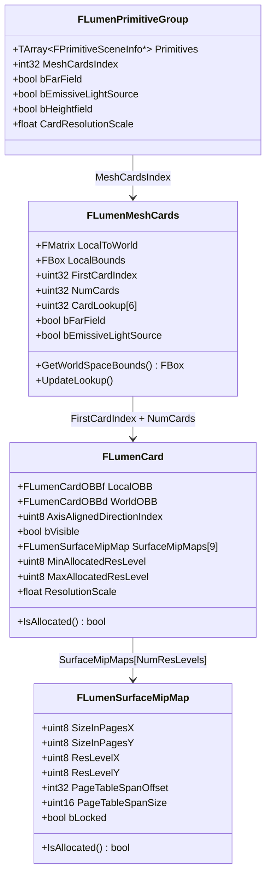

# Lumen Surface Cache（サーフェスキャッシュ）

- 上位: [[02_lumen_overview]]
- 関連: [[b_lumen_scene_lighting]] | [[c_lumen_tracing]]

---

## 概要

Lumen がシーンを表現するための独自データ構造。  
メッシュの表面を **Card（平面パッチ）** に分解し、各 Card にライティング情報を焼き込むことで、  
トレース時に安価にシーンの照明情報を参照できるようにする仕組み。

---

## クラス階層図



---

## Card とは何か

メッシュの表面を **軸平行な6方向（±X, ±Y, ±Z）** の平面パッチで近似したもの。  
各方向に1枚ずつ、有効な面のみ生成される。

```
壁メッシュ（例）
  FLumenMeshCards
   ├─ Card[0]  +X 方向面 → Surface Cache のアトラス矩形 A
   ├─ Card[1]  -X 方向面 → Surface Cache のアトラス矩形 B
   └─ Card[2]  +Z 方向面 → Surface Cache のアトラス矩形 C
```

### CardLookup

`FLumenMeshCards::CardLookup[6]` は方向インデックス（0〜5）から  
対応する `FLumenCard` のインデックスを直接引くためのルックアップテーブル。

---

## Surface Cache アトラス一覧

全Cardのデータを詰め込んだ大きな1枚テクスチャ群（アトラス）。  
シェーダーには `FLumenCardScene`（Global Shader Parameter）として渡される。

```cpp
// BEGIN_GLOBAL_SHADER_PARAMETER_STRUCT(FLumenCardScene, )
//   ↓ シェーダー側で LumenCardScene.AlbedoAtlas のようにアクセス

Texture2D AlbedoAtlas       // ベースカラー
Texture2D OpacityAtlas      // 不透明度
Texture2D NormalAtlas       // 法線（ワールド空間）
Texture2D EmissiveAtlas     // 自発光
Texture2D DepthAtlas        // 深度
```

トレーシングシェーダーが参照する完全なバインドは `FLumenCardTracingParameters`（`LumenTracingUtils.h`）：

```cpp
// ライティング済みアトラス（トレース結果の参照先）
Texture2D DirectLightingAtlas    // 直接光の計算結果
Texture2D IndirectLightingAtlas  // Radiosity の計算結果
Texture2D FinalLightingAtlas     // Direct + Indirect の合成済み
```

---

## MipMap 管理（`FLumenSurfaceMipMap`）

各 Card は複数の解像度レベルを持ち、距離に応じて適切な解像度が割り当てられる。

```
ResLevel の範囲（Lumen.h より）:
  MinResLevel = 3  → 2^3 = 8 テクセル（最低解像度）
  MaxResLevel = 11 → 2^11 = 2048 テクセル（最高解像度）
  NumResLevels = 9 段階

  PhysicalPageSize = 128 テクセル（物理ページのサイズ）
  VirtualPageSize  = 127 テクセル（0.5テクセルのボーダー込み）
```

解像度の決定フロー：
```
1. カメラとの距離 → DesiredLockedResLevel を計算
2. アトラスの空き → 実際の MinAllocatedResLevel / MaxAllocatedResLevel を割り当て
3. アトラスが満杯 → 低解像度に格下げ（DropResLevel）
```

---

## FLumenCardId（識別子）

```cpp
// 64bit パックされた識別子
union FLumenCardId {
    uint64 PackedValue;
    struct {
        uint32 ResLevelBiasX         : 4;   // X方向の解像度バイアス
        uint32 ResLevelBiasY         : 4;   // Y方向の解像度バイアス
        uint32 AxisAlignedDirectionIndex : 3; // 0〜5（方向）
        uint32 Unused                : 21;
        uint32 CustomId;                    // メッシュ固有ID
    };
};
```

---

## Surface Cache 更新サイクル

毎フレーム差分のみを更新する仕組み。

```
1. シーン変化の検出
   └─ FLumenPrimitiveGroup の追加/削除/移動 → Cardを dirty フラグ

2. キャプチャ対象の選定
   └─ 優先度（距離・更新頻度）に基づいてキャプチャするCardを決定

3. Surface Cache キャプチャ（FRasterizeToCardsVS）
   └─ Albedo/Normal/Emissive/Depth アトラスへ書き込み

4. 照明計算（→ [[b_lumen_scene_lighting]] へ）
   └─ DirectLightingAtlas / IndirectLightingAtlas → FinalLightingAtlas
```

### 主要 CVar

```
r.LumenScene.SurfaceCache.CardCapturesPerFrame = 300
    → 1フレームに最大 300 Card をキャプチャ

r.LumenScene.SurfaceCache.CardCaptureFactor = 64
    → 更新テクセル上限 = SurfaceCacheTexels / 64

r.LumenScene.SurfaceCache.CardCaptureRefreshFraction = 0.125
    → 既存Cardの再キャプチャに使えるバジェット割合（12.5%）

r.LumenScene.SurfaceCache.Freeze = 1      ← デバッグ用（更新停止）
r.LumenScene.SurfaceCache.Reset = 1       ← デバッグ用（全リセット）
r.LumenScene.PrimitivesPerTask = 128      ← 並列タスクあたりのプリミティブ数
r.LumenScene.FastCameraMode = 0           ← 高速カメラ時の低品質モード
```

---

## Surface Cache Feedback（フィードバックループ）

トレースシェーダーが **どの Card が参照されたか** を GPU バッファに記録し、  
CPU 側でフィードバックを読んでアトラスの解像度を動的に調整する。

```cpp
// FLumenCardTracingParameters に含まれるフィードバックバッファ
RWStructuredBuffer<uint2> RWSurfaceCacheFeedbackBuffer
    → トレースシェーダーが参照した CardPageIndex を書き込む

uint32 SurfaceCacheFeedbackBufferSize
uint32 SurfaceCacheFeedbackBufferTileWrapMask
```

```
よく参照される Card → 高解像度を割り当て
ほとんど参照されない Card → 低解像度に格下げ（メモリ節約）
```

---

## コード実行フロー

### エントリポイント

Surface Cache の更新は **2段階**に分かれる。  
- **フェーズ1（CPU 非同期）**: `BeginUpdateLumenSceneTasks()` — InitViews 時に CPU タスクで card 選定
- **フェーズ2（GPU）**: `UpdateLumenScene()` — GBuffer 描画前に GPU でアップロード・キャプチャ

```
FDeferredShadingSceneRenderer::Render()   (DeferredShadingRenderer.cpp)
  │
  ├─ [InitViews フェーズ]
  │   BeginUpdateLumenSceneTasks(GraphBuilder, FrameTemporaries)
  │     └─ AddSetupTask([...])  ← CPU 非同期タスク起動
  │           UpdateLumenScenePrimitives(GPUMask, Scene)
  │             ├─ PendingRemoveOperations → PrimitiveGroups から削除
  │             └─ PendingAddOperations   → PrimitiveGroups へ追加
  │           UpdateSurfaceCacheMeshCards(LumenSceneData, ...)
  │             └─ MeshCards の距離 / 解像度スコアを計算してキャプチャ候補を列挙
  │           LumenSceneData.ProcessLumenSurfaceCacheRequests(...)
  │             └─ CardPageToRender リストを確定（FrameTemporaries に格納）
  │
  └─ [GBuffer 描画前]
      UpdateLumenScene(GraphBuilder, FrameTemporaries)
        ├─ FrameTemporaries.UpdateSceneTask.Wait()  ← CPU タスク完了待ち
        ├─ [Atlas 再確保が必要な場合]
        │   LumenSceneData.AllocateCardAtlases()  → AtlasSizeが変化した場合
        │   ClearLumenSurfaceCacheAtlas()
        ├─ LumenSceneData.UploadPageTable()        → GPU へ仮想ページテーブルを転送
        ├─ Lumen::UpdateCardSceneBuffer()          → カード情報バッファをアップロード
        ├─ [GPU Driven Update 有効時]
        │   LumenScene::GPUDrivenUpdate()          → GPU 側でプリミティブ追加/削除を処理
        └─ [CardPagesToRender が存在する場合]
            ① ResampleLumenCards()    → 解像度変化したカードのデータを再サンプル
            ② AllocateCardCaptureAtlas()  → 一時キャプチャアトラスを確保
            ③ RenderLumenCardCaptures()   → メッシュドローコマンドで Albedo/Normal/Emissive を描画
            ④ CopyLumenCardCaptures()     → キャプチャ結果を恒久アトラスにコピー
```

### フロー詳細

1. **UpdateLumenScenePrimitives** — プリミティブの追加/削除（`LumenScene.cpp:873`）
   ```cpp
   // BeginUpdateLumenSceneTasks の CPU タスク内
   UpdateLumenScenePrimitives(GPUMask, Scene);
   ```
   - `PendingRemoveOperations` → `FLumenPrimitiveGroup` から Primitive を取り除く
   - `PendingAddOperations` → `FLumenMeshCards` を生成して `FLumenPrimitiveGroup` に登録
   - 参照: [[ref_lumen_scene]] | [[ref_lumen_mesh_cards]]

2. **UpdateSurfaceCacheMeshCards** — キャプチャ候補を選定（`LumenSurfaceCache.cpp`）
   ```cpp
   UpdateSurfaceCacheMeshCards(
       LumenSceneData, SurfaceCacheFeedbackData,
       LumenSceneCameraOrigins, ..., SurfaceCacheRequests, ViewFamily);
   ```
   - フィードバックバッファ（前フレームからの `SurfaceCacheFeedbackData`）で参照頻度を参照
   - 距離・ラフネス・解像度スコアで `SurfaceCacheRequests` を優先度付け
   - 参照: [[ref_lumen_surface_cache]] | [[ref_lumen_surface_cache_feedback]]

3. **ProcessLumenSurfaceCacheRequests** — `CardPagesToRender` リストを確定（`LumenSurfaceCache.cpp`）
   ```cpp
   LumenSceneData.ProcessLumenSurfaceCacheRequests(
       Views[0], MaxCardUpdateDistanceFromCamera, MaxTileCapturesPerFrame,
       LumenCardRenderer, GPUMask, SurfaceCacheRequests);
   ```
   - `MaxTileCapturesPerFrame`（`r.LumenScene.SurfaceCache.MaxTileCapturesPerFrame`）で上限クランプ
   - 確定した `FCardPageRenderData` リストを `LumenCardRenderer.CardPagesToRender` に格納
   - 参照: [[ref_lumen_surface_cache]]

4. **UploadPageTable / UpdateCardSceneBuffer** — GPU へバッファを転送（`LumenSceneRendering.cpp`）
   ```cpp
   LumenSceneData.UploadPageTable(GraphBuilder, UploadBuilder, FrameTemporaries);
   Lumen::UpdateCardSceneBuffer(GraphBuilder, UploadBuilder, FrameTemporaries, ViewFamily, Scene);
   UploadBuilder.Execute(GraphBuilder);  // まとめて GPU へ送信
   ```
   - 仮想ページテーブル・Card 情報（位置 / 向き / 解像度）を GPU バッファへ一括転送
   - 参照: [[ref_lumen_scene]] | [[ref_lumen_scene_data]]

5. **LumenScene::GPUDrivenUpdate** — GPU 側更新パス（`LumenSceneGPUDrivenUpdate.cpp`）
   ```cpp
   if (CVarLumenSceneGPUDrivenUpdate.GetValueOnRenderThread() != 0) {
       LumenScene::GPUDrivenUpdate(GraphBuilder, Scene, Views, FrameTemporaries);
   }
   ```
   - 前フレームの `SceneReadback` バッファを読んで追加/削除をGPU で処理
   - 参照: [[ref_lumen_scene_gpu_driven_update]]

6. **RenderLumenCardCaptures** — カードキャプチャ描画（`LumenSceneCardCapture.cpp`）
   ```cpp
   // CardPagesToRender.Num() > 0 の場合
   RenderLumenCardCaptures(GraphBuilder, SharedView, LumenCardRenderer,
       CardCaptureAtlas, CardCaptureRectBufferSRV, CommonPassParameters, ...);
   ```
   - `MeshCardCapture` パスで MeshDrawCommand を Dispatch
   - 出力先: `CardCaptureAtlas`（Albedo / Normal / Emissive / DepthStencil）
   - 結果を `CopyLumenCardCaptures()` で恒久アトラスへ転送
   - 参照: [[ref_lumen_scene_card_capture]] | [[ref_lumen_scene_rendering]]

### 関与クラス・関数一覧

| クラス / 関数 | ファイル | 役割 |
|------------|--------|------|
| `FLumenPrimitiveGroup` | `LumenSceneData.h` | プリミティブの Lumen グループ単位 |
| `FLumenMeshCards` | `LumenMeshCards.h` | メッシュの Card 集合（方向別6面）|
| `FLumenCard` | `LumenSceneData.h` | 1枚の平面パッチ（Atlas 上のページを管理）|
| `FLumenSceneData` | `LumenSceneData.h` | Lumen シーン全体のデータコンテナ |
| `FLumenCardRenderer` | `LumenSceneRendering.h` | CPU 側のカードキャプチャ情報（MeshDrawCommands 等）|
| `FCardPageRenderData` | `LumenSceneRendering.h` | 1ページのキャプチャ情報（Rect / DrawCommands）|
| `UpdateLumenScenePrimitives()` | `LumenScene.cpp` | CPU でプリミティブを PrimitiveGroup に追加/削除 |
| `UpdateSurfaceCacheMeshCards()` | `LumenSurfaceCache.cpp` | フィードバックとスコアでキャプチャ候補を選定 |
| `LumenScene::GPUDrivenUpdate()` | `LumenSceneGPUDrivenUpdate.cpp` | GPU 上でのプリミティブ追加/削除処理 |
| `RenderLumenCardCaptures()` | `LumenSceneCardCapture.cpp` | メッシュ描画で Card をキャプチャ |

---

## 関連ソースファイル

| ファイル | 役割 |
|---------|------|
| `LumenSceneData.h` | FLumenCard / FLumenMeshCards / FLumenPrimitiveGroup の定義 |
| `LumenMeshCards.h/cpp` | MeshCards の初期化・更新 |
| `LumenSurfaceCache.cpp` | アトラス管理・アロケーション |
| `LumenSurfaceCacheFeedback.h/cpp` | フィードバックバッファの読み書き |
| `LumenSceneRendering.cpp` | フレームごとの更新オーケストレーション |
| `LumenSceneCardCapture.h/cpp` | アトラスへの実際のキャプチャ描画 |
| `LumenTracingUtils.h` | FLumenCardTracingParameters（シェーダーバインド）|


---

## 関連リファレンス（ソースファイル別）

| リファレンス | 対象ソース | 主な内容 |
|------------|---------|---------|
| [[ref_lumen_scene_data]] | `LumenSceneData.h` | FLumenCard / FLumenPrimitiveGroup / FLumenPageTableEntry / FLumenSurfaceCacheAllocator |
| [[ref_lumen_mesh_cards]] | `LumenMeshCards.h/cpp` | FLumenMeshCards / CardLookup / UpdateCardSceneBuffer |
| [[ref_lumen_surface_cache]] | `LumenSurfaceCache.cpp` | ページアロケーション・更新スケジューリング・CVar 一覧 |
| [[ref_lumen_surface_cache_feedback]] | `LumenSurfaceCacheFeedback.h/cpp` | FLumenSurfaceCacheFeedback / フィードバックループ |
| [[ref_lumen_scene]] | `LumenScene.cpp` | プリミティブ登録/削除・フレーム更新フロー・CVar 一覧 |
| [[ref_lumen_scene_gpu_driven_update]] | `LumenSceneGPUDrivenUpdate.h/cpp` | FLumenSceneReadback / GPU Driven Update |
| [[ref_lumen_utils]] | `LumenSparseSpanArray.h` / `LumenUniqueList.h` | TSparseSpanArray / FUniqueIndexList |
