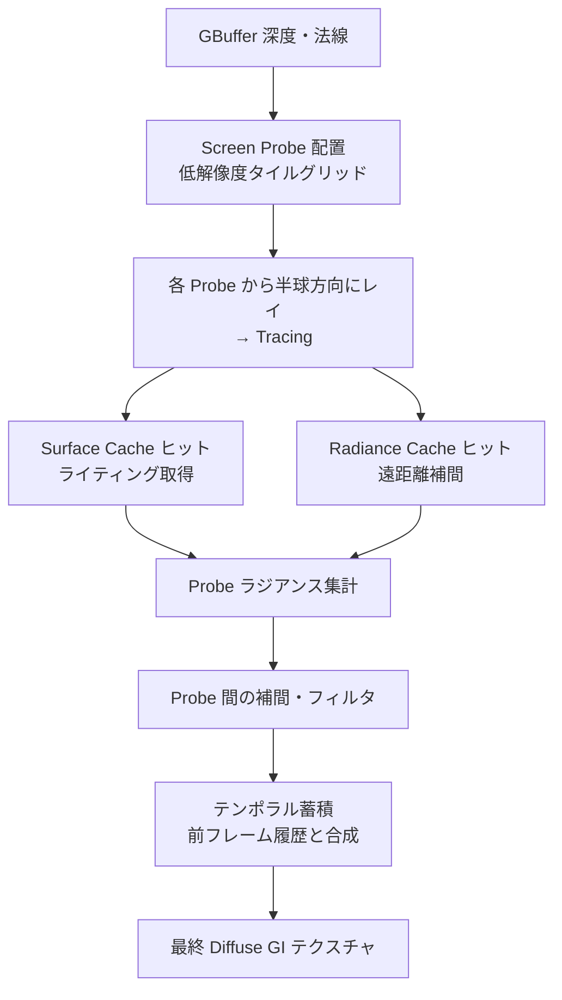

# Lumen Diffuse GI（拡散間接照明）

- 上位: [[02_lumen_overview]]
- 関連: [[c_lumen_tracing]] | [[d_lumen_radiance_cache]]

---

## 概要

Lumen の拡散 GI（Global Illumination）は **Screen Probe Gather** を中核とする。  
画面を低解像度グリッドに分割してプローブを配置し、各プローブから半球方向にレイをトレースして  
間接照明を計算する。遠距離は [[d_lumen_radiance_cache]] で補間してコストを抑える。

---

## 全体フロー



---

## Screen Probe Gather の仕組み

### Probe の配置

画面全体を **タイル（例: 8×8 ピクセル）** に分割し、タイルごとに1つの Probe を配置。

```
画面解像度: 1920×1080
タイルサイズ: 8×8 px
Probe 数: 240×135 ≈ 32,400 プローブ

各 Probe:
  位置 = タイル中央のピクセルのワールド空間座標
  法線 = GBuffer の法線
```

Probe が配置できない場所（空やガラス等）は隣接 Probe から補間。

### レイのトレース

各 Probe から **半球方向** に複数のレイを飛ばす（コサイン重み付き分布）。

```cpp
// FHemisphereDirectionSampleGenerator で生成（LumenTracingUtils.h）
GenerateSamples(
    TargetNumSamples,        // 目標レイ本数
    PowerOfTwoDivisor,       // フレーム間で分散させるための分母
    Seed,                    // フレーム毎に変わるシード
    bFullSphere = false,     // 半球のみ
    bCosineDistribution = true // コサイン重み付き
);
```

### ラジアンスの集計と補間

```
1. 各レイのヒット点から FinalLightingAtlas をサンプル
2. Probe のラジアンスバッファに蓄積
3. 隣接 Probe とバイリニア補間
4. 画面解像度にアップスケール（フィルタリング）
5. テンポラルに前フレームと合成（ノイズ低減）
```

---

## FScreenProbeGatherTemporalState（テンポラル状態）

フレーム間の蓄積に使う GPU テクスチャ群。`FLumenViewState` に保持される。

```cpp
class FScreenProbeGatherTemporalState {
    // 前フレームの拡散 GI（時間方向の再投影で再利用）
    TRefCountPtr<IPooledRenderTarget> DiffuseIndirectHistoryRT;
    TRefCountPtr<IPooledRenderTarget> BackfaceDiffuseIndirectHistoryRT;

    // ラフスペキュラー（Roughness大の反射も Diffuse GI パスで一部処理）
    TRefCountPtr<IPooledRenderTarget> RoughSpecularIndirectHistoryRT;

    // 短距離 AO・GI の履歴（近距離の補正用）
    TRefCountPtr<IPooledRenderTarget> ShortRangeAOHistoryRT;
    TRefCountPtr<IPooledRenderTarget> ShortRangeGIHistoryRT;

    // Probe の輝度履歴（Importance Sampling の重み付け用）
    TRefCountPtr<IPooledRenderTarget> ProbeHistoryScreenProbeRadiance;
    TRefCountPtr<IPooledRenderTarget> ImportanceSamplingHistoryScreenProbeRadiance;

    // 解像度変化検知用
    FIntRect ProbeHistoryViewRect;
    FVector4f ProbeHistoryScreenPositionScaleBias;
    FIntPoint HistoryEffectiveResolution;

    // 設定変更の検知（CVar変更時に履歴を無効化するため）
    FLumenGatherCvarState LumenGatherCvars;
};
```

### テンポラル再投影

```
現フレームの Probe 位置 → 前フレームのスクリーン座標に逆変換
前フレームのテクスチャから値をサンプル
ブレンド: CurrentFrame * (1 - α) + History * α
  α = 0 に近いほど現フレーム重視（ノイズ多い）
  α = 1 に近いほど履歴重視（ゴースト多い）
```

### 複数 GPU 対応（WITH_MGPU）

```cpp
void AddCrossGPUTransfers(...) {
    // SLI/mGPU 環境でテンポラルバッファを GPU 間転送
    TRANSFER_LUMEN_RESOURCE(DiffuseIndirectHistoryRT);
    TRANSFER_LUMEN_RESOURCE(ShortRangeAOHistoryRT);
    // ...
}
```

---

## FLumenGatherCvarState（設定スナップショット）

CVar の変更を検知してテンポラル履歴を破棄するための状態管理。

```cpp
class FLumenGatherCvarState {
    int32 TraceMeshSDFs;         // Mesh SDF 有効/無効
    float MeshSDFTraceDistance;  // トレース距離
    float SurfaceBias;           // 自己交差防止バイアス
    int32 VoxelTracingMode;      // Voxel モード
    int32 DirectLighting;        // 直接光設定

    // == 演算子で変化を検知
    bool operator==(const FLumenGatherCvarState& Rhs) const { ... }
};
```

CVar が変更されたとき（`operator==` が false を返すとき）は  
テンポラル履歴を `SafeRelease()` して再蓄積をやり直す。

---

## Short Range AO / GI（短距離補正）

通常の Screen Probe は低解像度のため細部の AO が甘くなる。  
`LumenShortRangeAO` で近距離の詳細な AO を別途計算して合成する。

```
ShortRangeAO:
  → 近距離（数十cm程度）の AO を高解像度で計算
  → Diffuse GI に乗算して細部の暗さを再現
  → ShortRangeAOHistoryRT に蓄積
```

---

## 主要 CVar

```
# GI 全体
r.Lumen.DiffuseIndirect.Allow = 1          ← GI の有効/無効
r.Lumen.DiffuseIndirect.TraceStepFactor     ← レイのステップ刻み
r.Lumen.DiffuseIndirect.SurfaceBias = 5.0  ← 自己交差防止バイアス
r.Lumen.DiffuseIndirect.MinSampleRadius = 10 ← 最小サンプル半径
r.Lumen.DiffuseIndirect.MinTraceDistance = 0 ← 最小トレース距離

# Screen Probe
r.Lumen.ScreenProbeGather.RadianceCache.NumProbesToTraceBudget
    ← 1フレームにトレースする Probe 数の上限

# テンポラル
r.LumenScene.FastCameraMode = 0
    ← カメラ高速移動時の低品質モード（テンポラル蓄積を減らして追従性向上）

# 近距離AO
r.Lumen.ShortRangeAO.Enable = 1
```

---

## コード実行フロー

### エントリポイント

Diffuse GI は Lighting フェーズの `RenderDiffuseIndirectAndAmbientOcclusion()` から呼ばれる。

```
RenderDiffuseIndirectAndAmbientOcclusion()   (IndirectLightRendering.cpp:977)
  │
  └─ [DiffuseIndirectMethod == Lumen 時]
      RenderLumenFinalGather(GraphBuilder, SceneTextures, FrameTemporaries, ...)
        │                    (LumenScreenProbeGather.cpp:2094)
        │
        ├─ [UseReSTIRGather() == true 時]
        │   RenderLumenReSTIRGather(...)
        │
        └─ [通常時]
            RenderLumenScreenProbeGather(...)
              │                (LumenScreenProbeGather.cpp:2156)
              │
              ├─ FScreenProbeDownsampleDepthUniformCS    ← Probe 均一配置 + 深度ダウンサンプル
              ├─ FScreenProbeAdaptivePlacementMarkCS     ← 適応 Probe のマーク
              ├─ FScreenProbeAdaptivePlacementSpawnCS    ← 適応 Probe の生成
              │
              ├─ [UseRadianceCache() == true 時]
              │   LumenRadianceCache::UpdateRadianceCaches(...)   ← Radiance Cache 更新
              │                             (LumenRadianceCache.cpp:1215)
              │
              ├─ [UseImportanceSampling() == true 時]
              │   GenerateImportanceSamplingRays(...)             ← IS レイ方向生成
              │
              ├─ TraceScreenProbes(...)                 ← Probe からのレイトレース
              │   (LumenScreenProbeTracing.cpp)
              │
              ├─ FilterScreenProbes(...)                ← Probe ラジアンスのフィルタリング
              │   (LumenScreenProbeFiltering.cpp)
              │
              ├─ [UseShortRangeAmbientOcclusion() 時]
              │   ComputeScreenSpaceShortRangeAO(...)   ← 近距離 AO 計算
              │
              ├─ InterpolateAndIntegrate(...)           ← Probe 補間 + GBuffer へ積分
              │   └─ FScreenProbeIntegrateCS
              │
              └─ UpdateHistoryScreenProbeGather(...)    ← テンポラル蓄積
                  └─ FScreenProbeTemporalReprojectionCS

        [どちらのパスの後も]
        └─ ComputeLumenTranslucencyGIVolume(...)        ← 半透明 GI Volume 更新
```

### フロー詳細

1. **Probe 配置** — 画面タイルグリッドに均一 Probe を生成し、深度・法線を低解像度にダウンサンプル（`LumenScreenProbeGather.cpp`）
   ```cpp
   // 均一 Probe の深度・法線を取得
   FScreenProbeDownsampleDepthUniformCS::FParameters* PassParameters = ...;
   // 適応 Probe のマーク → 生成（輝度変化が大きい領域に追加配置）
   FScreenProbeAdaptivePlacementMarkCS::FParameters* MarkParams = ...;
   FScreenProbeAdaptivePlacementSpawnCS::FParameters* SpawnParams = ...;
   ```
   - 参照: [[ref_lumen_screen_probe_gather]]

2. **Radiance Cache + Importance Sampling** — 遠距離補間用 Probe を更新し IS レイ方向を事前生成（`LumenScreenProbeGather.cpp:2525, 2553`）
   ```cpp
   LumenRadianceCache::UpdateRadianceCaches(
       GraphBuilder, FrameTemporaries, InputArray, OutputArray, ...);

   if (LumenScreenProbeGather::UseImportanceSampling(View))
       GenerateImportanceSamplingRays(GraphBuilder, View, SceneTextures,
           RadianceCacheParameters, BRDFProbabilityDensityFunction, ...);
   ```
   - 参照: [[ref_lumen_screen_probe_importance]] | [[ref_lumen_radiance_cache]]

3. **TraceScreenProbes + FilterScreenProbes** — Probe からレイを飛ばし Surface Cache をサンプリング、フィルタリング（`LumenScreenProbeGather.cpp:2576, 2590`）
   ```cpp
   TraceScreenProbes(GraphBuilder, Scene, View, FrameTemporaries,
       bTraceMeshSDFs, SceneTextures, LightingChannelsTexture,
       RadianceCacheParameters, ScreenProbeParameters, MeshSDFGridParameters, ...);

   FScreenProbeGatherParameters GatherParameters;
   FilterScreenProbes(GraphBuilder, View, SceneTextures,
       ScreenProbeParameters, GatherParameters, ComputePassFlags);
   ```
   - 参照: [[ref_lumen_screen_probe_tracing]] | [[ref_lumen_screen_probe_filtering]]

4. **InterpolateAndIntegrate + UpdateHistoryScreenProbeGather** — Probe を補間して全解像度に展開、テンポラル蓄積（`LumenScreenProbeGather.cpp:2639, 2662`）
   ```cpp
   // Probe の補間・GBuffer へ積分 → DiffuseIndirect / RoughSpecularIndirect を生成
   InterpolateAndIntegrate(GraphBuilder, SceneTextures, View, FrameTemporaries,
       ScreenProbeParameters, GatherParameters, IntegrateParameters, ...);

   // テンポラル再投影（ShortRangeAO 履歴の更新も含む）
   UpdateHistoryScreenProbeGather(GraphBuilder, View, ViewIndex,
       SceneTextures, FrameTemporaries, ...);
   ```
   - 参照: [[ref_lumen_screen_probe_gather]] | [[ref_lumen_short_range_ao]]

### 関与クラス・関数一覧

| クラス / 関数 | ファイル | 役割 |
|------------|--------|------|
| `RenderLumenFinalGather()` | `LumenScreenProbeGather.cpp` | Diffuse GI トップレベルエントリ（ReSTIR / 通常分岐） |
| `RenderLumenScreenProbeGather()` | `LumenScreenProbeGather.cpp` | Screen Probe Gather メインパス |
| `FScreenProbeDownsampleDepthUniformCS` | `LumenScreenProbeGather.cpp` | 均一 Probe 配置・深度ダウンサンプル |
| `FScreenProbeAdaptivePlacementMarkCS/SpawnCS` | `LumenScreenProbeGather.cpp` | 適応 Probe の選定・生成 |
| `GenerateImportanceSamplingRays()` | `LumenScreenProbeImportanceSampling.cpp` | BRDF 重要度サンプリングレイ生成 |
| `TraceScreenProbes()` | `LumenScreenProbeTracing.cpp` | Probe からのレイトレース |
| `FilterScreenProbes()` | `LumenScreenProbeFiltering.cpp` | Probe ラジアンスのフィルタリング |
| `ComputeScreenSpaceShortRangeAO()` | `LumenScreenSpaceBentNormal.cpp` | 近距離 AO 計算 |
| `InterpolateAndIntegrate()` | `LumenScreenProbeGather.cpp` | Probe 補間 + GBuffer への積分 |
| `UpdateHistoryScreenProbeGather()` | `LumenScreenProbeGather.cpp` | テンポラル蓄積・履歴更新 |

---

## 関連ソースファイル

| ファイル | 役割 |
|---------|------|
| `LumenDiffuseIndirect.cpp` | Diffuse GI メインパス・CVar定義 |
| `LumenScreenProbeGather` 関連 | Screen Probe の配置・トレース・フィルタ |
| `LumenViewState.h` | FScreenProbeGatherTemporalState の定義 |
| `LumenTracingUtils.h` | FHemisphereDirectionSampleGenerator |
| `LumenShortRangeAOHardwareRayTracing.cpp` | 短距離 AO の HW RT バリアント |

---

## 関連リファレンス

| リファレンス | 対象ソース |
|------------|----------|
| [[ref_lumen_diffuse_indirect]] | `LumenDiffuseIndirect.cpp` |
| [[ref_lumen_screen_probe_gather]] | `LumenScreenProbeGather.h/cpp` |
| [[ref_lumen_screen_probe_tracing]] | `LumenScreenProbeTracing.cpp` |
| [[ref_lumen_screen_probe_filtering]] | `LumenScreenProbeFiltering.cpp` |
| [[ref_lumen_screen_probe_importance]] | `LumenScreenProbeImportanceSampling.cpp` |
| [[ref_lumen_screen_probe_hwrt]] | `LumenScreenProbeHardwareRayTracing.cpp` |
| [[ref_lumen_short_range_ao]] | `LumenShortRangeAO.h` / `LumenShortRangeAOHardwareRayTracing.cpp` / `LumenScreenSpaceBentNormal.cpp` |
