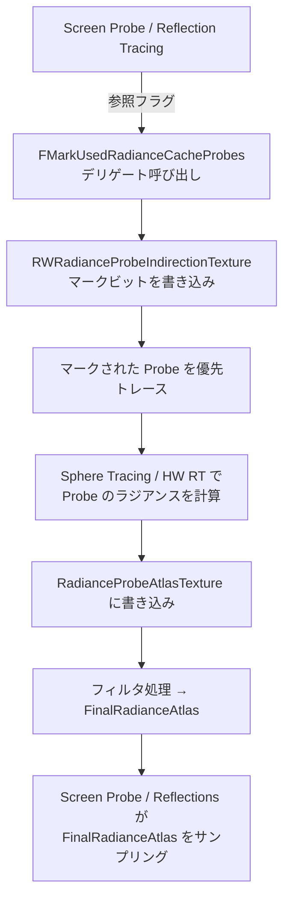

# Lumen Radiance Cache（放射輝度キャッシュ）

- 上位: [[02_lumen_overview]]
- 関連: [[lumen_diffuse_gi]] | [[lumen_reflections]] | [[lumen_tracing]]

---

## 概要

Screen Probe（[[lumen_diffuse_gi]]）や反射（[[lumen_reflections]]）から飛ばしたレイが  
**遠距離**に到達した場合、毎フレーム全てをトレースするとコストが高い。

Radiance Cache は **ワールド空間に3Dプローブを格子配置** し、  
低頻度で更新しながら補間して使い回すことでコストを削減する。

```
レイが遠距離に到達
  → Radiance Cache の近くのプローブを補間してサンプリング
  → プローブ自体は低頻度でトレース（毎フレームでない）
```

---

## クリップマップ構造

カメラ中心に **複数段のクリップマップ** を持ち、遠距離ほど疎なプローブ配置になる。

```
クリップマップ 0（近距離）: プローブ密度 高・更新頻度 高
クリップマップ 1（中距離）: プローブ密度 中・更新頻度 中
クリップマップ 2（遠距離）: プローブ密度 低・更新頻度 低
  ...
最大 MaxClipmaps 段（LumenViewState.h より: MaxVoxelClipmapLevels = 8）
```

### FRadianceCacheClipmap（1段分の設定）

```cpp
class FRadianceCacheClipmap {
    FVector Center;     // このクリップマップのワールド空間中心
    float Extent;       // クリップマップの半辺長

    FVector3d CornerWorldSpace;        // グリッドコーナー位置（倍精度）
    FVector3f CornerTranslatedWorldSpace; // 翻訳済みワールド座標

    float ProbeTMin;   // レイの最小距離（自己交差防止）

    // スクロール更新用 UV オフセット
    // カメラが動いた分だけオフセットして、新しいプローブだけ更新
    FVector VolumeUVOffset;

    float CellSize;    // プローブ間の間隔（ワールド単位）
};
```

### スクロール更新（Scrolling）

クリップマップはカメラと共に移動するが、全プローブを毎フレーム再トレースはしない。  
`VolumeUVOffset` でスクロールし、**新たに見えてきた端のプローブのみ更新**する。

```
前フレーム:  [A][B][C][D][E]
カメラが右に移動
今フレーム:  [B][C][D][E][F] ← [F] だけ新規トレース
             [A] は VolumeUVOffset で「ラップアラウンド」して [F] の場所に再利用
```

---

## FRadianceCacheState（GPU リソース一覧）

```cpp
class FRadianceCacheState {
    // クリップマップ配列
    TArray<FRadianceCacheClipmap> Clipmaps;
    float ClipmapWorldExtent;        // 全クリップマップの最大半径
    float ClipmapDistributionBase;   // クリップマップの指数的拡大の底
    float CachedLightingPreExposure; // 前回のライティング露出値

    // === GPU テクスチャ ===

    // Probe インデックスの 3D テクスチャ（ワールド位置 → プローブインデックス）
    TRefCountPtr<IPooledRenderTarget> RadianceProbeIndirectionTexture;

    // 各 Probe の放射輝度（Octahedral マッピング）
    TRefCountPtr<IPooledRenderTarget> RadianceProbeAtlasTexture;
    // 空の可視性（Sky Visibility）プローブ
    TRefCountPtr<IPooledRenderTarget> SkyVisibilityProbeAtlasTexture;

    // フィルタ済み最終アトラス（サンプリング用）
    TRefCountPtr<IPooledRenderTarget> FinalRadianceAtlas;     // 放射輝度
    TRefCountPtr<IPooledRenderTarget> FinalSkyVisibilityAtlas;
    TRefCountPtr<IPooledRenderTarget> FinalIrradianceAtlas;   // 放射照度（積分済み）
    TRefCountPtr<IPooledRenderTarget> ProbeOcclusionAtlas;    // オクルージョン情報

    // Probe の深度（方向別の距離情報）
    TRefCountPtr<IPooledRenderTarget> DepthProbeAtlasTexture;

    // === GPU バッファ（プローブ生存管理）===
    TRefCountPtr<FRDGPooledBuffer> ProbeAllocator;         // 使用中プローブ数
    TRefCountPtr<FRDGPooledBuffer> ProbeFreeListAllocator; // 空きリストのサイズ
    TRefCountPtr<FRDGPooledBuffer> ProbeFreeList;          // 再利用可能な Probe インデックス
    TRefCountPtr<FRDGPooledBuffer> ProbeLastUsedFrame;     // 最後に参照されたフレーム番号
    TRefCountPtr<FRDGPooledBuffer> ProbeLastTracedFrame;   // 最後にトレースしたフレーム番号
    TRefCountPtr<FRDGPooledBuffer> ProbeWorldOffset;       // ワールド空間オフセット
};
```

---

## FRadianceCacheConfiguration（設定）

```cpp
struct FRadianceCacheConfiguration {
    bool bFarField = true;       // 遠距離（Far Field）プローブを使うか
    bool bSkyVisibility = false; // 空の可視性プローブを有効にするか
};
```

---

## 更新フロー（フレームごと）



### FMarkUsedRadianceCacheProbes デリゲート

```cpp
// LumenRadianceCache.h
DECLARE_MULTICAST_DELEGATE_ThreeParams(
    FMarkUsedRadianceCacheProbes,
    FRDGBuilder&,
    const FViewInfo&,
    const LumenRadianceCache::FRadianceCacheMarkParameters&
);

// FUpdateInputs に2つある（Graphics Pass 用と Compute Pass 用）
FMarkUsedRadianceCacheProbes GraphicsMarkUsedRadianceCacheProbes;
FMarkUsedRadianceCacheProbes ComputeMarkUsedRadianceCacheProbes;
```

マーク用パラメータ：

```cpp
BEGIN_SHADER_PARAMETER_STRUCT(FRadianceCacheMarkParameters, )
    // 3D テクスチャ（ワールド位置 → Probe インデックスのマップ）
    SHADER_PARAMETER_RDG_TEXTURE_UAV(RWTexture3D<uint>, RWRadianceProbeIndirectionTexture)
    // クリップマップのコーナー位置とセルサイズ
    SHADER_PARAMETER_ARRAY(FVector4f, ClipmapCornerTWSAndCellSizeForMark, [MaxClipmaps])
    SHADER_PARAMETER(uint32, RadianceProbeClipmapResolutionForMark)
    SHADER_PARAMETER(uint32, NumRadianceProbeClipmapsForMark)
    SHADER_PARAMETER(float, InvClipmapFadeSizeForMark)
END_SHADER_PARAMETER_STRUCT()
```

---

## サンプリング（FinalRadianceAtlas から）

Screen Probe や Reflections がキャッシュを使う際は  
`FinalRadianceAtlas` から Octahedral マッピングでサンプリングする。

```
ワールド空間位置 → クリップマップレベル選択
  → RadianceProbeIndirectionTexture で Probe インデックス取得
  → FinalRadianceAtlas の対応する Probe テクセルを Octahedral で参照
  → 隣接プローブと補間して最終ラジアンス取得
```

---

## 主要定数（Lumen.h より）

```cpp
// Probe のページ・解像度関連
constexpr uint32 PhysicalPageSize = 128;  // 物理ページ サイズ（テクセル）
constexpr float MaxTraceDistance = 0.5f * UE_OLD_WORLD_MAX;  // 最大トレース距離

// クリップマップ関連（LumenViewState.h より）
const static int32 MaxVoxelClipmapLevels = 8;  // 最大クリップマップ段数
```

---

## 主要 CVar

```
r.LumenScene.RadianceCache.NumClipmaps = 4
    ← クリップマップの段数（多いほど遠距離も高品質）

r.LumenScene.RadianceCache.ClipmapWorldExtent
    ← 最大クリップマップの半径（ワールド単位）

r.LumenScene.RadianceCache.ProbeResolution = 32
    ← 1プローブあたりのテクセル数（32×32 = 1024 テクセル/プローブ）

r.LumenScene.RadianceCache.NumProbesToTraceBudget
    ← 1フレームにトレースする Probe 数の上限

r.Lumen.RadianceCache.FarField.Enable = 1
    ← 遠距離フィールドプローブの有効/無効
```

---

## 関連ソースファイル

| ファイル | 役割 |
|---------|------|
| `LumenRadianceCache.h/cpp` | Radiance Cache メインシステム |
| `LumenRadianceCacheInternal.h` | 内部実装の共有ヘッダ |
| `LumenRadianceCacheInterpolation.h` | サンプリング・補間処理 |
| `LumenRadianceCacheHardwareRayTracing.cpp` | HW RT バリアント |
| `LumenViewState.h` | FRadianceCacheState / FRadianceCacheClipmap の定義 |
| `LumenTranslucencyRadianceCache.cpp` | 半透明オブジェクト用の Radiance Cache |
