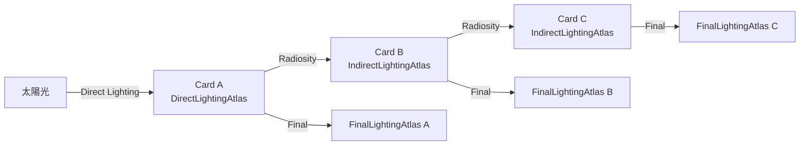

# Lumen Scene Lighting（Surface Cache への照明焼き込み）

- 上位: [[02_lumen_overview]]
- 関連: [[lumen_surface_cache]] | [[lumen_tracing]]

---

## 概要

[[lumen_surface_cache]] で構築された Surface Cache に  
**直接光（Direct Lighting）** と **Radiosity（間接光のバウンス）** を書き込む段階。  

ここで各 Card が「どう照らされているか」が確定し、  
[[lumen_tracing]] がレイをヒットさせたとき Surface Cache からライティング情報を読み出せるようになる。

---

## Surface Cache のライティングアトラス

```
DirectLightingAtlas    ← ここに直接光を書き込む（本ページの主題）
IndirectLightingAtlas  ← ここに Radiosity を書き込む（本ページの主題）
FinalLightingAtlas     ← Direct + Indirect の合成済み（トレースシェーダーが参照）
```

---

## 1. Direct Lighting（直接光）

### 担当ファイル
| ファイル | 内容 |
|---------|------|
| `LumenSceneDirectLighting.cpp` | メインパス |
| `LumenSceneDirectLightingHardwareRayTracing.cpp` | HW RT バリアント |
| `LumenSceneDirectLightingStochastic.inl` | 確率的サンプリングバリアント |

### 処理の流れ

```
各 FLumenCard について:
  1. そのCardの空間位置・法線方向を取得
  2. シーン上の全ライトのうち、このCardに影響するライトを列挙
  3. Shadow（Virtual Shadow Maps との統合）を考慮して直接光を計算
  4. DirectLightingAtlas の対応テクセルに書き込む
```

### FLumenCardUpdateContext（更新バッチ管理）

```cpp
// 1フレームに更新する Card のページリストを管理
class FLumenCardUpdateContext {
    FRDGBufferRef CardPageIndexAllocator;   // 何ページ更新するか
    FRDGBufferRef CardPageIndexData;        // 更新対象ページのインデックス
    FRDGBufferRef DrawCardPageIndicesIndirectArgs;     // Graphics用間接引数
    FRDGBufferRef DispatchCardPageIndicesIndirectArgs; // Compute用間接引数
    FIntPoint UpdateAtlasSize;   // このフレームの更新アトラスサイズ
    uint32 MaxUpdateTiles;       // 最大更新タイル数
    uint32 UpdateFactor;         // 更新係数
};

// EIndirectArgOffset: DrawCall の間接引数のオフセット定義
enum EIndirectArgOffset {
    ThreadPerPage = 0 * sizeof(FRHIDispatchIndirectParameters),
    ThreadPerTile = 1 * sizeof(FRHIDispatchIndirectParameters),
};
```

### アトラスへの描画（FRasterizeToCardsVS）

Card のテクセルをアトラス上の適切な位置に描画するための頂点シェーダー。

```cpp
class FRasterizeToCardsVS : public FGlobalShader {
    // DECLARE_GLOBAL_SHADER: グローバルシェーダーとして登録
    // SHADER_USE_PARAMETER_STRUCT: 型安全なパラメータバインド

    BEGIN_SHADER_PARAMETER_STRUCT(FParameters, )
        SHADER_PARAMETER_RDG_UNIFORM_BUFFER(FLumenCardScene, LumenCardScene)
        // DrawIndirectArgs: GPU Driven な間接描画引数
        RDG_BUFFER_ACCESS(DrawIndirectArgs, ERHIAccess::IndirectArgs)
        SHADER_PARAMETER_RDG_BUFFER_SRV(StructuredBuffer<uint>, CardPageIndexData)
        SHADER_PARAMETER(FVector2f, IndirectLightingAtlasSize)
    END_SHADER_PARAMETER_STRUCT()
};
```

### HW Ray Tracing バリアント

`r.Lumen.HardwareRayTracing = 1` の場合、Direct Lighting の Shadow 計算に  
DXR / Vulkan Ray Tracing を使用して精度を高める。

```
通常（Software）:
  Virtual Shadow Maps による Shadow → 高速・中精度

HW Ray Tracing:
  実際の Ray を飛ばしてシャドウを判定 → 低速・高精度
  LumenSceneDirectLightingHardwareRayTracing.cpp が担当
```

---

## 2. Radiosity（間接光バウンス）

### 担当ファイル
| ファイル | 内容 |
|---------|------|
| `LumenRadiosity.cpp` | Radiosity メインパス |
| `LumenRadiosity.h` | LumenRadiosity 名前空間・共有定義 |

### 何をするか

Direct Lighting で照らされた Card の光が、別の Card に当たって跳ね返る  
**間接光（1バウンス目以降）** を計算する処理。

```
Card A（直接光で照らされている）
  → Card A の FinalLightingAtlas を参照して輝度を取得
  → Card A から Card B に向けてレイを飛ばす
  → Card B の IndirectLightingAtlas に書き込む
```

これを繰り返すことで多バウンスの間接光を近似する（ただし収束は数フレームかかる）。

### FLumenRadiosityの処理概念図



---

## 3. FinalLightingAtlas の合成

```
FinalLightingAtlas = DirectLightingAtlas + IndirectLightingAtlas
```

これが [[lumen_tracing]] でレイがヒットした後に参照するアトラス。  
トレーシングシェーダーは `FLumenCardTracingParameters::FinalLightingAtlas` から  
ヒット地点のライティング情報を取得する。

---

## 主要 CVar

```
# Direct Lighting
r.LumenScene.DirectLighting.Allow = 1
r.Lumen.HardwareRayTracing = 0        ← 0:Software / 1:HW RT

# Radiosity
r.LumenScene.Radiosity.Allow = 1
```

---

## 関連ソースファイル

| ファイル | 役割 |
|---------|------|
| `LumenSceneDirectLighting.cpp` | 直接光のメインパス |
| `LumenSceneDirectLightingHardwareRayTracing.cpp` | HW RT による直接光シャドウ |
| `LumenSceneLighting.h` | FLumenCardUpdateContext・FRasterizeToCardsVS |
| `LumenRadiosity.cpp/h` | 間接光バウンス計算 |
| `LumenSceneLighting.cpp` | ライティング全体のオーケストレーション |
