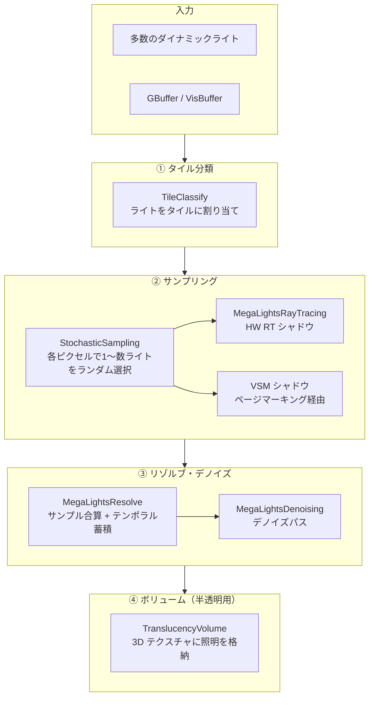

# MegaLights 全体概要

- 取得日: 2026-04-10
- 対象: `D:\UnrealEngine\Engine\Source\Runtime\Renderer\Private\MegaLights\`
- 上位: [[01_rendering_overview]]

---

## MegaLights とは

**多数のダイナミックライトを確率的サンプリングで効率よく処理する**システム（UE5.4〜）。  
従来は数十個程度が限界だったダイナミックライトを、  
ストキャスティックライティング（サンプリング＋デノイズ）によって数千個規模で扱えるようにする。

| 従来の問題 | MegaLights の解法 |
|-----------|-----------------|
| ライトごとに描画コストが線形増加 | タイル分類 + 確率的サンプリング（固定コスト） |
| シャドウ付きローカルライトは VSM が必要 | RT シャドウ or VSM を柔軟に選択 |
| 半透明への照明が難しい | TranslucencyVolume による近似 |

---

## 全体アーキテクチャ



---

## 動作モード

```cpp
enum class EMegaLightsMode
{
    Disabled,    // 無効
    EnabledRT,   // HW Ray Tracing シャドウ使用
    EnabledVSM,  // Virtual Shadow Maps シャドウ使用
};
```

---

## フレームの流れ（概略）

```
[A] TileClassify       → ライトをスクリーン空間タイルに割り当て
                          EMaterialSource ごとにダウンサンプルファクタを決定

[B] Stochastic Sampling → 各タイルで代表ライトをランダム選択
                           Far Field GDF 対応（UseFarField）

[C] Shadow             → EnabledRT: HW RT でシャドウレイ発射
                          EnabledVSM: VSM ページマーキング経由

[D] MegaLightsResolve  → 全サンプルを合算・正規化

[E] Denoising          → テンポラルフィルタ

[F] Translucency Volume → 半透明への MegaLights 照明を 3D ボリュームに焼き込み
```

---

## 主要クラス・構造体

```cpp
// ライティングボリューム（半透明用 3D テクスチャ）
class FMegaLightsVolume
{
    FRDGTextureRef Texture;                         // 不透明ライティング
    FRDGTextureRef TranslucencyAmbient[TVC_MAX];    // 半透明アンビエント
    FRDGTextureRef TranslucencyDirectional[TVC_MAX];// 半透明ディレクショナル
};

// タイル分類シェーダーパラメータ
BEGIN_SHADER_PARAMETER_STRUCT(FTileClassifyParameters, )
    SHADER_PARAMETER(uint32, EnableTexturedRectLights)
END_SHADER_PARAMETER_STRUCT()
```

---

## 主要関数（`MegaLights` namespace）

| 関数 | 説明 |
|------|------|
| `IsEnabled(ViewFamily)` | MegaLights が有効かどうか |
| `GetMegaLightsMode(ViewFamily, LightType, ...)` | ライトごとのモード（Disabled/RT/VSM）を返す |
| `UseHardwareRayTracing(ViewFamily)` | HW RT を使用するか |
| `UseVolume()` | ボリューム照明（TranslucencyVolume）を使うか |
| `IsMarkingVSMPages()` | VSM ページマーキングを実行するか |
| `GetDownsampleFactorXY(MaterialSource, Platform)` | マテリアルソース別のダウンサンプル係数 |

---

## 主要 CVar 一覧

| CVar | デフォルト | 説明 |
|------|----------|------|
| `r.MegaLights` | 0 | MegaLights 有効（0=無効, 1=VSM, 2=RT） |
| `r.MegaLights.HardwareRayTracing` | 1 | HW RT シャドウ使用 |
| `r.MegaLights.Volume` | 1 | TranslucencyVolume 有効 |
| `r.MegaLights.FarField` | 1 | Far Field GDF 使用 |
| `r.MegaLights.Denoiser` | 1 | デノイザー有効 |

---

## コード実行フロー

### エントリポイント

```
FDeferredShadingSceneRenderer::Render()
  │
  └─ RenderMegaLights(                               DeferredShadingRenderer.cpp:3318
         GraphBuilder,
         MegaLightsFrameTemporaries,
         SceneTextures,
         NaniteShadingMasks,
         LightingChannelsTexture)
       │                                              MegaLights.cpp:1959
       └─ for each ViewIndex:
           ├─ RenderMegaLightsViewContext(ViewContext, ...)       // GBuffer 入力
           │   │                                     MegaLights.cpp:1920
           │   ├─ [A] DownsampleSceneDepth / WorldNormal
           │   │       半解像度 Depth / Normal テクスチャを生成
           │   │
           │   ├─ [B] GenerateLightSamples            MegaLightsSampling.cpp
           │   │       FGenerateLightSamplesCS
           │   │       各ピクセルにランダムでライトをサンプリング
           │   │       → LightSamples テクスチャ（ライト ID + 方向）
           │   │
           │   ├─ [C] VisibilityTest（シャドウ）
           │   │   ├─ [EnabledRT]  MegaLights::RayTraceLightSamples()
           │   │   │               HW RT でシャドウレイを発射
           │   │   └─ [EnabledVSM] MegaLights::MarkVSMPages()
           │   │               VSM ページマーキング経由
           │   │
           │   ├─ [D] Resolve                         MegaLightsResolve.cpp
           │   │       FMegaLightsResolveCS
           │   │       BRDF 評価 → 全サンプル合算・正規化
           │   │
           │   ├─ [E] Denoise                         MegaLightsDenoising.cpp
           │   │   ├─ Temporal: History ブレンド
           │   │   └─ Spatial:  空間フィルタ
           │   │
           │   └─ [F] [Volume 有効] TranslucencyVolume
           │           半透明用 3D ボリュームに照明を注入
           │
           └─ [HairStrands 有効]
               RenderMegaLightsViewContext(ViewContextHair, ...)
```

### 関与クラス・関数一覧

| クラス / 関数 | ファイル | 役割 |
|-------------|--------|------|
| `MegaLights::IsEnabled(ViewFamily)` | `MegaLights.h` | 有効条件判定 |
| `RenderMegaLights()` | `MegaLights.cpp:1959` | 全ビューのオーケストレーション |
| `RenderMegaLightsViewContext()` | `MegaLights.cpp:1920` | 1ビュー分のパス実行 |
| `FGenerateLightSamplesCS` | `MegaLightsSampling.cpp` | ランダムライトサンプリング CS |
| `MegaLights::RayTraceLightSamples()` | `MegaLightsRayTracing.cpp` | HW RT シャドウ |
| `MegaLights::MarkVSMPages()` | `MegaLights.cpp` | VSM ページマーキング |
| `FMegaLightsResolveCS` | `MegaLightsResolve.cpp` | BRDF 評価・合算 |
| `FMegaLightsFrameTemporaries` | `MegaLightsInternal.h` | フレームリソース一時保持 |

### サブシステムドキュメント

| ドキュメント | 内容 |
|------------|------|
| [[a_megalights_pipeline]] | パイプライン全体・EMegaLightsInput |
| [[b_megalights_sampling]] | 確率的サンプリング詳細 |
| [[c_megalights_shadow]] | RT / VSM シャドウ統合 |
| [[d_megalights_resolve]] | Resolve・Denoise・Volume 注入 |
| [[ref_megalights_core]] | コア型定義リファレンス |

---

## 主要ソースファイル一覧

| ファイル | 役割 |
|---------|------|
| `MegaLights.h/.cpp` | エントリポイント・タイル分類・全体オーケストレーション |
| `MegaLightsInternal.h` | 内部共通型定義 |
| `MegaLightsSampling.cpp` | 確率的ライトサンプリング |
| `MegaLightsRayTracing.cpp` | HW RT シャドウパス |
| `MegaLightsResolve.cpp` | サンプル合算・リゾルブ |
| `MegaLightsDenoising.cpp` | テンポラルデノイズ |
| `MegaLightsViewState.h` | フレーム間ステート（テンポラル蓄積用） |
