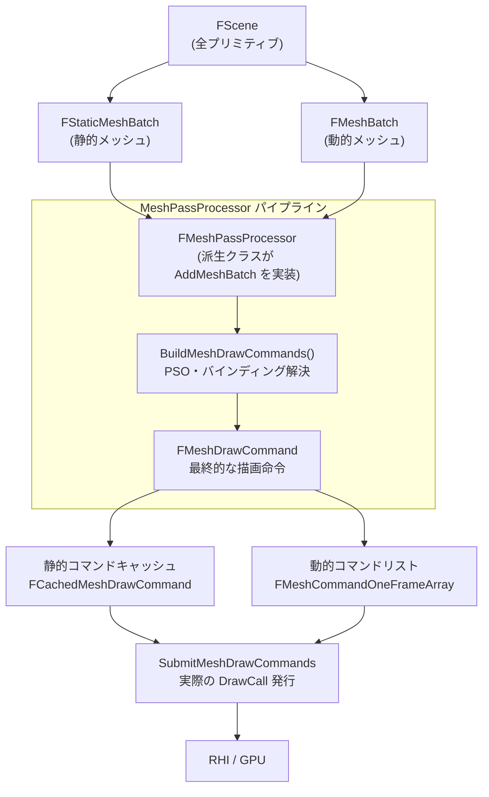

# MeshPassProcessor 全体概要

- 取得日: 2026-04-10
- 対象: `D:\UnrealEngine\Engine\Source\Runtime\Renderer\`
- 上位: [[01_rendering_overview]]
- Details: [[a_mpp_pipeline]] | [[b_mpp_drawcommand]] | [[c_mpp_shaders]] | [[d_mpp_passes]]
- Reference: [[ref_mpp_processor]] | [[ref_mpp_drawcommand]] | [[ref_mpp_shaders]] | [[ref_mpp_utils]]

---

## MeshPassProcessor とは

UE5 のジオメトリ描画パイプラインのコア。  
マテリアル・シェーダー・レンダーステートを組み合わせて **`FMeshDrawCommand`** を生成し、  
GPU に送るためのパイプラインを担うクラス群。

`FMeshPassProcessor` を継承した各パス固有のクラスが `AddMeshBatch()` を実装し、  
メッシュごとに PSO・バインディングを解決して `FMeshDrawCommand` を生成する。

---

## 全体アーキテクチャ



---

## 静的 vs 動的メッシュコマンド

| 種別 | 対象 | 生成タイミング | キャッシュ |
|------|------|--------------|----------|
| **静的コマンド** | `FStaticMeshBatch` | シーン追加時（1回） | `FCachedMeshDrawCommands` に保持 |
| **動的コマンド** | `FMeshBatch` | 毎フレーム | `FMeshCommandOneFrameArray`（フレーム末に破棄）|

---

## フレームの流れ

```
[シーン追加時]
FPrimitiveSceneInfo::AddStaticMeshes()
  └─ FMeshPassProcessor::AddMeshBatch()
       └─ BuildMeshDrawCommands()
            └─ FMeshDrawCommand 生成 → FCachedMeshDrawCommands に保存

[毎フレーム描画時]
FDeferredShadingRenderer::RenderXxxPass()
  └─ FMeshPassDrawListContext に dynamic MeshBatch を登録
       └─ FMeshPassProcessor::AddMeshBatch()
            └─ BuildMeshDrawCommands()
                 └─ FMeshCommandOneFrameArray に追加

  → SubmitMeshDrawCommands()
       └─ 静的 + 動的コマンドをマージして DrawCall 発行
```

---

## EMeshPass — パス一覧（抜粋）

| パス | 用途 |
|------|------|
| `DepthPass` | デプスプリパス |
| `BasePass` | GBuffer 書き込み（非Nanite） |
| `CSMShadowDepth` | カスケードシャドウマップ |
| `VSMShadowDepth` | Virtual Shadow Maps |
| `Velocity` | ベロシティバッファ |
| `TranslucencyStandard` | 半透明（標準） |
| `CustomDepth` | カスタム深度 |
| `LumenCardCapture` | Lumen Surface Cache 更新 |
| `NaniteMeshPass` | Nanite 通過メッシュ |
| `MeshDecal_DBuffer` | メッシュデカール |
| `HitProxy` (Editor) | エディタ選択判定 |

---

## 主要クラス一覧

| クラス | 役割 |
|--------|------|
| `FMeshPassProcessor` | 全パスの基底クラス。`AddMeshBatch()` をサブクラスが実装 |
| `FMeshDrawCommand` | RHI に直結した描画命令（PSO・バインディング・Draw引数）|
| `FMeshMaterialShader` | メッシュ用マテリアルシェーダーの基底 |
| `FMeshDrawShaderBindings` | シェーダーバインディングのストレージ |
| `FMeshPassProcessorRenderState` | ブレンドステート・深度ステンシルステート |
| `FMeshDrawCommandSortKey` | ドローコールのソートキー（BasePass/Translucent）|

---

## 主要ソースファイル一覧

| ファイル | 役割 |
|---------|------|
| `Public/MeshPassProcessor.h` | 基底クラス・`EMeshPass` enum |
| `Public/MeshPassProcessor.inl` | テンプレートメソッドのインライン実装 |
| `Private/MeshPassProcessor.cpp` | 実装本体 |
| `Private/MeshDrawCommands.h/.cpp` | `FMeshDrawCommand` の生成・実行 |
| `Public/MeshDrawShaderBindings.h` | シェーダーバインディング |
| `Public/MeshMaterialShader.h` | `FMeshMaterialShader` 基底 |
| `Public/MeshPassUtils.h` | `PassProcessorRenderState` ユーティリティ |
| `Public/SimpleMeshDrawCommandPass.h` | `AddSimpleMeshPass()` ヘルパー |
| `Private/MeshDrawCommandStats.h/.cpp` | デバッグ統計 |

---

## コード実行フロー

### エントリポイント

```
─── シーン追加時（静的コマンドキャッシュ）─────────────────────
UPrimitiveComponent::MarkRenderStateDirty() or AddToScene()
  └─ ENQUEUE_RENDER_COMMAND
       └─ FScene::AddPrimitive()
            └─ FPrimitiveSceneInfo::AddStaticMeshes()   PrimitiveSceneInfo.cpp:1537
                 └─ CacheMeshDrawCommands()              PrimitiveSceneInfo.cpp:583
                      └─ EMeshPass ごとに:
                           FPassProcessorManager::CreateMeshPassProcessor()
                             └─ AddMeshBatch() → BuildMeshDrawCommands()
                                  └─ FCachedPassMeshDrawListContextImmediate::FinalizeCommand()
                                       MeshPassProcessor.cpp:2032
                                       → FCachedPassMeshDrawList に永続保存

─── 毎フレーム（可視性 & DrawCall）─────────────────────────────
FDeferredShadingSceneRenderer::BeginInitViews()
  └─ FrustumCull → PrimitiveVisibilityMap 確定
       └─ ComputeRelevance → PrimitiveViewRelevanceMap 確定
            └─ GatherDynamicMeshElements
                 └─ FMeshPassProcessor::AddMeshBatch() [動的プリミティブ]
                      └─ BuildMeshDrawCommands()
                           └─ FDynamicPassMeshDrawListContext::FinalizeCommand()

FDeferredShadingSceneRenderer::RenderXxxPass()
  └─ VisibleMeshDrawCommands に静的コマンドをコピー (可視フラグ分)
  └─ SortMeshDrawCommands() (FMeshDrawCommandSortKey 昇順)
  └─ SubmitMeshDrawCommands()              MeshPassProcessor.cpp:1604
       └─ SubmitMeshDrawCommandsRange()   MeshPassProcessor.cpp:1616
            └─ FMeshDrawCommand::SubmitDraw()
                 ├─ SubmitDrawBegin(): PSO セット・バインディング適用
                 └─ SubmitDrawEnd():  DrawIndexedPrimitive / DrawPrimitive
```

### フロー詳細

1. **キャッシュ生成** `PrimitiveSceneInfo.cpp:583`  
   プリミティブのシーン追加時に `CacheMeshDrawCommands()` が全 EMeshPass を対象にプロセッサを生成し `FMeshDrawCommand` を確定させる。以後プリミティブ変化がなければ再生成なし。

2. **可視性フィルタリング**  
   `FrustumCull` + HZB オクルージョンで `PrimitiveVisibilityMap` を確定。`ComputeRelevance` で各プリミティブがどのパスに参加するかを `FPrimitiveViewRelevance` に記録する。

3. **動的コマンド生成**  
   `GatherDynamicMeshElements` がスケルタルメッシュ等の動的プリミティブに対して `AddMeshBatch()` を呼び出し、`FMeshCommandOneFrameArray` にコマンドを積む。

4. **ソート & インスタンシング**  
   `FMeshDrawCommandSortKey::PackedData` の昇順ソート後、`MatchesForDynamicInstancing()` で連続する同 PSO コマンドをインスタンスとしてまとめる。

5. **DrawCall 発行**  
   `SubmitMeshDrawCommandsRange()` がループで `FMeshDrawCommand::SubmitDraw()` を呼ぶ。`FMeshDrawCommandStateCache` により、前コマンドと同じ PSO / バインディングはスキップして RHI 呼び出しを最小化する。

### 関与クラス・関数一覧

| クラス / 関数 | ファイル:行 | 説明 |
|--------------|------------|------|
| `FPrimitiveSceneInfo::CacheMeshDrawCommands()` | `PrimitiveSceneInfo.cpp:583` | 静的コマンドキャッシュ生成エントリ |
| `FPassProcessorManager::CreateMeshPassProcessor()` | `MeshPassProcessor.h:2353` | EMeshPass からプロセッサをファクトリ生成 |
| `FMeshPassProcessor::AddMeshBatch()` | `MeshPassProcessor.h:2224` | 純粋仮想。PSO・シェーダー解決の入口 |
| `FMeshPassProcessor::BuildMeshDrawCommands()` | `MeshPassProcessor.h:2247` | FMeshDrawCommand 生成コア（テンプレート）|
| `FCachedPassMeshDrawListContextImmediate::FinalizeCommand()` | `MeshPassProcessor.cpp:2032` | 静的キャッシュへの書き込み |
| `FDynamicPassMeshDrawListContext::FinalizeCommand()` | `MeshPassProcessor.h:1820` | 動的フレームリストへの追加 |
| `SubmitMeshDrawCommands()` | `MeshPassProcessor.cpp:1604` | コマンド配列全体の RHI 発行 |
| `SubmitMeshDrawCommandsRange()` | `MeshPassProcessor.cpp:1616` | 並列分割対応の範囲指定発行 |
| `FMeshDrawCommand::SubmitDraw()` | `MeshPassProcessor.h:1416` | 1 コマンドの PSO + Draw 発行 |
| `FMeshDrawCommand::MatchesForDynamicInstancing()` | `MeshPassProcessor.cpp:1018` | 動的インスタンシング可否判定 |
