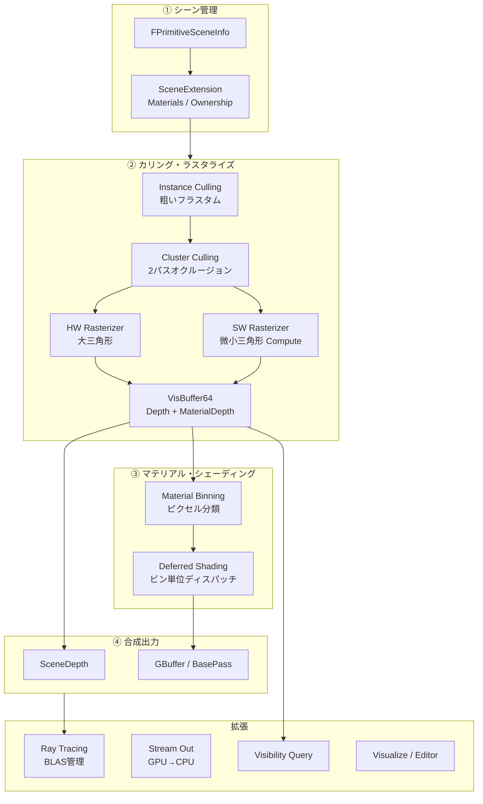

# Nanite 全体概要

- 取得日: 2026-04-10
- 対象: `D:\UnrealEngine\Engine\Source\Runtime\Renderer\Private\Nanite\`
- 上位: [[01_rendering_overview]]

---

## Nanite とは

**仮想化ジオメトリ（Virtualized Geometry）** システム。  
メッシュをクラスター単位で管理し、画面上の三角形密度を1px≒1三角形に近づけることで、  
LOD 管理コストなしに実質無限のポリゴン詳細度をリアルタイムで実現する。

| 従来の問題 | Nanite の解法 |
|-----------|--------------|
| LOD を手動で用意・切り替えが必要 | クラスター単位の自動 LOD（BVH 階層） |
| 大量三角形は Draw Call が爆発 | GPU Driven カリング + 1パスでレンダリング |
| 小さい三角形でも HW ラスタは重い | ソフトウェアラスタ（Compute）で微小三角形を処理 |
| マテリアル毎に Draw Call が増加 | Visibility Buffer + ビン別遅延シェーディング |
| 動的シーンでのストリーミング管理が難しい | GPU Feedback によるページストリーミング |

---

## 全体アーキテクチャ



---

## 各コンポーネントの詳細記事

| # | コンポーネント | 役割 | 詳細記事 |
|---|--------------|------|---------|
| ① | Cull & Raster | GPUドリブンカリング + HW/SW/CSハイブリッドラスタ | [[a_nanite_cull_raster]] |
| ② | Materials & Shading | マテリアルビン分類 + 遅延シェーディング | [[b_nanite_materials_shading]] |
| ③ | Visibility | 可視性クエリ・オーナーシップフィルタ | [[c_nanite_visibility]] |
| ④ | Ray Tracing | BLAS構築 + ストリームアウト | [[d_nanite_ray_tracing]] |
| ⑤ | Tessellation & Voxel | マイクロポリゴンテッセレーション + ボクセル | [[e_nanite_tess_voxel]] |
| ⑥ | Debug & Editor | デバッグビュー・エディタ選択・フィードバック | [[f_nanite_debug_editor]] |

---

## フレームの流れ（概略）

```
[A] Instance Culling   → 粗いフラスタム・距離カリング（GPU Driven）
[B] Cluster Culling    → 2パス：前フレームDepthでオクルージョン→残りを追加カリング
[C] Rasterization      → 大三角形=HW / 微小三角形=SW(Compute) → VisBuffer64へ
[D] Material Binning   → VisBufferからピクセルをマテリアルID別に分類
[E] Deferred Shading   → ビン単位でシェーダーディスパッチ → GBuffer出力
[F] Composition        → SceneDepth / CustomDepth / Stencil を確定
```

---

## 主要ソースファイル一覧

| ファイル | 役割 |
|---------|------|
| `Nanite.h/.cpp` | エントリポイント・FSharedContext / FRasterResults / シャドウ発行 |
| `NaniteShared.h/.cpp` | FPackedView / FGlobalResources / シェーダー基底クラス |
| `NaniteCullRaster.h/.cpp` | カリング・ラスタライズのコア（2パスカリング・HW/SW切り替え） |
| `NaniteComposition.h/.cpp` | SceneDepth / CustomDepth / Stencil の最終出力 |
| `NaniteMaterials.h/.cpp` | マテリアルスロット・ビン分類定義 |
| `NaniteMaterialsSceneExtension.h/.cpp` | マテリアルバッファの GPU 管理・非同期アップロード |
| `NaniteShading.h/.cpp` | シェーディングビン構築・ベースパス・Lumenカードパス |
| `NaniteDrawList.h/.cpp` | ドロー命令リスト（ビン登録・パイプライン遅延構築） |
| `NaniteVisibility.h/.cpp` | 可視性クエリ・並列タスク管理 |
| `NaniteOwnershipVisibilitySceneExtension.h/.cpp` | bOwnerNoSee / bOnlyOwnerSee の GPU 可視性フィルタ |
| `NaniteRayTracing.h/.cpp` | FRayTracingManager・BLAS 構築キュー |
| `NaniteStreamOut.h/.cpp` | GPU→CPU メッシュデータ抽出（RT用） |
| `TessellationTable.cpp` | マイクロポリゴン用テッセレーションテーブル事前生成 |
| `Voxel.h/.cpp` | ボクセルブリックのデバッグ描画 |
| `NaniteVisualize.h/.cpp` | デバッグビューモード・ピッキング表示 |
| `NaniteEditor.h/.cpp` | ヒットプロキシ・エディタ選択オーバーレイ |
| `NaniteFeedback.h/.cpp` | バッファオーバーフロー検出・マテリアル性能警告 |

---

## コード実行フロー

### エントリポイント

```
FDeferredShadingSceneRenderer::Render()
  │
  ├─ RenderNanite()                       DeferredShadingRenderer.cpp:1364
  │    │
  │    ├─ Nanite::InitRasterContext()     DeferredShadingRenderer.cpp:1451
  │    │    → VisBuffer64 / DbgBuffer64 / ShadingMaskBuffer を RDG で確保
  │    │
  │    ├─ Nanite::IRenderer::Create()     DeferredShadingRenderer.cpp:1676
  │    │    → FRasterContext / FSharedContext から具体的レンダラーを生成
  │    │
  │    ├─ NaniteRenderer->DrawGeometry()  DeferredShadingRenderer.cpp:1689
  │    │    → Instance Culling → Cluster Culling → HW/SW Rasterize → VisBuffer
  │    │
  │    └─ NaniteRenderer->ExtractResults() DeferredShadingRenderer.cpp:1696
  │         → FRasterResults（PageRequests / VisibilityResults 等）を取得
  │
  ├─ Nanite::BuildShadingCommands()       DeferredShadingRenderer.cpp:2599
  │    → ENaniteMeshPass::BasePass / LumenCardCapture の IndirectDispatch 引数を構築
  │
  └─ RenderBasePass()
       └─ RenderBasePassInternal()        BasePassRendering.cpp:1449
            └─ RenderNaniteBasePass lambda  BasePassRendering.cpp:1516
                 └─ Nanite::DispatchBasePass()  BasePassRendering.cpp:1543
                      └─ ShadeBinning()    NaniteShading.cpp:1294
                           → ClassifyPixels → BuildShadingBinArgs
                      → IndirectDispatch × ビン数 → GBuffer 書き込み
```

### フロー詳細

1. **RenderNanite()** `DeferredShadingRenderer.cpp:1364`  
   可視性カリング完了後に呼ばれる。`InitRasterContext` でフレーム用バッファを確保し、`IRenderer::Create` で具象レンダラーを生成する。

2. **DrawGeometry()** — 2パスカリング＋ラスタライズ  
   内部でインスタンス→クラスター→三角形の順に GPU Driven カリングを実行。`ERasterScheduling::HardwareAndSoftwareOverlap` の場合は HW ラスタと SW ラスタを非同期コンピュートで同時実行する。結果は `VisBuffer64`（Depth 40bit + MaterialDepth 24bit）に書き込まれる。

3. **BuildShadingCommands()** `DeferredShadingRenderer.cpp:2599`  
   `FNaniteShadingCommands` に各マテリアルビンの IndirectDispatch 引数を構築する。BasePass と LumenCardCapture で別々に呼ばれる。

4. **DispatchBasePass()** `NaniteShading.cpp:1178`  
   `ShadeBinning()` でピクセルをビンに分類した後、ビン単位でコンピュートシェーダーをディスパッチして GBuffer に書き込む。

### 関与クラス・関数一覧

| クラス / 関数 | ファイル:行 | 説明 |
|--------------|------------|------|
| `FDeferredShadingSceneRenderer::RenderNanite()` | `DeferredShadingRenderer.cpp:1364` | Nanite レンダリング全体のエントリ |
| `Nanite::InitRasterContext()` | `DeferredShadingRenderer.cpp:1451` | VisBuffer64 等 RDG テクスチャの確保 |
| `Nanite::IRenderer::Create()` | `NaniteCullRaster.h:181` | 具象レンダラー生成（Factory）|
| `IRenderer::DrawGeometry()` | `NaniteCullRaster.h:197` | Instance/Cluster カリング + HW/SW ラスタ |
| `IRenderer::ExtractResults()` | `NaniteCullRaster.h:250` | FRasterResults の書き出し |
| `Nanite::BuildShadingCommands()` | `NaniteShading.h:49` | ビン別 IndirectDispatch 引数構築 |
| `Nanite::DispatchBasePass()` | `NaniteShading.cpp:1178` | ビン単位 CS ディスパッチ → GBuffer 書き込み |
| `Nanite::ShadeBinning()` | `NaniteShading.cpp:1443` | VisBuffer ピクセルのビン分類 |
| `FDeferredShadingSceneRenderer::RenderBasePass()` | `BasePassRendering.cpp:1071` | BasePass 全体エントリ（Nanite + 非Nanite） |

---

## 有効化条件（`Nanite.h`）

```cpp
// パイプライン種別（カリング・ラスタ関数の引数に使う）
enum class EPipeline : uint8
{
    Primary,       // 通常の BasePass レンダリング
    Shadows,       // シャドウデプス
    Lumen,         // Lumen Surface Cache キャプチャ
    Editor,        // エディタ選択オーバーレイ
    HitProxy,      // ヒットプロキシ描画
};

// ラスタライズスケジューリング
enum class ERasterScheduling : uint8
{
    HardwareOnly,                  // HW ラスタのみ
    HardwareThenSoftware,          // HW → SW（同期）
    HardwareAndSoftwareOverlap,    // HW ∥ SW（非同期コンピュート）
};
```

---

## 主要 CVar 一覧

| CVar | デフォルト | 説明 |
|------|----------|------|
| `r.Nanite.AsyncRasterization` | 1 | 非同期コンピュートラスタ有効 |
| `r.Nanite.ComputeRasterization` | 1 | SW（Compute）ラスタ有効 |
| `r.Nanite.ProgrammableRaster` | 1 | マスク・PDO 等プログラマブルラスタ有効 |
| `r.Nanite.Tessellation` | 0 | マイクロポリゴンテッセレーション有効（実験的） |
| `r.Nanite.MaxPixelsPerEdge` | 1.0 | エッジあたりの目標ピクセル数（LOD 制御） |
| `r.Nanite.MinPixelsPerEdgeHW` | 32.0 | この値以上の三角形を HW ラスタに回す閾値 |
| `r.Nanite.DicingRate` | 1.0 | マイクロポリゴンの目標サイズ |
| `r.Nanite.MeshShaderRasterization` | 1 | メッシュシェーダー使用 |
| `r.Nanite.ResummarizeHTile` | 1 | 深度出力後の H-Tile 再要約 |
| `r.Nanite.ShowStats` | 0 | GPU 統計情報表示 |
| `r.Nanite.Shadows` | 1 | Nanite シャドウ有効 |
