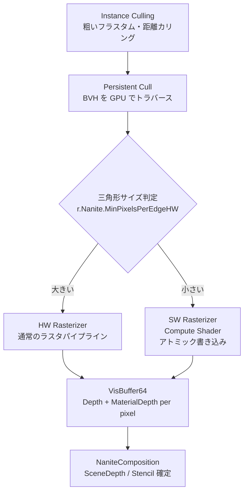

# Nanite Cull & Raster（カリング・ラスタライズ）

- 上位: [[03_nanite_overview]]
- 関連: [[b_nanite_materials_shading]] | [[c_nanite_visibility]]

---

## 概要

Nanite の中核処理。GPU Driven な2段階カリングと、  
HW / SW（Compute）ハイブリッドラスタライズによって  
VisBuffer64（深度 + マテリアル深度）を生成する。

---

## 全体フロー



---

## 2パスオクルージョンカリング

```
Pass 1（Main Pass）:
  前フレームの HZB（Hierarchical Z Buffer）でクラスターを早期棄却
  → 通過したクラスターをラスタライズ → VisBuffer を更新

Pass 2（Post Pass）:
  Pass 1 の VisBuffer から HZB を再構築
  → Pass 1 で棄却されたが実は可視なクラスターをラスタライズ（アンサンプル救済）
```

---

## 主要クラス・構造体

```cpp
// ラスタライズコンテキスト（フレームごとに作成）
struct FRasterContext
{
    FRasterScheduling RasterScheduling;    // HW Only / HW+SW / Overlap
    EOutputBufferMode OutputBufferMode;    // VisBuffer / Depth Only 等
    FRDGTextureRef VisBuffer64;            // Depth(40bit) + MaterialDepth(24bit)
    FRDGTextureRef DbgBuffer64;            // デバッグ用
    FRDGBufferRef  ShadingMaskBuffer;      // シェーディングマスク
    uint32 RasterBinCount;                 // ラスタライズビン数
};

// ラスタライズ結果（カリング後の統計・フィードバック）
struct FRasterResults
{
    FRDGBufferRef PageRequests;      // ページストリーミング要求
    FRDGBufferRef VisiblePatches;    // 可視パッチリスト（テッセレーション用）
    FNaniteVisibilityResults VisibilityResults;
};

// ERasterScheduling
enum class ERasterScheduling : uint8
{
    HardwareOnly,                 // HW ラスタのみ（コンピュートなし）
    HardwareThenSoftware,         // HW 完了後 SW（同期）
    HardwareAndSoftwareOverlap,   // HW と SW を非同期コンピュートで並列実行
};

// EPipeline（どのパスで使うか）
enum class EPipeline : uint8
{
    Primary,   // BasePass
    Shadows,   // シャドウデプス
    Lumen,     // Lumen Surface Cache
    Editor,    // エディタ選択
    HitProxy,  // ヒットプロキシ
};
```

---

## 主要 CVar

| CVar | デフォルト | 説明 |
|------|----------|------|
| `r.Nanite.AsyncRasterization` | 1 | 非同期コンピュートラスタ有効 |
| `r.Nanite.AsyncRasterization.ShadowDepths` | 1 | シャドウ深度パスの非同期化 |
| `r.Nanite.AsyncRasterization.LumenMeshCards` | 1 | Lumen カードパスの非同期化 |
| `r.Nanite.ComputeRasterization` | 1 | SW（Compute）ラスタ有効 |
| `r.Nanite.ProgrammableRaster` | 1 | マスク・PDO 等プログラマブルラスタ |
| `r.Nanite.MeshShaderRasterization` | 1 | メッシュシェーダー使用 |
| `r.Nanite.PrimShaderRasterization` | 1 | プリミティブシェーダー使用（AMD 向け） |
| `r.Nanite.MaxPixelsPerEdge` | 1.0 | 目標エッジピクセル数（LOD 係数） |
| `r.Nanite.MinPixelsPerEdgeHW` | 32.0 | この値以上を HW ラスタへ回す閾値 |
| `r.Nanite.DepthBucketing` | 1 | 深度バケッティング最適化 |
| `r.Nanite.ResummarizeHTile` | 1 | 深度出力後 H-Tile 再要約 |
| `r.Nanite.DecompressDepth` | 0 | 深度デコンプレス強制 |
| `r.Nanite.CustomDepthExportMethod` | 1 | カスタム深度エクスポート方式 |

---

## 関連ソースファイル

| ファイル | 役割 |
|---------|------|
| `NaniteCullRaster.h/.cpp` | 2パスカリング・HW/SW ラスタライズのコア |
| `NaniteComposition.h/.cpp` | SceneDepth / CustomDepth / Stencil 合成出力 |

---

## コード実行フロー

### エントリポイント

```
FDeferredShadingSceneRenderer::RenderNanite()   DeferredShadingRenderer.cpp:1364
  │
  ├─ Nanite::InitRasterContext()                DeferredShadingRenderer.cpp:1451
  │    NaniteCullRaster.cpp:6121
  │    → VisBuffer64（R64_UINT）を RDG で確保
  │    → ShadingMaskBuffer / DbgBuffer64 を確保
  │    → FRasterContext を返す
  │
  ├─ Nanite::IRenderer::Create()                NaniteCullRaster.h:181
  │    FSharedContext / FRasterContext / FConfiguration を受け取り
  │    → 具象レンダラー（FRenderer）を生成して IRenderer として返す
  │
  ├─ NaniteRenderer->DrawGeometry()             NaniteCullRaster.h:197
  │    │
  │    ├─ [Pass 1: Main Pass]
  │    │    Instance Culling（GPU Driven フラスタム・距離カリング）
  │    │    → Cluster Culling（前フレーム HZB でオクルージョン）
  │    │    → HW Rasterizer（大三角形: r.Nanite.MinPixelsPerEdgeHW以上）
  │    │    → SW Rasterizer（微小三角形: Compute Shader、アトミック書き込み）
  │    │    → VisBuffer64 更新
  │    │
  │    └─ [Pass 2: Post Pass]
  │         Pass 1 VisBuffer から HZB を再構築
  │         → Pass 1 で棄却されたが実は可視なクラスターをラスタライズ
  │         → VisBuffer64 更新（アンサンプル救済）
  │
  ├─ NaniteRenderer->ExtractResults()           DeferredShadingRenderer.cpp:1696
  │    → FRasterResults を取り出す
  │    （PageRequests / VisiblePatches / VisibilityResults）
  │
  └─ Nanite::EmitDepthTargets()                 NaniteComposition.h
       → VisBuffer64 から SceneDepth を確定
```

### フロー詳細

1. **InitRasterContext()** `NaniteCullRaster.cpp:6121`  
   `EOutputBufferMode::VisBuffer` の場合 `VisBuffer64`（64bit = Depth 40bit + MaterialDepth 24bit）を確保。`DepthOnly` の場合はシャドウパス用に深度テクスチャのみ確保する。

2. **IRenderer::Create()** `NaniteCullRaster.h:181`  
   `FSharedContext`（RenderFlags/ShaderMap/Pipeline）と `FRasterContext` を受け取り、内部の具象クラス `FRenderer` を `TUniquePtr<IRenderer>` として返す。

3. **DrawGeometry() — 2パスカリング**  
   Main Pass で前フレーム HZB を使用した保守的カリングを行い、Post Pass でその結果を使って漏れを補完する。この2パス方式により1フレームの遅延でほぼ完全なオクルージョンカリングを実現する。

4. **HW vs SW ラスタ選択**  
   `r.Nanite.MinPixelsPerEdgeHW`（デフォルト32）以上のエッジサイズを持つ三角形は HW ラスタへ。未満は SW ラスタ（Compute）へ振り分ける。`ERasterScheduling::HardwareAndSoftwareOverlap` で両者を非同期コンピュートで並列実行する。

5. **EmitDepthTargets()** `NaniteComposition.h`  
   `VisBuffer64` から SceneDepth と MaterialDepth Stencil を確定し、後続の GBuffer パスが参照できる状態にする。

### 関与クラス・関数一覧

| クラス / 関数 | ファイル:行 | 説明 |
|--------------|------------|------|
| `Nanite::InitRasterContext()` | `NaniteCullRaster.cpp:6121` | VisBuffer64 等の RDG テクスチャ確保 |
| `Nanite::IRenderer::Create()` | `NaniteCullRaster.h:181` | 具象レンダラー生成ファクトリ |
| `IRenderer::DrawGeometry()` | `NaniteCullRaster.h:197` | 2パスカリング + HW/SW ラスタ実行 |
| `IRenderer::ExtractResults()` | `NaniteCullRaster.h:250` | FRasterResults の書き出し |
| `Nanite::EmitDepthTargets()` | `NaniteComposition.h` | VisBuffer64 → SceneDepth 確定 |
| `Nanite::EmitCustomDepthStencilTargets()` | `NaniteComposition.h` | CustomDepth / Stencil 確定 |

---

## 関連リファレンス

| リファレンス | 対象ソース | 主な内容 |
|------------|---------|---------|
| [[ref_nanite_cull_raster]] | `NaniteCullRaster.h/.cpp` | FRasterContext / FRasterResults / InitRasterContext / ERasterScheduling |
| [[ref_nanite_composition]] | `NaniteComposition.h/.cpp` | EmitDepthTargets / EmitCustomDepthStencilTargets / FCustomDepthContext |
