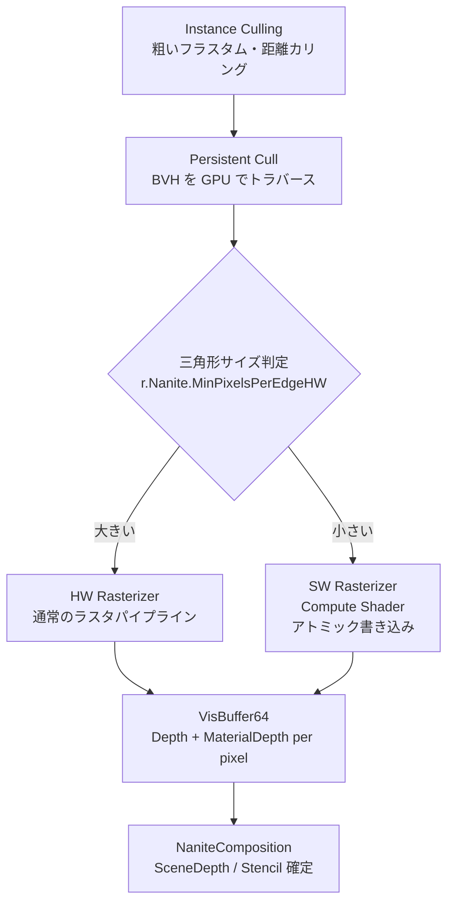

# Nanite Cull & Raster（カリング・ラスタライズ）

- 上位: [[03_nanite_overview]]
- 関連: [[b_nanite_materials_shading]] | [[c_nanite_visibility]]

---

## 概要

Nanite の中核処理。GPU Driven な2段階カリングと、  
HW / SW（Compute）ハイブリッドラスタライズによって  
VisBuffer64（深度 + マテリアル深度）を生成する。

---

## 全体フロー



---

## 2パスオクルージョンカリング

```
Pass 1（Main Pass）:
  前フレームの HZB（Hierarchical Z Buffer）でクラスターを早期棄却
  → 通過したクラスターをラスタライズ → VisBuffer を更新

Pass 2（Post Pass）:
  Pass 1 の VisBuffer から HZB を再構築
  → Pass 1 で棄却されたが実は可視なクラスターをラスタライズ（アンサンプル救済）
```

---

## 主要クラス・構造体

```cpp
// ラスタライズコンテキスト（フレームごとに作成）
struct FRasterContext
{
    FRasterScheduling RasterScheduling;    // HW Only / HW+SW / Overlap
    EOutputBufferMode OutputBufferMode;    // VisBuffer / Depth Only 等
    FRDGTextureRef VisBuffer64;            // Depth(40bit) + MaterialDepth(24bit)
    FRDGTextureRef DbgBuffer64;            // デバッグ用
    FRDGBufferRef  ShadingMaskBuffer;      // シェーディングマスク
    uint32 RasterBinCount;                 // ラスタライズビン数
};

// ラスタライズ結果（カリング後の統計・フィードバック）
struct FRasterResults
{
    FRDGBufferRef PageRequests;      // ページストリーミング要求
    FRDGBufferRef VisiblePatches;    // 可視パッチリスト（テッセレーション用）
    FNaniteVisibilityResults VisibilityResults;
};

// ERasterScheduling
enum class ERasterScheduling : uint8
{
    HardwareOnly,                 // HW ラスタのみ（コンピュートなし）
    HardwareThenSoftware,         // HW 完了後 SW（同期）
    HardwareAndSoftwareOverlap,   // HW と SW を非同期コンピュートで並列実行
};

// EPipeline（どのパスで使うか）
enum class EPipeline : uint8
{
    Primary,   // BasePass
    Shadows,   // シャドウデプス
    Lumen,     // Lumen Surface Cache
    Editor,    // エディタ選択
    HitProxy,  // ヒットプロキシ
};
```

---

## 主要 CVar

| CVar | デフォルト | 説明 |
|------|----------|------|
| `r.Nanite.AsyncRasterization` | 1 | 非同期コンピュートラスタ有効 |
| `r.Nanite.AsyncRasterization.ShadowDepths` | 1 | シャドウ深度パスの非同期化 |
| `r.Nanite.AsyncRasterization.LumenMeshCards` | 1 | Lumen カードパスの非同期化 |
| `r.Nanite.ComputeRasterization` | 1 | SW（Compute）ラスタ有効 |
| `r.Nanite.ProgrammableRaster` | 1 | マスク・PDO 等プログラマブルラスタ |
| `r.Nanite.MeshShaderRasterization` | 1 | メッシュシェーダー使用 |
| `r.Nanite.PrimShaderRasterization` | 1 | プリミティブシェーダー使用（AMD 向け） |
| `r.Nanite.MaxPixelsPerEdge` | 1.0 | 目標エッジピクセル数（LOD 係数） |
| `r.Nanite.MinPixelsPerEdgeHW` | 32.0 | この値以上を HW ラスタへ回す閾値 |
| `r.Nanite.DepthBucketing` | 1 | 深度バケッティング最適化 |
| `r.Nanite.ResummarizeHTile` | 1 | 深度出力後 H-Tile 再要約 |
| `r.Nanite.DecompressDepth` | 0 | 深度デコンプレス強制 |
| `r.Nanite.CustomDepthExportMethod` | 1 | カスタム深度エクスポート方式 |

---

## 関連ソースファイル

| ファイル | 役割 |
|---------|------|
| `NaniteCullRaster.h/.cpp` | 2パスカリング・HW/SW ラスタライズのコア |
| `NaniteComposition.h/.cpp` | SceneDepth / CustomDepth / Stencil 合成出力 |

---

## 関連リファレンス

| リファレンス | 対象ソース | 主な内容 |
|------------|---------|---------|
| [[ref_nanite_cull_raster]] | `NaniteCullRaster.h/.cpp` | FRasterContext / FRasterResults / InitRasterContext / ERasterScheduling |
| [[ref_nanite_composition]] | `NaniteComposition.h/.cpp` | EmitDepthTargets / EmitCustomDepthStencilTargets / FCustomDepthContext |
