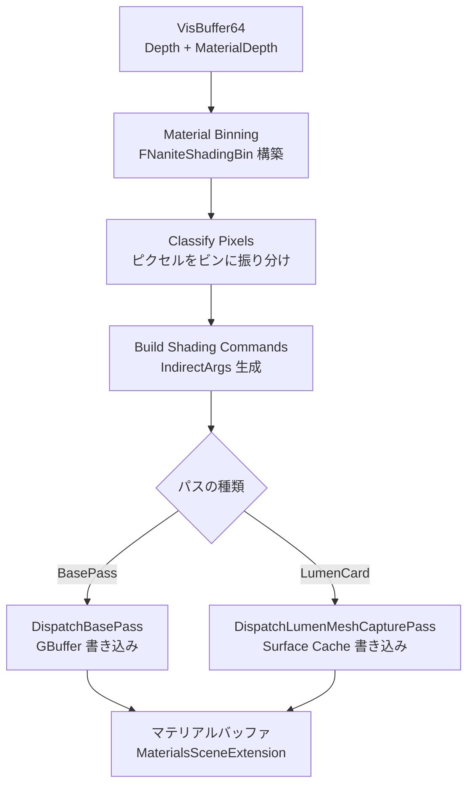

# Nanite Materials & Shading（マテリアル・シェーディング）

- 上位: [[03_nanite_overview]]
- 関連: [[a_nanite_cull_raster]] | [[c_nanite_visibility]]

---

## 概要

VisBuffer から「どのピクセルがどのマテリアルか」を分類（ビニング）し、  
マテリアルビン単位でコンピュートシェーダーをディスパッチして GBuffer に書き込む、  
Nanite の遅延マテリアルシェーディングシステム。

---

## 全体フロー



---

## マテリアルビニングの仕組み

```
VisBuffer の各ピクセルに MaterialDepth が記録されている
  ↓
MaterialDepth → FNaniteMaterialSlot → BinIndex に変換
  ↓
同じ BinIndex のピクセルをまとめて1回のコンピュートディスパッチで処理
  ↓
各ビンのシェーダーが GBuffer に Material Attributes を書き込む
```

---

## 主要クラス・構造体

```cpp
// マテリアルビン（ラスタライズ用）
struct FNaniteRasterBin
{
    int32 BinIndex;      // ビンID（負の値は無効）
    uint16 MaterialFlags; // PDO, Masked, TwoSided 等のフラグ
};

// マテリアルビン（シェーディング用）
struct FNaniteShadingBin
{
    uint32 DataByteOffset; // ビンデータへのオフセット
    uint32 MaterialFlags;  // シェーダー選択フラグ
};

// マテリアルスロット（プリミティブごとのビン索引）
struct FNaniteMaterialSlot
{
    uint32 RasterBin  : 12; // ラスタライズビンID
    uint32 ShadingBin : 12; // シェーディングビンID
    uint32 Flags      : 8;  // 予約
};

// シェーディングパイプライン
struct FNaniteShadingPipeline
{
    FRHIComputePipelineState* ComputePipelineState; // CSO
    bool bIsProgrammable;   // プログラマブルシェーダーか
    bool bForceFullyRough;  // 完全ラフ強制（パフォーマンス用）
};

// マテリアルバッファ管理（SceneExtension）
class FMaterialsSceneExtension : public ISceneExtension
{
    // GPU バッファ（永続）
    FMaterialBuffers Buffers;
    // 非同期アップロード
    FUploader Uploader;
    // ヒットプロキシ ID バッファ
    TUniquePtr<FHitProxyIDBuffer> HitProxyIDBuffer;
};
```

---

## 主要 CVar

| CVar | デフォルト | 説明 |
|------|----------|------|
| `r.Nanite.ProgrammableRaster` | 1 | プログラマブルラスタ（マスク・PDO等）有効 |
| `r.Nanite.MaterialCache` | 1 | マテリアルパイプラインキャッシュ有効 |

---

## 関連ソースファイル

| ファイル | 役割 |
|---------|------|
| `NaniteMaterials.h/.cpp` | FNaniteMaterialSlot / FNaniteShadingBin / ビン分類定義 |
| `NaniteMaterialsSceneExtension.h/.cpp` | GPU バッファ管理・非同期アップロード・SceneExtension 実装 |
| `NaniteShading.h/.cpp` | ShadeBinning / BuildShadingCommands / DispatchBasePass |
| `NaniteDrawList.h/.cpp` | ドロー命令リスト・FNaniteMaterialListContext |

---

## 関連リファレンス

| リファレンス | 対象ソース | 主な内容 |
|------------|---------|---------|
| [[ref_nanite_materials]] | `NaniteMaterials.h/.cpp` | FNaniteMaterialSlot / FNaniteShadingBin / PackMaterialBitFlags |
| [[ref_nanite_materials_scene_ext]] | `NaniteMaterialsSceneExtension.h/.cpp` | FMaterialsSceneExtension / FMaterialBuffers / FUploader |
| [[ref_nanite_shading]] | `NaniteShading.h/.cpp` | FShadeBinning / BuildShadingCommands / DispatchBasePass / DispatchLumenMeshCapturePass |
| [[ref_nanite_draw_list]] | `NaniteDrawList.h/.cpp` | FNaniteMaterialListContext / AddRasterBin / AddShadingBin |
