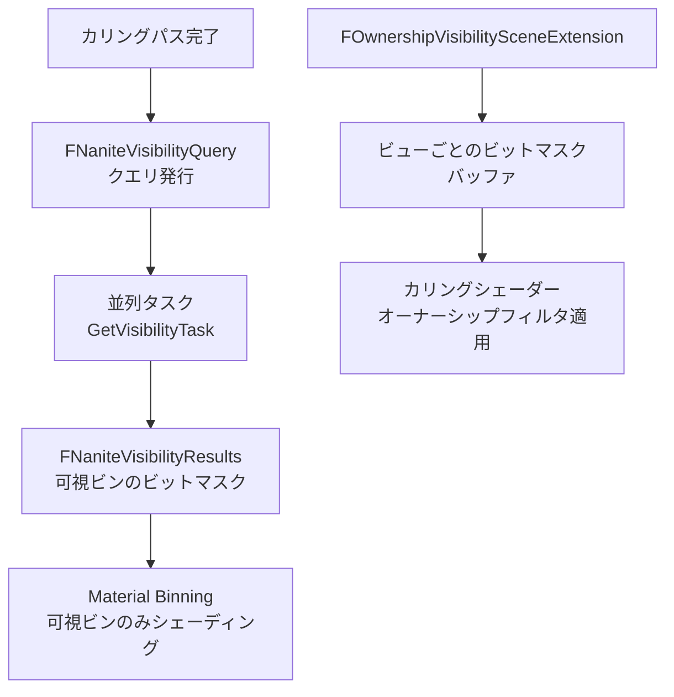

# Nanite Visibility（可視性）

- 上位: [[03_nanite_overview]]
- 関連: [[a_nanite_cull_raster]] | [[b_nanite_materials_shading]]

---

## 概要

Naniteのカリング結果（どのインスタンス・ビンが可視か）を  
非同期タスクで並列管理し、シェーディングパスやマテリアルビン選択に伝えるシステム。  
また `bOwnerNoSee` / `bOnlyOwnerSee` のオーナーシップベース可視性を GPU で処理する。

---

## 全体フロー



---

## 主要クラス・構造体

```cpp
// 可視性テスト結果（ラスタライズビン・シェーディングビンのビットマスク）
struct FNaniteVisibilityResults
{
    // ラスタライズビンが可視かどうかのビットマスク
    TArray<uint32> RasterBinVisibility;
    // シェーディングビンが可視かどうかのビットマスク
    TArray<uint32> ShadingBinVisibility;

    bool IsRasterBinVisible(uint16 BinIndex) const;
    bool IsShadingBinVisible(uint16 BinIndex) const;
    bool IsAnyBinVisible() const;
};

// 可視性管理（フレームをまたいだクエリ管理）
class FNaniteVisibility
{
    // クエリ発行
    FNaniteVisibilityQuery* BeginVisibilityQuery(
        const TArrayView<const FPrimitiveSceneInfo*>& Primitives,
        const FNaniteRasterPipelines* RasterPipelines,
        const FNaniteShadingPipelines* ShadingPipelines);

    // 結果取得（タスク完了待ち）
    const FNaniteVisibilityResults* GetVisibilityResults(
        const FNaniteVisibilityQuery* Query) const;
};

// スコープドフレーム管理（フレーム開始/終了を自動管理）
class FNaniteScopedVisibilityFrame
{
    // コンストラクタ: FNaniteVisibility::BeginFrame()
    // デストラクタ:  FNaniteVisibility::EndFrame()
};

// オーナーシップ可視性（bOwnerNoSee / bOnlyOwnerSee）
class FOwnershipVisibilitySceneExtension : public ISceneExtension
{
    // ビューごとのオーナーシップビットマスクバッファ
    FRDGBufferRef GetOwnershipVisibilityBuffer(const FSceneView& View) const;
    // オーナーシップを持つプリミティブの取得
    bool GetPrimitivesWithOwnership(TArray<FPrimitiveSceneInfo*>& OutPrimitives) const;
};
```

---

## 関連ソースファイル

| ファイル | 役割 |
|---------|------|
| `NaniteVisibility.h/.cpp` | FNaniteVisibilityResults / FNaniteVisibility / FNaniteVisibilityQuery / 並列タスク |
| `NaniteOwnershipVisibilitySceneExtension.h/.cpp` | bOwnerNoSee / bOnlyOwnerSee の GPU ビットマスク生成 |

---

## コード実行フロー

### エントリポイント

```
FDeferredShadingSceneRenderer::BeginInitViews()
  │
  └─ FNaniteVisibility::BeginVisibilityQuery()   NaniteVisibility.cpp:347
       → クエリオブジェクト（FNaniteVisibilityQuery）を生成・登録
       → GetVisibilityTask() で UE::Tasks::FTask を発行
            PerformNaniteVisibility()
              → ラスタービン・シェーディングビンごとに
                可視プリミティブのビットを走査
              → RasterBinVisibility / ShadingBinVisibility ビットマスクを構築

FDeferredShadingSceneRenderer::EndInitViews() または RenderNanite()
  │
  └─ FNaniteVisibility::GetVisibilityResults()
       → GetVisibilityTask() の完了を待つ（必要な場合のみ）
       → FNaniteVisibilityResults* を返す
            → DispatchBasePass() がビン可視判定に使用
               IsRasterBinVisible() / IsShadingBinVisible()

[オーナーシップ可視性]
FDeferredShadingSceneRenderer::BeginInitViews()
  └─ FOwnershipVisibilitySceneExtension::Update()
       → ビューごとの bOwnerNoSee / bOnlyOwnerSee プリミティブを GPU バッファにアップロード
       → カリングシェーダーが DrawGeometry() 内でオーナーシップフィルタを適用
```

### フロー詳細

1. **BeginVisibilityQuery()** `NaniteVisibility.cpp:347`  
   描画対象プリミティブのリスト（`FPrimitiveSceneInfo*` 配列）と `FNaniteRasterPipelines` / `FNaniteShadingPipelines` を受け取り、バックグラウンドタスクとして `PerformNaniteVisibility` を開始する。タスクは `DrawGeometry()` と並列実行される。

2. **PerformNaniteVisibility()** `NaniteVisibility.cpp:267`  
   プリミティブごとに登録されているラスタービン・シェーディングビンのインデックスを走査し、可視プリミティブに対応するビットを立てる。結果は `FNaniteVisibilityResults::RasterBinVisibility` / `ShadingBinVisibility` の uint32 配列（ビットマスク）に格納される。

3. **GetVisibilityResults()** `NaniteVisibility.cpp:144`  
   タスクの完了を待ってから `FNaniteVisibilityResults*` を返す。`DispatchBasePass()` はこの結果を参照し、可視でないビンのディスパッチをスキップしてシェーダー実行コストを削減する。

### 関与クラス・関数一覧

| クラス / 関数 | ファイル:行 | 説明 |
|--------------|------------|------|
| `FNaniteVisibility::BeginVisibilityQuery()` | `NaniteVisibility.cpp:347` | 非同期可視性タスクの発行 |
| `PerformNaniteVisibility()` | `NaniteVisibility.cpp:267` | ビットマスク構築タスク本体 |
| `FNaniteVisibility::GetVisibilityResults()` | `NaniteVisibility.cpp:144` | タスク完了待ち + 結果返却 |
| `FNaniteVisibilityResults::IsRasterBinVisible()` | `NaniteVisibility.cpp:164` | ラスタービンの可視判定 |
| `FNaniteVisibilityResults::IsShadingBinVisible()` | `NaniteVisibility.cpp:169` | シェーディングビンの可視判定 |
| `FOwnershipVisibilitySceneExtension::GetOwnershipVisibilityBuffer()` | `NaniteOwnershipVisibilitySceneExtension.h` | ビュー別オーナーシップビットマスクバッファ取得 |

---

## 関連リファレンス

| リファレンス | 対象ソース | 主な内容 |
|------------|---------|---------|
| [[ref_nanite_visibility]] | `NaniteVisibility.h/.cpp` | FNaniteVisibilityResults / FNaniteVisibility / BeginVisibilityQuery / GetVisibilityTask |
| [[ref_nanite_ownership_visibility]] | `NaniteOwnershipVisibilitySceneExtension.h/.cpp` | FOwnershipVisibilitySceneExtension / GetOwnershipVisibilityBuffer |
