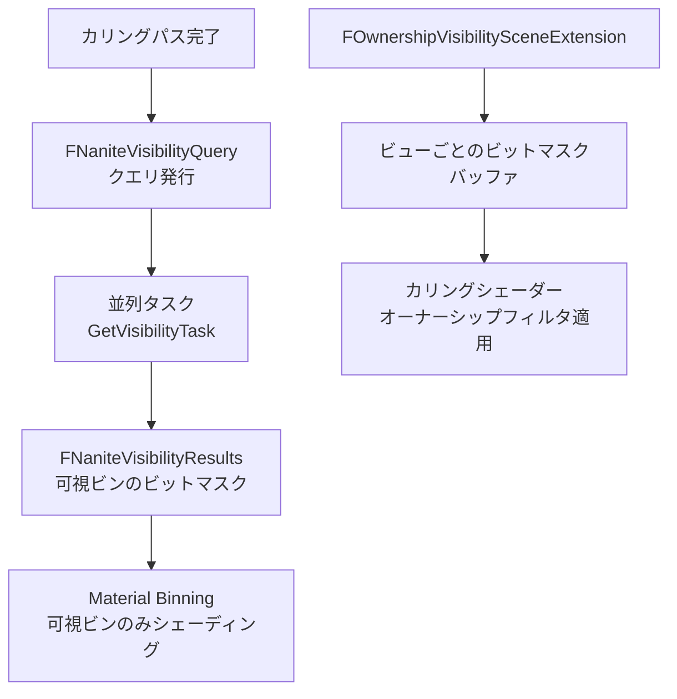

# Nanite Visibility（可視性）

- 上位: [[03_nanite_overview]]
- 関連: [[a_nanite_cull_raster]] | [[b_nanite_materials_shading]]

---

## 概要

Naniteのカリング結果（どのインスタンス・ビンが可視か）を  
非同期タスクで並列管理し、シェーディングパスやマテリアルビン選択に伝えるシステム。  
また `bOwnerNoSee` / `bOnlyOwnerSee` のオーナーシップベース可視性を GPU で処理する。

---

## 全体フロー



---

## 主要クラス・構造体

```cpp
// 可視性テスト結果（ラスタライズビン・シェーディングビンのビットマスク）
struct FNaniteVisibilityResults
{
    // ラスタライズビンが可視かどうかのビットマスク
    TArray<uint32> RasterBinVisibility;
    // シェーディングビンが可視かどうかのビットマスク
    TArray<uint32> ShadingBinVisibility;

    bool IsRasterBinVisible(uint16 BinIndex) const;
    bool IsShadingBinVisible(uint16 BinIndex) const;
    bool IsAnyBinVisible() const;
};

// 可視性管理（フレームをまたいだクエリ管理）
class FNaniteVisibility
{
    // クエリ発行
    FNaniteVisibilityQuery* BeginVisibilityQuery(
        const TArrayView<const FPrimitiveSceneInfo*>& Primitives,
        const FNaniteRasterPipelines* RasterPipelines,
        const FNaniteShadingPipelines* ShadingPipelines);

    // 結果取得（タスク完了待ち）
    const FNaniteVisibilityResults* GetVisibilityResults(
        const FNaniteVisibilityQuery* Query) const;
};

// スコープドフレーム管理（フレーム開始/終了を自動管理）
class FNaniteScopedVisibilityFrame
{
    // コンストラクタ: FNaniteVisibility::BeginFrame()
    // デストラクタ:  FNaniteVisibility::EndFrame()
};

// オーナーシップ可視性（bOwnerNoSee / bOnlyOwnerSee）
class FOwnershipVisibilitySceneExtension : public ISceneExtension
{
    // ビューごとのオーナーシップビットマスクバッファ
    FRDGBufferRef GetOwnershipVisibilityBuffer(const FSceneView& View) const;
    // オーナーシップを持つプリミティブの取得
    bool GetPrimitivesWithOwnership(TArray<FPrimitiveSceneInfo*>& OutPrimitives) const;
};
```

---

## 関連ソースファイル

| ファイル | 役割 |
|---------|------|
| `NaniteVisibility.h/.cpp` | FNaniteVisibilityResults / FNaniteVisibility / FNaniteVisibilityQuery / 並列タスク |
| `NaniteOwnershipVisibilitySceneExtension.h/.cpp` | bOwnerNoSee / bOnlyOwnerSee の GPU ビットマスク生成 |

---

## 関連リファレンス

| リファレンス | 対象ソース | 主な内容 |
|------------|---------|---------|
| [[ref_nanite_visibility]] | `NaniteVisibility.h/.cpp` | FNaniteVisibilityResults / FNaniteVisibility / BeginVisibilityQuery / GetVisibilityTask |
| [[ref_nanite_ownership_visibility]] | `NaniteOwnershipVisibilitySceneExtension.h/.cpp` | FOwnershipVisibilitySceneExtension / GetOwnershipVisibilityBuffer |
