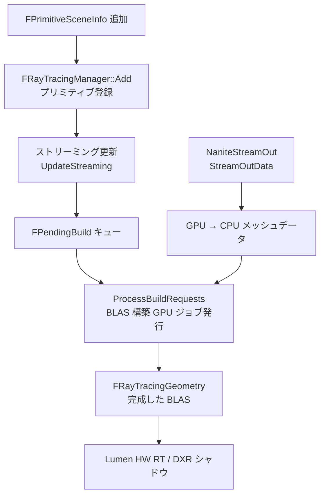

# Nanite Ray Tracing（レイトレーシング統合）

- 上位: [[03_nanite_overview]]
- 関連: [[a_nanite_cull_raster]] | [[e_nanite_tess_voxel]]

---

## 概要

Nanite ジオメトリは仮想化されたクラスター構造であるため、  
HW レイトレーシングの加速構造体（BLAS）と直接互換性がない。  
このシステムが Nanite メッシュから BLAS を構築・更新し、  
Lumen や DXR シャドウ等の RT パスが参照できるようにする。

`NaniteStreamOut` は BLAS 構築のためのメッシュデータを GPU から CPU に抽出する補助システム。

---

## 全体フロー



---

## 主要クラス・構造体

```cpp
// レイトレーシング加速構造体管理
class FRayTracingManager
{
public:
    // プリミティブの追加・削除
    void Add(FPrimitiveSceneInfo* SceneInfo);
    void Remove(FPrimitiveSceneInfo* SceneInfo);

    // ストリーミング更新（毎フレーム呼ばれる）
    void UpdateStreaming(FRDGBuilder& GraphBuilder);

    // BLAS 構築要求の処理（GPU ジョブ発行）
    void ProcessBuildRequests(FRDGBuilder& GraphBuilder);

    // 完成した BLAS の取得
    FRayTracingGeometry* GetRayTracingGeometry(
        const FPrimitiveSceneInfo* SceneInfo) const;

private:
    // 内部幾何データ（クラスターメッシュ情報）
    struct FInternalData { ... };

    // 構築待機キュー
    struct FPendingBuild
    {
        FPrimitiveSceneInfo* SceneInfo;
        uint32 LODIndex;
        bool bDynamic;
    };

    TArray<FPendingBuild> PendingBuilds;
};

// ストリームアウトリクエスト
struct FStreamOutRequest
{
    FPrimitiveSceneInfo* Primitive;
    uint32 LODIndex;
    FStreamOutMeshDataHeader Header;    // 頂点数・インデックス数等
    TArray<FStreamOutMeshDataSegment> Segments;
};
```

---

## 関連ソースファイル

| ファイル | 役割 |
|---------|------|
| `NaniteRayTracing.h/.cpp` | FRayTracingManager・BLAS 構築キュー・ストリーミング更新 |
| `NaniteStreamOut.h/.cpp` | GPU→CPU メッシュデータ抽出（BLAS 用） |

---

## 関連リファレンス

| リファレンス | 対象ソース | 主な内容 |
|------------|---------|---------|
| [[ref_nanite_ray_tracing]] | `NaniteRayTracing.h/.cpp` | FRayTracingManager / FInternalData / FPendingBuild / ProcessBuildRequests |
| [[ref_nanite_stream_out]] | `NaniteStreamOut.h/.cpp` | FStreamOutRequest / StreamOutData / FStreamOutMeshDataHeader |
