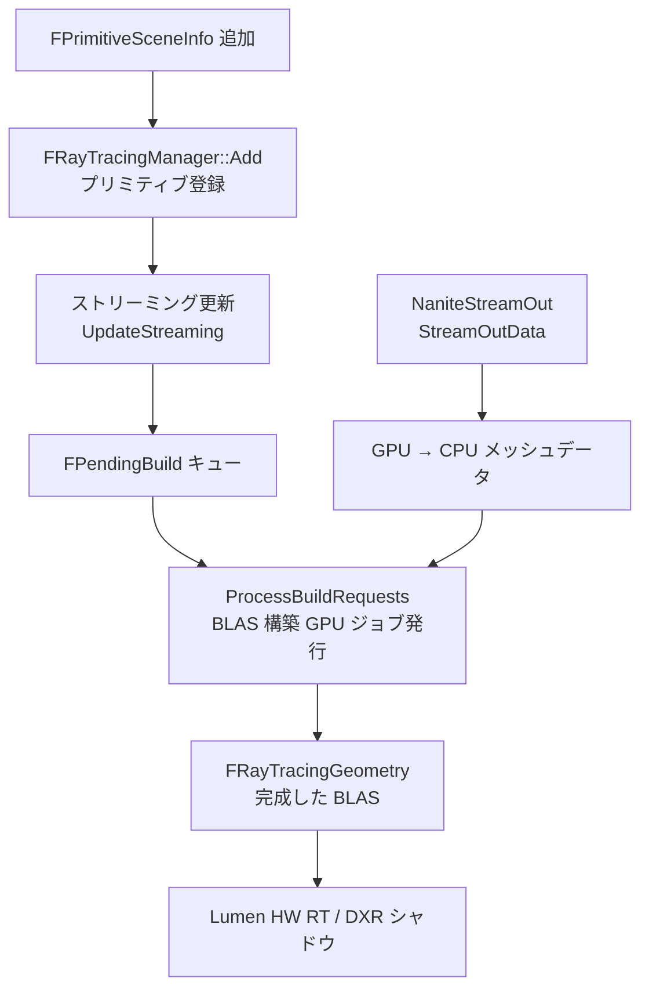

# Nanite Ray Tracing（レイトレーシング統合）

- 上位: [[03_nanite_overview]]
- 関連: [[a_nanite_cull_raster]] | [[e_nanite_tess_voxel]]

---

## 概要

Nanite ジオメトリは仮想化されたクラスター構造であるため、  
HW レイトレーシングの加速構造体（BLAS）と直接互換性がない。  
このシステムが Nanite メッシュから BLAS を構築・更新し、  
Lumen や DXR シャドウ等の RT パスが参照できるようにする。

`NaniteStreamOut` は BLAS 構築のためのメッシュデータを GPU から CPU に抽出する補助システム。

---

## 全体フロー



---

## 主要クラス・構造体

```cpp
// レイトレーシング加速構造体管理
class FRayTracingManager
{
public:
    // プリミティブの追加・削除
    void Add(FPrimitiveSceneInfo* SceneInfo);
    void Remove(FPrimitiveSceneInfo* SceneInfo);

    // ストリーミング更新（毎フレーム呼ばれる）
    void UpdateStreaming(FRDGBuilder& GraphBuilder);

    // BLAS 構築要求の処理（GPU ジョブ発行）
    void ProcessBuildRequests(FRDGBuilder& GraphBuilder);

    // 完成した BLAS の取得
    FRayTracingGeometry* GetRayTracingGeometry(
        const FPrimitiveSceneInfo* SceneInfo) const;

private:
    // 内部幾何データ（クラスターメッシュ情報）
    struct FInternalData { ... };

    // 構築待機キュー
    struct FPendingBuild
    {
        FPrimitiveSceneInfo* SceneInfo;
        uint32 LODIndex;
        bool bDynamic;
    };

    TArray<FPendingBuild> PendingBuilds;
};

// ストリームアウトリクエスト
struct FStreamOutRequest
{
    FPrimitiveSceneInfo* Primitive;
    uint32 LODIndex;
    FStreamOutMeshDataHeader Header;    // 頂点数・インデックス数等
    TArray<FStreamOutMeshDataSegment> Segments;
};
```

---

## 関連ソースファイル

| ファイル | 役割 |
|---------|------|
| `NaniteRayTracing.h/.cpp` | FRayTracingManager・BLAS 構築キュー・ストリーミング更新 |
| `NaniteStreamOut.h/.cpp` | GPU→CPU メッシュデータ抽出（BLAS 用） |

---

## コード実行フロー

### エントリポイント

```
[プリミティブ追加/削除時]
FScene::AddPrimitive() / RemovePrimitive()
  └─ Nanite::GRayTracingManager.Add() / Remove()
       → FPrimitiveSceneInfo を内部管理テーブルに登録/削除
       → 初回は FPendingBuild キューに追加

[毎フレーム: RenderNanite() より前]
Nanite::GRayTracingManager.UpdateStreaming()
  → ストリーミング状態を確認
  → ストリームが完了したエントリを FPendingBuild に移動

[毎フレーム: RenderNanite() 内]
Nanite::GRayTracingManager.ProcessBuildRequests()
  │
  ├─ NaniteStreamOut::StreamOutData()
  │    → GPU→CPU でメッシュ頂点/インデックスデータを抽出
  │    → FStreamOutRequest::Header / Segments を埋める
  │
  └─ RHIBuildAccelerationStructure()
       → FRayTracingGeometry（BLAS）を構築
       → 完成した BLAS を Lumen HW RT / DXR シャドウが参照

[BLAS 取得]
Nanite::GRayTracingManager.GetRayTracingGeometry(SceneInfo)
  → FRayTracingGeometry* を返す（Lumen/シャドウパスが使用）
```

### フロー詳細

1. **Add() / Remove()**  
   プリミティブの追加削除時にレンダースレッドで呼ばれる。内部で `FInternalData` マップを更新し、BLAS が必要なエントリを `FPendingBuild` キューに追加する。

2. **UpdateStreaming()**  
   Nanite ページストリーミングの完了を確認し、BLAS 構築に必要なデータが揃ったエントリを `FPendingBuild` に移動する。ストリーミングが未完了なら次フレームに持ち越す。

3. **NaniteStreamOut::StreamOutData()**  
   Nanite の仮想ジオメトリ（クラスター）を従来の頂点/インデックスバッファ形式で GPU から CPU に読み出す。RHI 加速構造体の構築は従来フォーマットのメッシュデータを必要とするため、このステップが必要となる。

4. **ProcessBuildRequests()**  
   `FPendingBuild` を処理し、`RHIBuildAccelerationStructure()` を発行して BLAS を完成させる。完成した `FRayTracingGeometry` は `GetRayTracingGeometry()` で取得できる。

### 関与クラス・関数一覧

| クラス / 関数 | ファイル:行 | 説明 |
|--------------|------------|------|
| `Nanite::FRayTracingManager::Add()` | `NaniteRayTracing.h` | プリミティブ登録 |
| `Nanite::FRayTracingManager::Remove()` | `NaniteRayTracing.h` | プリミティブ削除 |
| `Nanite::FRayTracingManager::UpdateStreaming()` | `NaniteRayTracing.h` | ストリーミング完了確認 |
| `Nanite::FRayTracingManager::ProcessBuildRequests()` | `NaniteRayTracing.h` | BLAS 構築 GPU ジョブ発行 |
| `Nanite::FRayTracingManager::GetRayTracingGeometry()` | `NaniteRayTracing.h` | 完成 BLAS の取得 |
| `NaniteStreamOut::StreamOutData()` | `NaniteStreamOut.h` | GPU→CPU メッシュデータ抽出 |

---

## 関連リファレンス

| リファレンス | 対象ソース | 主な内容 |
|------------|---------|---------|
| [[ref_nanite_ray_tracing]] | `NaniteRayTracing.h/.cpp` | FRayTracingManager / FInternalData / FPendingBuild / ProcessBuildRequests |
| [[ref_nanite_stream_out]] | `NaniteStreamOut.h/.cpp` | FStreamOutRequest / StreamOutData / FStreamOutMeshDataHeader |
