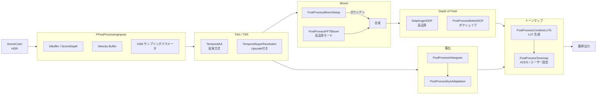

# PostProcess 全体概要

- 取得日: 2026-04-10
- 対象: `D:\UnrealEngine\Engine\Source\Runtime\Renderer\Private\PostProcess\`
- 上位: [[01_rendering_overview]]
- Details: [[a_pp_orchestrator]] | [[b_pp_taa_tsr]] | [[c_pp_bloom]] | [[d_pp_exposure]] | [[e_pp_dof_motionblur]] | [[f_pp_tonemap]] | [[g_pp_misc]]
- Reference: [[ref_pp_orchestrator]] | [[ref_pp_taa]] | [[ref_pp_tsr]] | [[ref_pp_bloom]] | [[ref_pp_exposure]] | [[ref_pp_dof]] | [[ref_pp_motionblur]] | [[ref_pp_tonemap]] | [[ref_pp_material_misc]] | [[ref_pp_visualize]] | [[ref_pp_debug_editor]] | [[ref_pp_platform]]

---

## PostProcess とは

GBuffer・SceneColor が確定した後に実行される**後処理パイプライン全体**。  
TAA/TSR（テンポラルアップスケール）・Bloom・Exposure・Depth of Field・Tonemap 等を担う。  
`AddPostProcessingPasses()` が全パスを RDG に順番に登録するオーケストレーターとなる。

---

## 全体アーキテクチャ



---

## フレームの流れ（概略）

```
AddPostProcessingPasses() の呼び出し順:

[A] Velocity / Motion Blur
    → PostProcessMotionBlur（カメラ・オブジェクトモーションブラー）

[B] Temporal AA / TSR
    → TemporalAA.cpp    : TAA（従来）
    → TemporalSuperResolution.cpp : TSR（アップスケーリング付き）

[C] Bloom
    → PostProcessBloomSetup → ガウシアン Bloom
    → PostProcessFFTBloom   → FFT 高品質 Bloom（オプション）

[D] Lens Flare / Dirt Mask
    → PostProcessLensFlares

[E] Exposure / Eye Adaptation
    → PostProcessHistogram → PostProcessEyeAdaptation

[F] Depth of Field
    → DiaphragmDOF.cpp（高品質ボケ）
    → PostProcessBokehDOF.cpp（ボケシェイプ使用時）

[G] Local Exposure
    → PostProcessLocalExposure

[H] Tonemap
    → PostProcessCombineLUTs → PostProcessTonemap（ACES等）

[I] Upscale / DLSS / XeSS など
    → PostProcessUpscale / FTemporalUpscaler

[J] UI / Debug
    → PostProcessSelectionOutline / VisualizeBuffer / GBufferHints 等
```

---

## TAA vs TSR

| 項目 | TAA（TemporalAA） | TSR（TemporalSuperResolution） |
|------|------------------|-----------------------------|
| アップスケーリング | なし（native解像度） | あり（1/2〜1/4 → native） |
| ゴースト対策 | 速度ベース反発 | 履歴矩形クリッピング |
| シャープネス | 普通 | 高い |
| 負荷 | 低い | やや高い |
| 主な用途 | 旧プラットフォーム・軽量ビルド | UE5 デフォルト AA |

```cpp
// FTemporalUpscaler: TSR の公開 API（プラグインや DLSS 差し替えに対応）
class ITemporalUpscaler
{
    virtual FOutputs AddPasses(
        FRDGBuilder& GraphBuilder,
        const FViewInfo& View,
        const FPassInputs& PassInputs) const = 0;
};
```

---

## コード実行フロー

### エントリポイント

```
FDeferredShadingSceneRenderer::Render()
  └─ AddPostProcessingPasses()                     PostProcessing.cpp:347
       │
       ├─[A] AddMotionBlurPass()                   PostProcessMotionBlur.cpp:1333
       │
       ├─[B] AddTemporalAAPass()  or ITemporalUpscaler::AddPasses()   TemporalAA.cpp:571
       │
       ├─[C] AddBloomSetupPass() + Gaussian/FFT    PostProcessBloomSetup.cpp:120
       │
       ├─[D] AddHistogramPass()                    PostProcessHistogram.cpp:451
       │     AddHistogramEyeAdaptationPass()        PostProcessEyeAdaptation.cpp:1023
       │
       ├─[E] DiaphragmDOF::AddPasses()             DiaphragmDOF.cpp:1486
       │
       ├─[F] AddCombineLUTPass()                   PostProcessCombineLUTs.cpp:494
       │     AddTonemapPass()                      PostProcessTonemap.cpp:569
       │
       └─[G] AddDebugViewPostProcessingPasses()    PostProcessing.cpp:2073
```

### 関与クラス・関数一覧

| クラス/関数 | ファイル:行 | 役割 |
|------------|-----------|------|
| `AddPostProcessingPasses()` | `PostProcessing.cpp:347` | 全パスのオーケストレーター |
| `AddTemporalAAPass()` | `TemporalAA.cpp:571` | TAA 実行 |
| `ITemporalUpscaler::AddPasses()` | `TemporalAA.h` | TSR/DLSS 等のインターフェース |
| `AddBloomSetupPass()` | `PostProcessBloomSetup.cpp:120` | Bloom セットアップ |
| `AddHistogramPass()` | `PostProcessHistogram.cpp:451` | 輝度ヒストグラム集計 |
| `AddHistogramEyeAdaptationPass()` | `PostProcessEyeAdaptation.cpp:1023` | Eye Adaptation |
| `DiaphragmDOF::AddPasses()` | `DiaphragmDOF.cpp:1486` | 高品質 DOF |
| `AddMotionBlurPass()` | `PostProcessMotionBlur.cpp:1333` | モーションブラー |
| `AddCombineLUTPass()` | `PostProcessCombineLUTs.cpp:494` | LUT 合成 |
| `AddTonemapPass()` | `PostProcessTonemap.cpp:569` | トーンマップ |
| `AddDebugViewPostProcessingPasses()` | `PostProcessing.cpp:2073` | デバッグビュー |

---

## 主要クラス・関数

```cpp
// PostProcess 全パスの登録（DeferredShadingRenderer から呼ばれる）
void AddPostProcessingPasses(
    FRDGBuilder& GraphBuilder,
    const FViewInfo& View,
    int32 ViewIndex,
    FSceneUniformBuffer& SceneUniformBuffer,
    EDiffuseIndirectMethod DiffuseIndirectMethod,
    EReflectionsMethod ReflectionsMethod,
    const FPostProcessingInputs& Inputs,
    const Nanite::FRasterResults* NaniteRasterResults,
    FVirtualShadowMapArray* VirtualShadowMapArray,
    ...);

// PostProcessing の入力データ（GBuffer / Velocity 等）
struct FPostProcessingInputs
{
    FRDGTextureRef SceneColor;
    FRDGTextureRef SceneDepth;
    FRDGTextureRef SceneVelocity;
    FRDGTextureRef SeparateTranslucency;
    TRDGUniformBufferRef<FSceneTextureUniformParameters> SceneTextures;
};
```

---

## 主要 CVar 一覧

| CVar | デフォルト | 説明 |
|------|----------|------|
| `r.AntiAliasingMethod` | 4 | AA 手法（0=None, 1=FXAA, 2=TAA, 4=TSR） |
| `r.TemporalAA.Quality` | 2 | TAA 品質（0=Low, 2=High） |
| `r.TSR.History.ScreenPercentage` | 200 | TSR 履歴バッファのスクリーン割合 |
| `r.BloomQuality` | 5 | Bloom 品質レベル |
| `r.DepthOfFieldQuality` | 2 | DOF 品質（0=Off, 4=DiaphragmDOF最高） |
| `r.Tonemapper.Quality` | 5 | トーンマッパー品質 |
| `r.EyeAdaptation.MethodOverride` | -1 | 露出適応手法オーバーライド |
| `r.LocalExposure.HighlightContrastScale` | 0.8 | ローカル露出ハイライト調整 |
| `r.MotionBlurQuality` | 4 | モーションブラー品質 |

---

## 主要ソースファイル一覧

| ファイル | 役割 |
|---------|------|
| `PostProcessing.h/.cpp` | 全パス統括 `AddPostProcessingPasses()` |
| `TemporalAA.h/.cpp` | TAA（従来型テンポラルアンチエイリアス） |
| `TemporalSuperResolution.cpp` | TSR（テンポラルスーパーレゾリューション） |
| `PostProcessTonemap.h/.cpp` | トーンマッパー（ACES・LUT 合成） |
| `PostProcessCombineLUTs.h/.cpp` | Color LUT の合成・生成 |
| `PostProcessBloomSetup.h/.cpp` | ガウシアン Bloom |
| `PostProcessFFTBloom.h/.cpp` | FFT 高品質 Bloom |
| `DiaphragmDOF.h/.cpp` | 高品質被写界深度 |
| `PostProcessMotionBlur.h/.cpp` | モーションブラー |
| `PostProcessEyeAdaptation.h/.cpp` | Eye Adaptation（自動露出） |
| `PostProcessHistogram.h/.cpp` | 輝度ヒストグラム集計 |
| `PostProcessLocalExposure.h/.cpp` | ローカル露出調整 |
| `PostProcessUpscale.h/.cpp` | 単純アップスケール |
| `PostProcessAA.cpp` | FXAA 等の簡易 AA |
| `PostProcessSubsurface.h/.cpp` | サブサーフェス散乱後処理 |
| `PostProcessMaterial.h/.cpp` | ユーザーカスタム後処理マテリアル |
| `PostProcessLensFlares.h/.cpp` | レンズフレア |
| `NeuralPostProcess.h/.cpp` | ニューラルネット後処理（実験的） |
