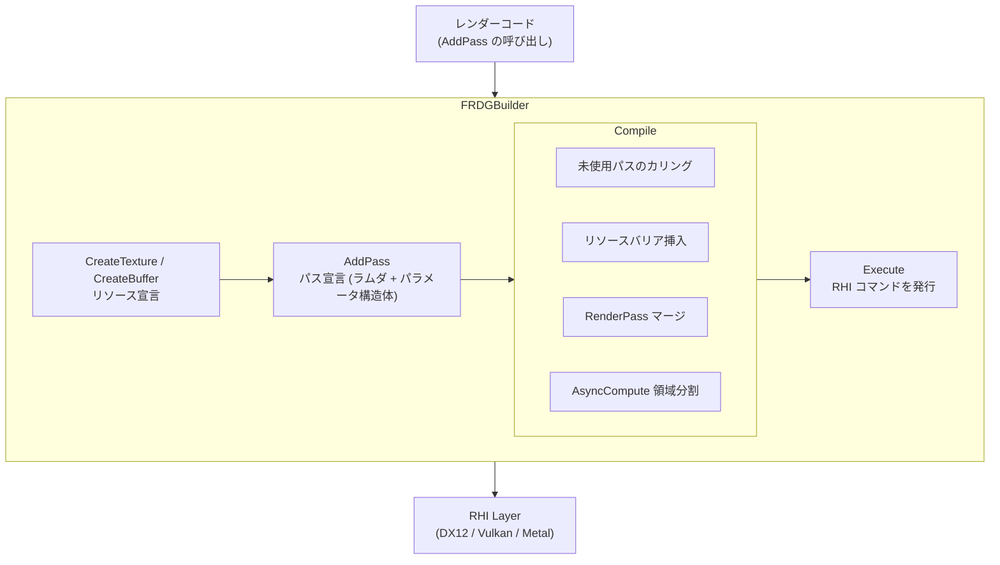

# RDG (Render Dependency Graph) 全体概要

- 取得日: 2026-04-10
- 対象: `D:\UnrealEngine\Engine\Source\Runtime\RenderCore\Public\RenderGraph*.h`
- 上位: [[01_rendering_overview]]
- Details: [[a_rdg_builder]] | [[b_rdg_resources]] | [[c_rdg_pass]] | [[d_rdg_parameters]] | [[e_rdg_debug_trace]]
- Reference: [[ref_rdg_builder]] | [[ref_rdg_resources]] | [[ref_rdg_pass]] | [[ref_rdg_utils]] | [[ref_rdg_definitions]] | [[ref_rdg_allocator]] | [[ref_rdg_parameter]] | [[ref_rdg_blackboard]] | [[ref_rdg_event]] | [[ref_rdg_validation]] | [[ref_rdg_trace]]

---

## RDG とは

**Render Dependency Graph**。UE5 のレンダリングパス全体を DAG（有向非巡回グラフ）として宣言的に記述し、  
バリア・メモリライフタイム・並列実行・リソースカリングを自動管理するフレームワーク。

`FRDGBuilder` に「どのリソースを使ってどの処理をするか」を宣言（AddPass）するだけで、  
実際の RHI 命令列はグラフコンパイル後に最適化されて発行される。

---

## 全体アーキテクチャ



---

## フレームの流れ（概略）

```
FRDGBuilder GraphBuilder(RHICmdListImmediate, RDG_EVENT_NAME("Frame"));

// 1. 外部リソースを登録
FRDGTextureRef SceneColor = GraphBuilder.RegisterExternalTexture(SceneColorRT);

// 2. 新規リソースを作成（宣言のみ・GPUメモリはまだ確保されない）
FRDGTextureRef OutputTexture = GraphBuilder.CreateTexture(
    FRDGTextureDesc::Create2D(Resolution, PF_FloatRGBA, FClearValueBinding::Black,
        TexCreate_RenderTargetable | TexCreate_ShaderResource),
    TEXT("MyOutput"));

// 3. パスを追加（ラムダは defer される）
auto* PassParams = GraphBuilder.AllocParameters<FMyPassParameters>();
PassParams->InTexture = SceneColor;
PassParams->OutTexture = GraphBuilder.CreateUAV(OutputTexture);

GraphBuilder.AddPass(
    RDG_EVENT_NAME("MyComputePass"),
    PassParams,
    ERDGPassFlags::Compute,
    [PassParams, MyCS](FRHIComputeCommandList& RHICmdList) {
        FComputeShaderUtils::Dispatch(RHICmdList, MyCS, *PassParams, GroupCount);
    });

// 4. Execute（コンパイル → バリア挿入 → 実行）
GraphBuilder.Execute();
```

---

## 主要コンセプト

| コンセプト | 説明 |
|-----------|------|
| **宣言的記述** | AddPass でパスを宣言するだけ。実行順序・バリアは自動決定 |
| **リソースカリング** | どのパスからも参照されないリソース/パスは自動的に除外 |
| **RenderPass マージ** | 連続する Raster パスを自動マージしてバリアを削減 |
| **AsyncCompute** | `ERDGPassFlags::AsyncCompute` でグラフィックスと並走 |
| **並列実行** | `ERDGBuilderFlags::Parallel` で Setup/Compile/Execute を並列化 |
| **Blackboard** | `FRDGBlackboard` でパス間データを型安全に受け渡し |
| **Transient Resource** | フレーム内のみ存在するリソースはエイリアシングで再利用 |

---

## 主要クラス一覧

| クラス | 役割 |
|--------|------|
| `FRDGBuilder` | グラフ全体の管理・実行 |
| `FRDGTexture` | RDG 管理テクスチャ |
| `FRDGBuffer` | RDG 管理バッファ |
| `FRDGPass` | パスの基底クラス |
| `FRDGBlackboard` | パス間データストア |
| `FRDGEventName` | GPU プロファイル名 |
| `FRDGParameterStruct` | パスパラメータのラッパー |

---

## 主要 CVar

| CVar | デフォルト | 説明 |
|------|----------|------|
| `r.RDG.Debug` | 0 | RDG デバッグ情報出力 |
| `r.RDG.Parallel` | 1 | 並列 Setup/Compile/Execute |
| `r.RDG.ImmediateMode` | 0 | 即時実行モード（デバッグ用）|
| `r.RDG.BreakPoint` | 0 | 特定パスでブレーク |
| `r.RDG.ClobberResources` | 0 | 未初期化リソースをランダム値で埋める |
| `r.RDG.TransientResourceAllocator` | 1 | Transient リソース再利用 |

---

## 主要ソースファイル一覧

| ファイル | 役割 |
|---------|------|
| `RenderGraphBuilder.h/.inl` | `FRDGBuilder` — グラフ構築・実行 |
| `RenderGraphResources.h/.inl` | `FRDGTexture`, `FRDGBuffer`, View 型 |
| `RenderGraphPass.h` | `FRDGPass`, `TRDGLambdaPass` |
| `RenderGraphDefinitions.h` | 基本 enum・型エイリアス |
| `RenderGraphBlackboard.h` | `FRDGBlackboard` |
| `RenderGraphEvent.h/.inl` | `FRDGEventName`, スコープマクロ |
| `RenderGraphParameter.h` | `FRDGParameterStruct` |
| `RenderGraphUtils.h` | ユーティリティ関数群 |
| `RenderGraphAllocator.h` | グラフアロケータ |
| `RenderGraphValidation.h` | デバッグ検証ロジック |
| `RenderGraphTrace.h` | RDG トレース出力 |
| `RenderGraph.h` | 上記を一括 include |

---

## コード実行フロー

### エントリポイント

```
FSceneRenderBuilder::Execute()          SceneRenderBuilder.cpp
  │
  └─ [レンダーコマンドキュー内]
       │
       ├─ FRDGBuilder GraphBuilder(      SceneRenderBuilder.cpp:872
       │      RHICmdList,
       │      RDG_EVENT_NAME(...),
       │      ERDGBuilderFlags::Parallel,
       │      Scene->GetShaderPlatform())
       │
       ├─ RenderNode.Function(GraphBuilder, ...) ← Render() 関数呼び出し
       │     例: FDeferredShadingSceneRenderer::Render(GraphBuilder, ...)
       │       └─ 各サブシステムへの AddPass 呼び出し群
       │           ├─ GraphBuilder.CreateTexture(...)
       │           ├─ GraphBuilder.RegisterExternalTexture(...)
       │           ├─ GraphBuilder.AddPass(...)  ← ラムダは defer される
       │           └─ GraphBuilder.QueueTextureExtraction(...)
       │
       └─ GraphBuilder.Execute()         SceneRenderBuilder.cpp:915
             └─ → 【Execute() 内部フロー】（Details/a_rdg_builder.md 参照）
```

### フロー詳細

1. **FRDGBuilder 生成** — `SceneRenderBuilder.cpp:872`
   ```cpp
   FRDGBuilder GraphBuilder(
       RHICmdList,
       RDG_EVENT_NAME("%s", FunctionInputs.FullPath),
       ERDGBuilderFlags::Parallel,
       Scene->GetShaderPlatform());
   ```
   - [[ref_rdg_allocator]] の `FRDGAllocator` を TLS から取得
   - Prologue パスを `Passes` レジストリに登録
   - `RDG_ENABLE_TRACE` が有効なら `FRDGTrace::OutputGraphBegin()` は Execute 直前に実施

2. **Render() 関数 —— パス宣言フェーズ** （[[a_rdg_builder]] 参照）
   ```cpp
   // レンダラーが CreateTexture / AddPass を呼ぶ段階
   // この時点でラムダは登録されるだけで実行されない
   FDeferredShadingSceneRenderer::Render(GraphBuilder, ...);
   ```
   - `AddPass()` ごとに `TRDGLambdaPass` が生成され `FRDGPassRegistry` に登録
   - パラメータ構造体が参照するリソースは [[ref_rdg_parameter]] で追跡される
   - `ERDGBuilderFlags::ParallelSetup` が有効なら `AddSetupTask` は並列タスクで走る

3. **GraphBuilder.Execute()** — `RenderGraphBuilder.cpp:1755`
   - グラフ全体のコンパイル → GPU リソース確保 → パス実行 → 後処理
   - 詳細フローは [[a_rdg_builder]] の「コード実行フロー」セクション参照

4. **Execute 後クリーンアップ**
   - `QueueTextureExtraction` で登録した外部ポインタに pooled テクスチャを書き戻し
   - `FRDGBuilder` のデストラクタで `FRDGAllocator::ReleaseAll()` を呼びメモリを一括解放

### 関与クラス・関数一覧

| クラス / 関数 | ファイル | 役割 |
|-------------|--------|------|
| `FSceneRenderBuilder` | `SceneRenderBuilder.cpp` | レンダーコマンドをキューに積み実行 |
| `FRDGBuilder` | `RenderGraphBuilder.h/.cpp` | グラフ全体の管理・実行 |
| `FDeferredShadingSceneRenderer::Render()` | `DeferredShadingRenderer.cpp` | 代表的なレンダー関数エントリ |
| `FRDGAllocator` | `RenderGraphAllocator.h` | グラフ内 CPU メモリのスタック管理 |
| `FRDGTrace` | `RenderGraphTrace.h` | Insights トレース |
