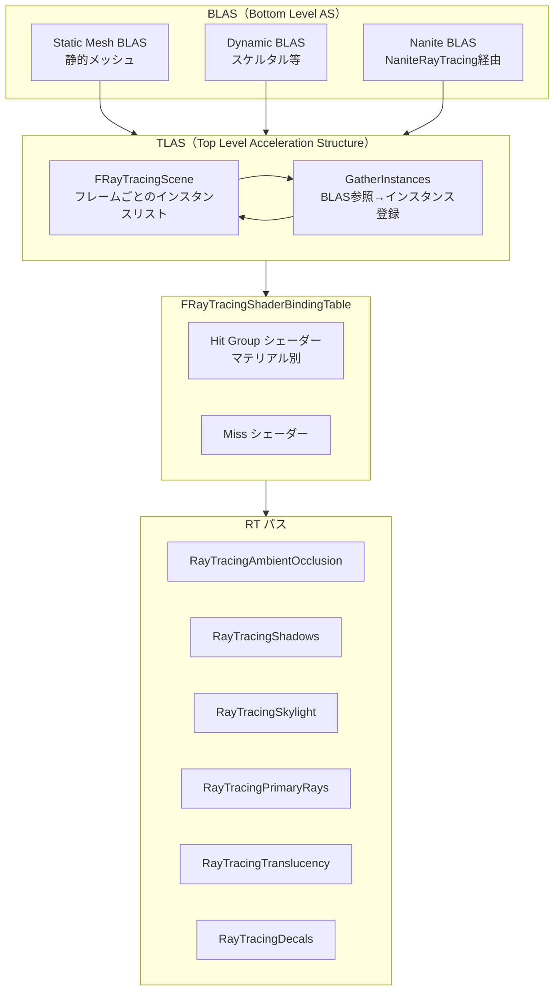

# Ray Tracing 全体概要

- 取得日: 2026-04-10
- 対象: `D:\UnrealEngine\Engine\Source\Runtime\Renderer\Private\RayTracing\`
- 上位: [[01_rendering_overview]]

---

## Ray Tracing とは

DXR（DirectX 12 Ultimate）/ Vulkan Ray Tracing 対応時にのみ有効になる  
**HW アクセラレーションレイトレーシング基盤**。  
Lumen の HW RT バックエンドとして使われるほか、  
AO・シャドウ・反射・スカイライト等の独立した品質優先モードも提供する。

| 機能 | 説明 |
|------|------|
| Lumen HW RT | Lumen のトレースバックエンドとして透過的に使用 |
| RT シャドウ | ディレクショナル・スポット等の高品質シャドウ |
| RT AO | ハードウェアレイによるアンビエントオクルージョン |
| RT リフレクション | 鏡面反射の高品質モード |
| RT スカイライト | スカイライトのシャドウイング |
| MegaLights RT | MegaLights のシャドウバックエンド |

> **注意**: このフォルダは `RHI_RAYTRACING` マクロで全体がガードされており、  
> DXR/Vulkan RT 非対応ハードウェアではコンパイルされない。

---

## 全体アーキテクチャ



---

## フレームの流れ（概略）

```
[A] RayTracing::OnRenderBegin()
    → フレーム開始時のシーン更新

[B] CreateGatherInstancesTaskData() / AddView()
    → ビューごとのインスタンス収集タスクを作成

[C] BeginGatherInstances()
    → 並列タスクで各プリミティブ BLAS を TLAS に登録
    → フラスタムカリングタスクと依存関係を設定

[D] BeginGatherDynamicRayTracingInstances()
    → スケルタルメッシュ等の動的 BLAS 更新

[E] FinishGatherInstances()
    → TLAS の構築コマンドを RDG に発行

[F] FinishGatherVisibleShaderBindings()
    → 可視インスタンスのヒットグループシェーダーバインドを確定

[G] 各 RT パス
    → RayTracingShadows / AO / Skylight 等を独立して実行
    → Lumen から呼ばれる HW RT トレースも同じ TLAS を使用
```

---

## 主要クラス・構造体

```cpp
// シーンオプション（RT インスタンス収集時の設定）
namespace RayTracing
{
    struct FSceneOptions
    {
        bool bTranslucentGeometry;     // 半透明ジオメトリを含めるか
        bool bIncludeSky;              // スカイを含めるか
        bool bLightingChannelsUsingAHS;// ライティングチャンネルを AHS で処理するか
    };

    // インスタンス収集タスクのデータ（並列処理用）
    struct FGatherInstancesTaskData;
}

// RT シーン（フレームごとに構築）
class FRayTracingScene
{
    // TLAS に登録するインスタンスのリスト
    TArray<FRayTracingGeometryInstance> Instances;
    // TLAS バッファ（RDG）
    FRDGBufferRef TLASBuffer;
};

// シェーダーバインディングテーブル
class FRayTracingShaderBindingTable
{
    // ヒットグループごとのシェーダーバインドデータ
    TArray<FRayTracingShaderBindingData> VisibleShaderBindings;
};
```

---

## 主要 CVar 一覧

| CVar | デフォルト | 説明 |
|------|----------|------|
| `r.RayTracing` | 0 | RT 全体の有効/無効（プロジェクト設定） |
| `r.RayTracing.Shadows` | -1 | RT シャドウ（-1=自動, 0=無効, 1=有効） |
| `r.RayTracing.AmbientOcclusion` | -1 | RT AO |
| `r.RayTracing.Reflections` | -1 | RT リフレクション |
| `r.RayTracing.SkyLight` | 1 | RT スカイライト |
| `r.RayTracing.ExcludeDecals` | 1 | デカールを TLAS から除外 |
| `r.RayTracing.InstanceCulling` | 1 | フラスタムカリング有効 |

---

## 主要ソースファイル一覧

| ファイル | 役割 |
|---------|------|
| `RayTracing.h/.cpp` | インスタンス収集・TLAS 構築・全体エントリ |
| `RayTracingScene.h/.cpp` | FRayTracingScene（TLAS）管理 |
| `RayTracingShaderBindingTable.h/.cpp` | SBT（ヒットグループシェーダーバインド）管理 |
| `RayTracingInstanceCulling.h/.cpp` | フラスタムカリング・インスタンスフィルタリング |
| `RayTracingInstanceMask.h/.cpp` | インスタンスマスク（ライティングチャンネル） |
| `RayTracingMaterialHitShaders.h/.cpp` | マテリアルヒットシェーダーのコンパイル・登録 |
| `RayTracingShadows.h/.cpp` | RT シャドウパス |
| `RayTracingAmbientOcclusion.cpp` | RT AO パス |
| `RayTracingSkyLight.h/.cpp` | RT スカイライトパス |
| `RayTracingLighting.h/.cpp` | RT ライティング共通ユーティリティ |
| `RayTracingPrimaryRays.cpp` | 1次レイ（反射等の高品質モード） |
| `RayTracingTranslucency.cpp` | 半透明 RT |
| `RayTracingDecals.h/.cpp` | デカールの RT 対応 |
| `RayTracingDynamicGeometryUpdateManager.cpp` | 動的ジオメトリの BLAS 更新管理 |
| `RaytracingOptions.h` | RT オプション構造体の定義 |
