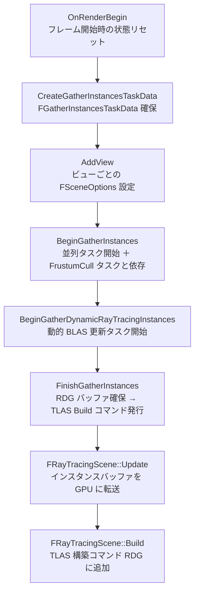

# Ray Tracing シーン構築（TLAS / BLAS / GatherInstances）

- 上位: [[07_raytracing_overview]]
- 関連: [[d_rt_materials_sbt]]

## 概要

レイトレーシングのフレーム描画に先立ち、GPU 上の **Top Level Acceleration Structure（TLAS）** を構築するサブシステム。  
各プリミティブが持つ **Bottom Level AS（BLAS）** を `FRayTracingScene` に登録し、  
フラスタムカリングと並列タスクを組み合わせて高速にシーンを構成する。

---

## 全体フロー



---

## レイヤー構造

`FRayTracingScene` は 3 つのレイヤーを管理する：

| レイヤー | 用途 |
|---------|------|
| `Base` | 通常オブジェクト（不透明・半透明） |
| `Decals` | デカールジオメトリ |
| `FarField` | 遠景（Far Field）オブジェクト |

各レイヤーはビューごとに独立した `FLayerView` を持ち、それぞれ独立した RHI TLAS を持つ。

---

## キャッシュ vs トランジェント インスタンス

```cpp
// キャッシュドインスタンス（プリミティブ登録時に確保、フレームをまたいで保持）
FInstanceHandle FRayTracingScene::AddCachedInstance(
    FRayTracingGeometryInstance Instance,
    ERayTracingSceneLayer Layer,
    const FPrimitiveSceneProxy* Proxy,
    bool bDynamic,
    int32 GeometryHandle);

// トランジェントインスタンス（フレームごとに追加・破棄）
FInstanceHandle FRayTracingScene::AddTransientInstance(
    FRayTracingGeometryInstance Instance,
    ERayTracingSceneLayer Layer,
    FViewHandle ViewHandle,
    const FPrimitiveSceneProxy* Proxy,
    bool bDynamic,
    int32 GeometryHandle);
```

インスタンスバッファのレイアウトは `[CachedInstances | TransientInstances]`。  
トランジェント領域は毎フレーム `Reset()` でクリアされる。

---

## フラスタムカリング

```cpp
// RayTracingInstanceCulling.h
namespace RayTracing
{
    // カリング対象か判定（設定値チェック済み）
    bool ShouldConsiderCulling(
        const FRayTracingCullingParameters& CullingParameters,
        const FBoxSphereBounds& ObjectBounds,
        float MinDrawDistance);

    // フラグによるカリング（RT フラグ参照）
    bool CullPrimitiveByFlags(
        const FRayTracingCullingParameters& CullingParameters,
        const FScene* Scene,
        int32 PrimitiveIndex);

    // 境界ボックス込みの完全カリング判定
    bool ShouldCullBounds(
        const FRayTracingCullingParameters& CullingParameters,
        const FBoxSphereBounds& ObjectBounds,
        float MinDrawDistance,
        bool bIsFarFieldPrimitive);
}
```

カリング半径は `GetRayTracingCullingRadius()` で取得（`r.RayTracing.Culling.Radius` CVar）。

---

## 主要 CVar

| CVar | デフォルト | 説明 |
|------|----------|------|
| `r.RayTracing.ParallelPrimitiveGather` | 1 | プリミティブ収集の並列化 |
| `r.RayTracing.AutoInstance` | 1 | 静的メッシュの自動インスタンシング |
| `r.RayTracing.ExcludeTranslucent` | 0 | 半透明を TLAS から除外 |
| `r.RayTracing.ExcludeSky` | 1 | スカイを TLAS から除外 |
| `r.RayTracing.ExcludeDecals` | 0 | デカールを TLAS から除外 |
| `r.RayTracing.DynamicGeometryLastRenderTimeUpdateDistance` | 5000 | 動的ジオメトリの LastRenderTime 更新距離 |

---

## 関連ソースファイル

| ファイル | 役割 |
|---------|------|
| `RayTracing.h/.cpp` | GatherInstances の全体制御 |
| `RayTracingScene.h/.cpp` | FRayTracingScene（TLAS 管理） |
| `RayTracingInstanceCulling.h/.cpp` | フラスタムカリング |
| `RayTracingDynamicGeometryUpdateManager.cpp` | 動的 BLAS 更新管理 |

---

## コード実行フロー

### エントリポイント

```
FDeferredShadingSceneRenderer::Render()
  │
  ├─ RayTracing::OnRenderBegin()               // RayTracing.cpp
  │
  ├─ RayTracing::CreateGatherInstancesTaskData()
  ├─ RayTracing::AddView()
  ├─ RayTracing::BeginGatherInstances()        // FrustumCull タスクと依存
  ├─ RayTracing::BeginGatherDynamicRayTracingInstances()
  │
  └─ RayTracing::FinishGatherInstances()       // RDG パス追加
       ├─ FRayTracingScene::Update()           // インスタンスバッファ転送
       └─ FRayTracingScene::Build()            // TLAS 構築コマンド
```

### フロー詳細

1. **OnRenderBegin** — フレーム開始時に前フレームのトランジェント状態をリセット
   ```cpp
   void RayTracing::OnRenderBegin(const FSceneRenderUpdateInputs& SceneUpdateInputs);
   ```

2. **CreateGatherInstancesTaskData / AddView** — ビューの収集タスクデータを初期化
   ```cpp
   FGatherInstancesTaskData* CreateGatherInstancesTaskData(
       FSceneRenderingBulkObjectAllocator& InAllocator,
       FScene& Scene, uint32 NumViews);
   void AddView(FGatherInstancesTaskData& TaskData, FViewInfo& View, ...);
   ```

3. **BeginGatherInstances** — フラスタムカリングタスク完了後に並列で各 BLAS を TLAS へ登録
   ```cpp
   void BeginGatherInstances(FGatherInstancesTaskData& TaskData, UE::Tasks::FTask FrustumCullTask);
   ```

4. **BeginGatherDynamicRayTracingInstances** — スケルタルメッシュ等の動的 BLAS を非同期更新
   ```cpp
   void BeginGatherDynamicRayTracingInstances(FGatherInstancesTaskData& TaskData);
   ```

5. **FinishGatherInstances** — RDG への Build コマンド発行（レンダースレッドで実行）
   ```cpp
   bool FinishGatherInstances(
       FRDGBuilder& GraphBuilder,
       FGatherInstancesTaskData& TaskData,
       FRayTracingScene& RayTracingScene,
       FRayTracingShaderBindingTable& RayTracingSBT,
       FGlobalDynamicReadBuffer& InDynamicReadBuffer,
       FSceneRenderingBulkObjectAllocator& InBulkAllocator);
   ```

### 関与クラス・関数一覧

| クラス / 関数 | ファイル | 役割 |
|------------|--------|------|
| `RayTracing::FGatherInstancesTaskData` | `RayTracing.cpp` | 並列タスクのデータホルダー |
| `FRayTracingScene` | `RayTracingScene.h` | TLAS 全体管理 |
| `FRayTracingScene::Update()` | `RayTracingScene.cpp` | GPU インスタンスバッファ転送 |
| `FRayTracingScene::Build()` | `RayTracingScene.cpp` | TLAS 構築 RDG パス |
| `RayTracing::ShouldCullBounds()` | `RayTracingInstanceCulling.cpp` | フラスタムカリング判定 |

## 関連リファレンス

| リファレンス | 対象ソース |
|------------|----------|
| [[ref_rt_scene]] | `RayTracingScene.h/.cpp` |
| [[ref_rt_instances]] | `RayTracingInstanceCulling.h`, `RayTracingInstanceMask.h` |
