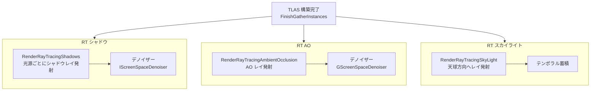

# Ray Tracing シャドウ・AO・スカイライト パス

- 上位: [[07_raytracing_overview]]
- 関連: [[a_rt_scene]] | [[c_rt_reflection]]

## 概要

HW レイトレーシングを使った **RT シャドウ・RT AO・RT スカイライト** の3パス。  
いずれも構築済み TLAS に対してシャドウレイ / AO レイを発射し、  
デノイザーを通して最終結果を生成する。

| パス | 効果 | 主要ファイル |
|------|------|------------|
| RT シャドウ | ポイント・スポット・ディレクショナル光源の高品質シャドウ | `RayTracingShadows.cpp` |
| RT AO | SSAO より高品質なアンビエントオクルージョン | `RayTracingAmbientOcclusion.cpp` |
| RT スカイライト | スカイライトのシャドウイング・遮蔽 | `RaytracingSkylight.cpp` |

---

## 全体フロー



---

## RT シャドウ

```cpp
// RayTracingShadows.h
namespace RayTracingShadows
{
    // シーンオプションにシャドウが必要かを反映
    void SetRayTracingSceneOptions(
        bool bSceneHasLightsWithRayTracedShadows,
        RayTracing::FSceneOptions& SceneOptions);
}
```

- 光源ごとに **シャドウマスクテクスチャ** を生成
- `r.RayTracing.Shadows` CVar で PostProcess ボリュームによる自動制御を上書き可能
- MegaLights の HW RT シャドウモードとは別の独立パス

---

## RT AO

```cpp
// RayTracingAmbientOcclusion.cpp

// 有効かどうかの判定
bool ShouldRenderRayTracingAmbientOcclusion(const FViewInfo& View);
// → GRayTracingAmbientOcclusion < 0 の場合は PostProcess Volume の値を参照
// → GScreenSpaceDenoiser で選択したデノイザーを使用

// レイジェネレーションシェーダー
class FRayTracingAmbientOcclusionRGS : public FGlobalShader { ... };
```

### RT AO CVar

| CVar | デフォルト | 説明 |
|------|----------|------|
| `r.RayTracing.AmbientOcclusion` | -1 | -1=PostProcess 依存, 0=無効, 1=有効 |
| `r.RayTracing.AmbientOcclusion.SamplesPerPixel` | -1 | サンプル数（-1=PV 依存） |
| `r.RayTracing.AmbientOcclusion.EnableTwoSidedGeometry` | 0 | 両面ジオメトリ |
| `r.AmbientOcclusion.Denoiser` | 2 | 0=無効, 1=デフォルト, 2=GScreenSpaceDenoiser |

---

## RT スカイライト

```cpp
// RayTracingSkyLight.h

// 天球からの遮蔽レイを発射し、スカイライトの可視性マスクを生成
void RenderRayTracingSkyLight(
    FRDGBuilder& GraphBuilder,
    FScene* Scene,
    FRDGTextureRef SceneColorTexture,
    TArray<FViewInfo>& Views,
    FRayTracingScene& RayTracingScene,
    FRayTracingShaderBindingTable& SBT);
```

- スカイライトのキューブマップから各ピクセルへの遮蔽率を計算
- テンポラル蓄積で安定化

---

## 主要 CVar

| CVar | デフォルト | 説明 |
|------|----------|------|
| `r.RayTracing.Shadows` | -1 | RT シャドウ（-1=自動） |
| `r.RayTracing.SkyLight` | 1 | RT スカイライト |
| `r.RayTracing.Shadows.EnableTwoSidedGeometry` | 1 | シャドウレイ両面判定 |
| `r.RayTracing.Shadows.EnableMaterials` | 1 | シャドウでマテリアル AHS を有効化 |

---

## 関連ソースファイル

| ファイル | 役割 |
|---------|------|
| `RayTracingShadows.h/.cpp` | RT シャドウパス本体 |
| `RayTracingAmbientOcclusion.cpp` | RT AO パス本体 |
| `RaytracingSkylight.cpp` | RT スカイライトパス本体 |
| `RayTracingLighting.h/.cpp` | 光源データバインド共通ユーティリティ |

---

## コード実行フロー

### エントリポイント

```
FDeferredShadingSceneRenderer::Render()
  │
  ├─ RenderRayTracingShadows()             // 光源ごとに呼び出し
  │    ├─ FRayTracingShadowRGS (RGS)      // シャドウレイジェネレーション
  │    └─ IScreenSpaceDenoiser::Denoise() // デノイズ
  │
  ├─ RenderRayTracingAmbientOcclusion()   // ShouldRenderRayTracingAmbientOcclusion() が true の場合
  │    ├─ FRayTracingAmbientOcclusionRGS (RGS)
  │    └─ GScreenSpaceDenoiser->DenoiseAmbientOcclusion()
  │
  └─ RenderRayTracingSkyLight()           // r.RayTracing.SkyLight=1 の場合
       ├─ RGS でスカイ遮蔽レイ発射
       └─ テンポラル蓄積パス
```

### フロー詳細

1. **RT シャドウ** — 光源ごとに `RenderRayTracingShadows()` を呼び出し、シャドウマスクを生成
   - 条件: `r.RayTracing.Shadows != 0` かつ光源の `bCastRaytracedShadow == true`

2. **RT AO** — `ShouldRenderRayTracingAmbientOcclusion()` が `true` のとき実行
   ```cpp
   bool bEnabled = GRayTracingAmbientOcclusion < 0
       ? View.FinalPostProcessSettings.RayTracingAO > 0
       : GRayTracingAmbientOcclusion != 0;
   ```

3. **RT スカイライト** — `r.RayTracing.SkyLight=1` かつスカイライトが存在する場合に実行

### 関与クラス・関数一覧

| クラス / 関数 | ファイル | 役割 |
|------------|--------|------|
| `RayTracingShadows::SetRayTracingSceneOptions()` | `RayTracingShadows.h` | シーン収集フラグ設定 |
| `FRayTracingAmbientOcclusionRGS` | `RayTracingAmbientOcclusion.cpp` | AO レイジェネレーションシェーダー |
| `ShouldRenderRayTracingAmbientOcclusion()` | `RayTracingAmbientOcclusion.cpp` | AO 有効判定 |
| `RenderRayTracingSkyLight()` | `RaytracingSkylight.cpp` | スカイライトパス本体 |

## 関連リファレンス

| リファレンス | 対象ソース |
|------------|----------|
| [[ref_rt_shadows]] | `RayTracingShadows.h`, `RayTracingAmbientOcclusion.cpp`, `RaytracingSkylight.cpp` |
