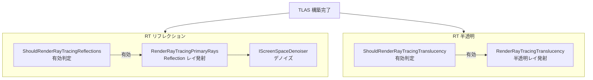

# Ray Tracing リフレクション・半透明

- 上位: [[07_raytracing_overview]]
- 関連: [[b_rt_shadow_ao]] | [[d_rt_materials_sbt]]

## 概要

HW レイトレーシングによる **高品質反射（RT リフレクション / Primary Rays）** と  
**半透明オブジェクトのレイトレーシング（RT Translucency）** の2パス。  
通常のスクリーンスペース反射（SSR）やラスタライズ半透明より品質が高い反面、  
コストが高いため `r.RayTracing.Reflections` / `r.RayTracing.Translucency` で制御する。

| パス | 主要ファイル | 用途 |
|------|------------|------|
| RT Reflections（Primary Rays） | `RayTracingPrimaryRays.cpp` | 鏡面反射の高品質モード |
| RT Translucency | `RayTracingTranslucency.cpp` | 半透明の正確な描画 |

---

## 全体フロー



---

## RT リフレクション（Primary Rays）

```cpp
// RayTracingPrimaryRays.cpp

// 有効判定
bool ShouldRenderRayTracingReflections(const FViewInfo& View);

// メインエントリポイント
void RenderRayTracingReflections(
    FRDGBuilder& GraphBuilder,
    const FSceneTextureParameters& SceneTextures,
    const FViewInfo& View,
    int DenoiserMode,
    const FRayTracingReflectionOptions& Options,
    FRDGTextureRef* OutColorTexture,
    FRDGTextureRef* OutRayHitDistanceTexture);
```

- GBuffer から鏡面ロブに沿った反射レイを生成
- ヒット後にマテリアル評価（MissShader でスカイライトフォールバック）
- `r.RayTracing.Reflections.MaxRoughness` でラフネス閾値を設定

### RT リフレクション CVar

| CVar | デフォルト | 説明 |
|------|----------|------|
| `r.RayTracing.Reflections` | -1 | -1=PostProcess 依存, 0=無効, 1=有効 |
| `r.RayTracing.Reflections.MaxRoughness` | -1 | 有効ラフネス上限（-1=PV 依存） |
| `r.RayTracing.Reflections.SamplesPerPixel` | -1 | サンプル数 |
| `r.RayTracing.Reflections.ReflectionCaptures` | 1 | キャプチャのフォールバック |

---

## RT 半透明

```cpp
// RayTracingTranslucency.cpp

// 有効判定
bool ShouldRenderRayTracingTranslucency(const FViewInfo& View);

// メインエントリポイント
bool RenderRayTracingTranslucency(
    FRDGBuilder& GraphBuilder,
    FRDGTextureMSAARef SceneColorTexture,
    TArray<FViewInfo>& Views,
    FRayTracingScene& RayTracingScene,
    FRayTracingShaderBindingTable& SBT);
```

- 半透明オブジェクトへの正確なレイキャスト
- ラスタライズ半透明（FForwardShadingRenderer）の代替として機能
- `bTranslucentGeometry = true` の `FSceneOptions` でインスタンスが TLAS に含まれる

### RT 半透明 CVar

| CVar | デフォルト | 説明 |
|------|----------|------|
| `r.RayTracing.Translucency` | -1 | -1=PostProcess 依存 |
| `r.RayTracing.Translucency.MaxRoughness` | -1 | ラフネス上限 |
| `r.RayTracing.Translucency.SamplesPerPixel` | 1 | サンプル数 |
| `r.RayTracing.Translucency.MaxRefractionRays` | -1 | 屈折レイ最大数 |

---

## 関連ソースファイル

| ファイル | 役割 |
|---------|------|
| `RayTracingPrimaryRays.cpp` | RT リフレクション・Primary Rays 本体 |
| `RayTracingTranslucency.cpp` | RT 半透明パス本体 |
| `RayTracingLighting.h/.cpp` | 両パスで使う光源サンプリング |

---

## コード実行フロー

### エントリポイント

```
FDeferredShadingSceneRenderer::Render()
  │
  ├─ RenderRayTracingReflections()        // ShouldRenderRayTracingReflections() が true
  │    ├─ レイジェネレーションシェーダー発射
  │    └─ IScreenSpaceDenoiser::DenoiseReflections()
  │
  └─ RenderRayTracingTranslucency()       // ShouldRenderRayTracingTranslucency() が true
       └─ レイジェネレーションシェーダー発射
```

### フロー詳細

1. **RT リフレクション有効判定**
   ```cpp
   bool ShouldRenderRayTracingReflections(const FViewInfo& View);
   // GBuffer から鏡面ロブを評価し反射レイを発射
   ```
   - 条件: `r.RayTracing.Reflections != 0` かつ `View.FinalPostProcessSettings.ReflectionsType == EReflectionsType::RayTracing`

2. **RT 半透明有効判定**
   ```cpp
   bool ShouldRenderRayTracingTranslucency(const FViewInfo& View);
   ```
   - `FSceneOptions::bTranslucentGeometry = true` でインスタンスを TLAS に含める必要がある

### 関与クラス・関数一覧

| クラス / 関数 | ファイル | 役割 |
|------------|--------|------|
| `ShouldRenderRayTracingReflections()` | `RayTracingPrimaryRays.cpp` | リフレクション有効判定 |
| `RenderRayTracingReflections()` | `RayTracingPrimaryRays.cpp` | リフレクションパス本体 |
| `ShouldRenderRayTracingTranslucency()` | `RayTracingTranslucency.cpp` | 半透明有効判定 |
| `RenderRayTracingTranslucency()` | `RayTracingTranslucency.cpp` | 半透明パス本体 |

## 関連リファレンス

| リファレンス | 対象ソース |
|------------|----------|
| [[ref_rt_instances]] | `RayTracingInstanceMask.h`（半透明インスタンスのマスク設定） |
| [[ref_rt_sbt]] | `RayTracingShaderBindingTable.h`（SBT レコード参照） |
