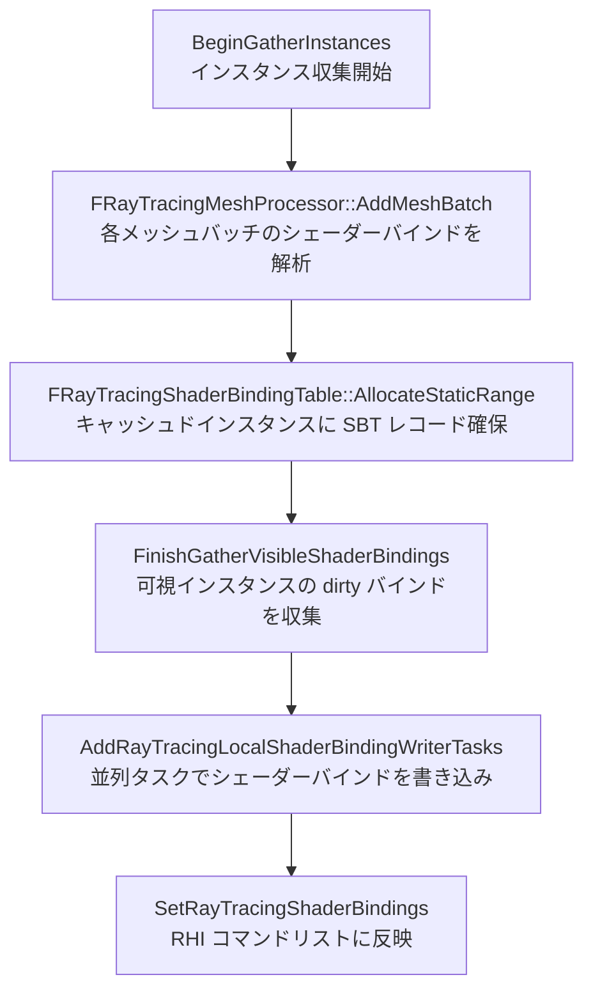

# Ray Tracing マテリアルヒットシェーダーと SBT 管理

- 上位: [[07_raytracing_overview]]
- 関連: [[a_rt_scene]] | [[c_rt_reflection]]

## 概要

レイトレーシングでは各プリミティブセグメントごとに  
**ヒットグループシェーダー（Hit Group）** を **Shader Binding Table（SBT）** に登録する必要がある。  
`FRayTracingShaderBindingTable` が SBT のレコード領域を管理し、  
`FRayTracingMeshProcessor` がマテリアルからシェーダーバインドデータを生成する。

---

## 全体フロー



---

## Shader Binding Table（SBT）

```cpp
// SBT のレコードレイアウト
class FRayTracingShaderBindingTable
{
    // レコード範囲の割り当て（静的・キャッシュ済み）
    FRayTracingSBTAllocation* AllocateStaticRange(
        uint32 SegmentCount,
        const FRHIRayTracingGeometry* Geometry,
        FRayTracingCachedMeshCommandFlags Flags);

    // 動的割り当て（フレームごとにリセット）
    FRayTracingSBTAllocation* AllocateDynamicRange(
        ERayTracingShaderBindingLayerMask AllocatedLayers,
        uint32 SegmentCount);

    // dirty バインドを収集（永続 SBT の更新に使用）
    FRayTracingShaderBindingDataOneFrameArray GetDirtyBindings(
        TConstArrayView<FRayTracingShaderBindingData> VisibleBindings,
        bool bForceAllDirty);
};
```

### 静的 vs 動的レコード

| 種類 | 永続性 | 用途 |
|------|--------|------|
| 静的（Static） | フレームをまたぐ | 静的メッシュ・Nanite プロキシ |
| 動的（Dynamic） | 毎フレームリセット | スケルタルメッシュ・動的プリミティブ |

### レイヤー別 SBT

`ERayTracingShaderBindingLayer` で Base / Decals の2レイヤーを管理。  
各インスタンスは `InstanceContributionToHitGroupIndex` でレコード先頭を特定する。

---

## マテリアルヒットシェーダー

```cpp
// RayTracingMaterialHitShaders.h

class FRayTracingMeshProcessor
{
public:
    // マテリアルを解析してヒットグループシェーダーバインドを生成
    void AddMeshBatch(
        const FMeshBatch& MeshBatch,
        uint64 BatchElementMask,
        const FPrimitiveSceneProxy* PrimitiveSceneProxy);

private:
    // ヒットグループシェーダーバインドを SBT レコードに書き込む
    template<typename RayTracingShaderType, typename ShaderElementDataType>
    void BuildRayTracingMeshCommands(...);
};

// デフォルトシェーダー（マテリアルがない場合のフォールバック）
FRHIRayTracingShader* GetRayTracingDefaultMissShader(...);
FRHIRayTracingShader* GetRayTracingDefaultOpaqueShader(...);
FRHIRayTracingShader* GetRayTracingDefaultHiddenShader(...);
```

### キャッシュ可能条件

```cpp
// グローバル / 静的 UBO を使わない場合のみキャッシュ可能
RayTracingMeshCommand.bCanBeCached = !RayTracingMeshCommand.HasGlobalUniformBufferBindings();
```

---

## 動的 BLAS 更新

```cpp
// RayTracingDynamicGeometryUpdateManager.cpp

// スケルタルメッシュ等の動的ジオメトリは毎フレーム BLAS を再構築
void BeginGatherDynamicRayTracingInstances(FGatherInstancesTaskData& TaskData);
```

- スキンメッシュの最新ポーズで BLAS を再ビルド
- `r.RayTracing.DynamicGeometryLastRenderTimeUpdateDistance` 内のみ更新

---

## デフォルトグローバルシェーダー

| クラス | 役割 |
|--------|------|
| `FHiddenMaterialHitGroup` | 不可視マテリアル用（any-hit で即 miss） |
| `FOpaqueShadowHitGroup` | シャドウ用不透明ヒットグループ |
| `FDefaultCallableShader` | デカール用デフォルト callable |

---

## 主要 CVar

| CVar | デフォルト | 説明 |
|------|----------|------|
| `r.RayTracing.ParallelMeshBatchSetup` | 1 | マテリアルバインド並列処理 |
| `r.RayTracing.ParallelMeshBatchSize` | 1024 | 並列タスクごとのバッチサイズ |
| `r.RayTracing.DebugForceOpaque` | 0 | 全インスタンスを強制不透明化 |
| `r.RayTracing.DebugDisableTriangleCull` | 0 | 三角形カリング無効（デバッグ） |

---

## 関連ソースファイル

| ファイル | 役割 |
|---------|------|
| `RayTracingShaderBindingTable.h/.cpp` | SBT 管理 |
| `RayTracingMaterialHitShaders.h/.cpp` | マテリアルヒットシェーダー・FRayTracingMeshProcessor |
| `RayTracingDynamicGeometryUpdateManager.cpp` | 動的 BLAS 更新管理 |
| `RayTracingMeshDrawCommands.cpp` | キャッシュ済み RT MDC 管理 |

---

## コード実行フロー

### エントリポイント

```
RayTracing::BeginGatherInstances()
  │
  └─ FRayTracingMeshProcessor::AddMeshBatch()   // 各 MeshBatch のシェーダー解析
       └─ BuildRayTracingMeshCommands()          // SBT レコード書き込み

RayTracing::FinishGatherVisibleShaderBindings()
  │
  └─ FRayTracingShaderBindingTable::GetDirtyBindings()
       └─ AddRayTracingLocalShaderBindingWriterTasks()   // 並列バインド書き込みタスク
            └─ SetRayTracingShaderBindings()             // RHI 反映
```

### フロー詳細

1. **静的割り当て** — プリミティブ登録時に `AllocateStaticRange()` で SBT レコードを確保
   ```cpp
   FRayTracingSBTAllocation* AllocateStaticRange(
       uint32 SegmentCount,
       const FRHIRayTracingGeometry* Geometry,
       FRayTracingCachedMeshCommandFlags Flags);
   // 同一 Geometry + Flags の場合はレコードを共有（参照カウント管理）
   ```

2. **dirty バインド収集** — `FinishGatherVisibleShaderBindings()` で可視インスタンスの更新分を収集
   ```cpp
   bool FinishGatherVisibleShaderBindings(FGatherInstancesTaskData& TaskData);
   TConstArrayView<FRayTracingShaderBindingData> GetVisibleShaderBindings(...);
   ```

3. **並列書き込み** — `AddRayTracingLocalShaderBindingWriterTasks()` で 1024 バインドごとに並列タスク分割

4. **RHI 反映** — `SetRayTracingShaderBindings()` で RHI コマンドリストに発行

### 関与クラス・関数一覧

| クラス / 関数 | ファイル | 役割 |
|------------|--------|------|
| `FRayTracingShaderBindingTable` | `RayTracingShaderBindingTable.h` | SBT 全体管理 |
| `FRayTracingSBTAllocation` | `RayTracingShaderBindingTable.h` | レコード範囲の割り当て単位 |
| `FRayTracingMeshProcessor` | `RayTracingMaterialHitShaders.h` | マテリアル → シェーダーバインド変換 |
| `AddRayTracingLocalShaderBindingWriterTasks()` | `RayTracingMaterialHitShaders.h` | 並列バインド書き込みタスク |
| `SetRayTracingShaderBindings()` | `RayTracingMaterialHitShaders.h` | RHI 反映 |

## 関連リファレンス

| リファレンス | 対象ソース |
|------------|----------|
| [[ref_rt_sbt]] | `RayTracingShaderBindingTable.h/.cpp` |
| [[ref_rt_instances]] | `RayTracingMaterialHitShaders.h`, `RayTracingInstanceMask.h` |
