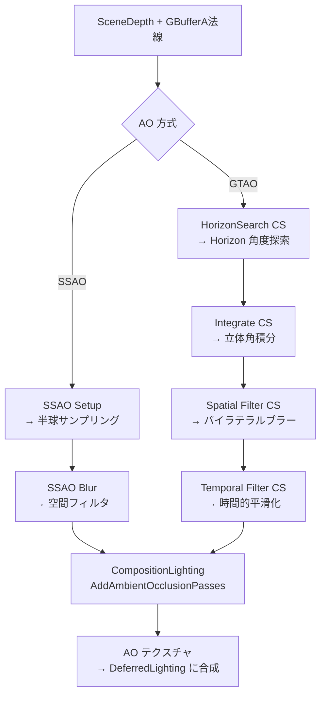

# 22: Screen Space AO 全体概要

- 対象ファイル: `PostProcessAmbientOcclusion.h/.cpp` / `CompositionLighting.h/.cpp`
- 関連: [[ref_ssao]] / [[ref_composition_lighting]]

---

## 概要

UE5 の環境遮蔽（AO）は複数方式が共存する。  
通常は **GTAO**（Ground Truth AO）が使用され、Lumen 有効時は  
Lumen Short Range AO に置き換えられる。

---

## AO 方式の選択

| 条件 | 方式 |
|------|------|
| Lumen 有効 | Lumen Short Range AO（Lumen SSGI の副産物）|
| Lumen 無効 + `r.AmbientOcclusion.Method=1` | GTAO（Ground Truth Ambient Occlusion）|
| Lumen 無効 + `r.AmbientOcclusion.Method=0` | SSAO（従来のサンプリング方式）|
| モバイル | PostProcessAmbientOcclusionMobile |

---

## アーキテクチャ（Mermaid）



---

## EGTAOType / ESSAOType（PostProcessAmbientOcclusion.h）

```cpp
enum class ESSAOType
{
    EPS,       // ピクセルシェーダー版
    ECS,       // 非 Async Compute シェーダー版
    EAsyncCS,  // Async Compute シェーダー版
};

enum class EGTAOType
{
    EOff,                    // GTAO 無効（SSAO を使用）
    EAsyncCombinedSpatial,   // HorizonSearch + Integrate を Async Compute で実行
                             // Temporal / Upsample は GFX パイプ
    EAsyncHorizonSearch,     // HorizonSearch のみ Async Compute
                             // Integrate 以降は GFX パイプ
    ENonAsync,               // 全パスを GFX パイプで実行
};
```

---

## GTAO パスフロー（EGTAOPass）

```cpp
enum EGTAOPass
{
    EGTAOPass_None                  = 0x0,
    EGTAOPass_HorizonSearch         = 0x1,  // 水平線角度探索
    EGTAOPass_HorizonSearchIntegrate = 0x2, // 探索 + 積分（Combined）
    EGTAOPass_Integrate             = 0x4,  // 立体角積分
    EGTAOPass_SpatialFilter         = 0x8,  // 空間バイラテラルフィルタ
    EGTAOPass_TemporalFilter        = 0x10, // 時間的フィルタ（Velocity 必要）
    EGTAOPass_Upsample              = 0x20, // ハーフ解像度 → 全解像度
};
```

---

## フレームフロー

```
CompositionLighting::ProcessAfterOcclusion()
  │
  ├─ [Lumen 有効時]
  │   FLumenScreenProbeGatherAO → AO テクスチャを生成
  │   以降の GTAO/SSAO はスキップ
  │
  ├─ [GTAO]
  │   FGTAOContext ctx(GTAOType)
  │   AddAmbientOcclusionPasses(GraphBuilder, View, ctx, ...)
  │     │
  │     ├─ [A] HorizonSearch CS (+ Integrate)
  │     │   入力: SceneDepth(HZB), GBufferA(法線)
  │     │   出力: HorizonAngleTexture
  │     │
  │     ├─ [B] Integrate CS（Separate の場合）
  │     │   HorizonAngle → 立体角積分 → BentNormal + AO値
  │     │
  │     ├─ [C] SpatialFilter CS（バイラテラルブラー）
  │     │   深度 + 法線をキーに周辺サンプル重み付き平均
  │     │
  │     └─ [D] TemporalFilter CS
  │         Velocity Buffer で前フレーム座標を計算して再投影
  │         Neighborhood Clamp で過去値をクランプ
  │         → AO テクスチャ（R8 または R8G8）
  │
  └─ DeferredLightingComposite()
      → AO テクスチャをサンプルして間接光に乗算
```

---

## 主要 CVar

| CVar | デフォルト | 説明 |
|------|----------|------|
| `r.AmbientOcclusion.Method` | 1 | 0=SSAO, 1=GTAO |
| `r.GTAO.Quality` | 3 | GTAO 品質（0-4）|
| `r.GTAO.HalfRes` | 1 | 1/2 解像度で GTAO 実行 |
| `r.GTAO.UseNormals` | 1 | GBuffer 法線を使用 |
| `r.GTAO.TemporalFilter` | 1 | 時間的フィルタ有効 |
| `r.AmbientOcclusionStaticFraction` | 1.0 | AO の静的強度スケール |

---

## 関連リファレンス

- [[ref_ssao]] — `FGTAOContext` / `FSSAOHelper` / シェーダークラス群
- [[ref_composition_lighting]] — `FCompositionLighting` / `AddAmbientOcclusionPasses()`
