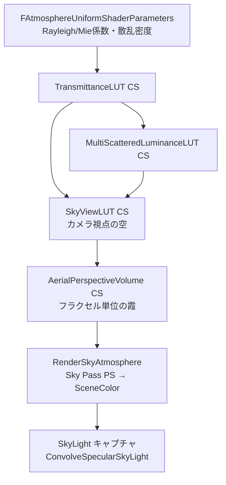

# 18: Sky Atmosphere 全体概要

- 対象ファイル: `SkyAtmosphereRendering.h/.cpp` / `SkyPassRendering.h/.cpp`
- 関連: [[ref_sky_atmosphere]] / [[ref_sky_light]]

---

## 概要

**物理ベースの大気散乱**（Rayleigh / Mie 散乱）を LUT（Look-Up Table）に事前計算し、  
ランタイムはLUTからサンプルして空と大気透過を高速に描画する。  
4種の LUT が必要で、カメラの遠近状況に応じてバイパスできる。

---

## 主要 LUT 一覧

| LUT名 | サイズ | 内容 |
|-------|--------|------|
| Transmittance LUT | 256×64 | 大気端から視点への透過率 |
| MultiScattered Luminance LUT | 32×32 | 多重散乱の輝度 |
| SkyView LUT | 192×108 | カメラ付近の空の色（Lat/Long マップ）|
| Aerial Perspective Volume | 32×32×16 | カメラから各フラクセルの散乱・透過 |

---

## アーキテクチャ（Mermaid）



---

## FAtmosphereUniformShaderParameters（SkyAtmosphereRendering.h）

```cpp
BEGIN_GLOBAL_SHADER_PARAMETER_STRUCT(FAtmosphereUniformShaderParameters, )
    SHADER_PARAMETER(float, MultiScatteringFactor)     // 多重散乱係数
    SHADER_PARAMETER(float, BottomRadiusKm)            // 地球表面半径 [km]
    SHADER_PARAMETER(float, TopRadiusKm)               // 大気上端半径 [km]
    SHADER_PARAMETER(float, RayleighDensityExpScale)   // Rayleigh 指数密度スケール
    SHADER_PARAMETER(FLinearColor, RayleighScattering) // Rayleigh 散乱係数 (RGB)
    SHADER_PARAMETER(FLinearColor, MieScattering)      // Mie 散乱係数
    SHADER_PARAMETER(float, MieDensityExpScale)
    SHADER_PARAMETER(FLinearColor, MieExtinction)      // Mie 消散係数
    SHADER_PARAMETER(float, MiePhaseG)                 // Henyey-Greenstein 位相関数 g
    SHADER_PARAMETER(FLinearColor, MieAbsorption)
    // Ozone 層吸収（2 層モデル）
    SHADER_PARAMETER(float, AbsorptionDensity0LayerWidth)
    SHADER_PARAMETER(float, AbsorptionDensity0ConstantTerm)
    SHADER_PARAMETER(float, AbsorptionDensity0LinearTerm)
    SHADER_PARAMETER(float, AbsorptionDensity1ConstantTerm)
    SHADER_PARAMETER(float, AbsorptionDensity1LinearTerm)
    SHADER_PARAMETER(FLinearColor, AbsorptionExtinction) // Ozone 消散係数
    SHADER_PARAMETER(FLinearColor, GroundAlbedo)         // 地表アルベド
END_GLOBAL_SHADER_PARAMETER_STRUCT()
```

---

## フレームフロー

```
RenderSkyAtmosphereMainView()               SkyAtmosphereRendering.cpp
  │
  ├─ [A] TransmittanceLUT
  │   条件: 大気パラメータが変化した場合のみ（通常は静的キャッシュ）
  │   → CS で 256×64 テクスチャを計算
  │      Beer-Lambert 積分: T(x→top) = exp(-∫σ_ext ds)
  │
  ├─ [B] MultiScatteredLuminanceLUT
  │   条件: 大気パラメータ or ライスト方向が変化した場合
  │   → CS で 32×32 テクスチャを計算（複数バウンス多重散乱）
  │
  ├─ [C] SkyViewLUT
  │   毎フレーム（カメラ位置によって変化）
  │   → CS で 192×108 テクスチャを計算
  │      各テクセル = カメラ視線方向の Sky 色
  │
  ├─ [D] AerialPerspectiveVolume
  │   毎フレーム（カメラ近傍）
  │   → CS で 32×32×16 フラクセルを計算
  │      各フラクセル = 視線方向 × 深度スライスの散乱・透過
  │
  └─ [E] RenderSky（描画パス）
      FSkyAtmosphereRenderContext を設定
      → SkyPassPS: SkyViewLUT + AerialPerspective からサンプル
      → SceneColor の空部分に合成
      → bFastSky=true: SkyViewLUT のみ（高速近似）
      → bFastAerialPerspective: ボリュームなしで近似

[SkyLight キャプチャ]
ReflectionEnvironmentCapture.cpp
  → 定期キャプチャ（変化検知時）
  → SkyAtmosphere の TransmittanceLUT / SkyViewLUT を参照
  → キューブマップにフィルタリングして ConvolveSpecularSkyLight
```

---

## 主要 CVar

| CVar | デフォルト | 説明 |
|------|----------|------|
| `r.SkyAtmosphere` | 1 | Sky Atmosphere 有効 |
| `r.SkyAtmosphere.FastSkyLUT` | 1 | SkyView LUT 高速近似 |
| `r.SkyAtmosphere.AerialPerspective.DepthTest` | 1 | Aerial Perspective 深度テスト |
| `r.SkyAtmosphere.SampleCountMin` | 2 | LUT 計算の最小サンプル数 |

---

## 関連リファレンス

- [[ref_sky_atmosphere]] — `FSkyAtmosphereRenderContext` / `FSkyAtmosphereRenderSceneInfo`
- [[ref_sky_light]] — `FSkyLightSceneProxy` / `ConvolveSpecularSkyLight`
