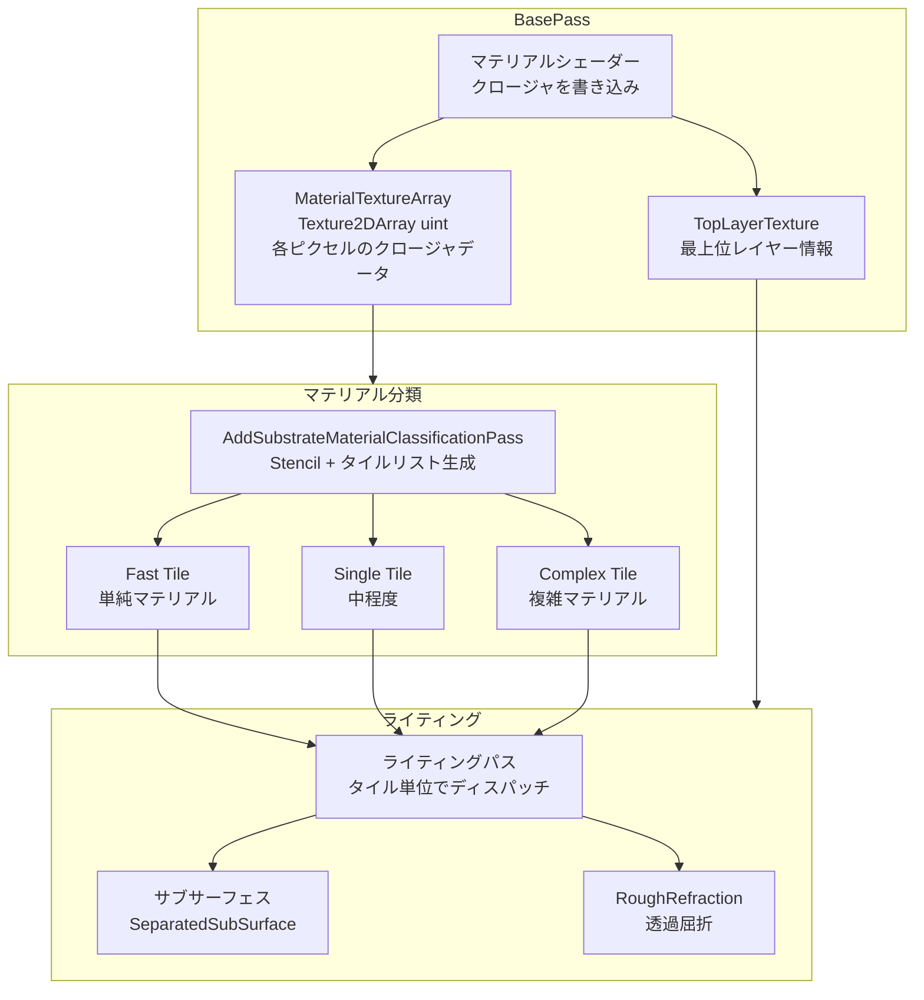

# Substrate 全体概要

- 取得日: 2026-04-10
- 対象: `D:\UnrealEngine\Engine\Source\Runtime\Renderer\Private\Substrate\`
- 上位: [[01_rendering_overview]]

---

## Substrate とは

旧来の「シェーディングモデル（Shading Models）」を置き換える**新マテリアルレイヤーシステム**（UE5.3〜 実験的）。  
1ピクセルに複数のマテリアルクロージャ（Closure）を積み重ねられるようにし、  
複雑な表面（コーティング・サブサーフェス・クリアコート等）を統一的に扱う。

| 従来の問題 | Substrate の解法 |
|-----------|---------------|
| シェーディングモデルが固定の enum で拡張しにくい | クロージャのレイヤー構造で柔軟に組み合わせ |
| 複数マテリアル層の表現が制限あり | 1ピクセル複数クロージャ（MaxClosurePerPixel） |
| GBuffer フォーマットが固定 | MaterialTextureArray（可変スライス数）に保存 |
| ライティングパスのコストが高い | タイル分類（Fast/Single/Complex）で最適化 |

---

## 全体アーキテクチャ



---

## タイル分類（ステンシルビット）

```cpp
// ステンシルビットでタイル種別を識別
namespace Substrate
{
    constexpr uint32 StencilBit_Fast           = 0x10; // 単純マテリアル（最高速）
    constexpr uint32 StencilBit_Single         = 0x20; // 中程度
    constexpr uint32 StencilBit_Complex        = 0x40; // 複雑（複数クロージャ）
    constexpr uint32 StencilBit_ComplexSpecial = 0x80; // 特殊複雑（Eye等）
}
```

---

## 主要クラス・構造体

```cpp
// シーン単位のデータ（FScene に保持）
struct FSubstrateSceneData
{
    // ピクセル当たりの最大バイト数・クロージャ数
    uint32 EffectiveMaxBytesPerPixel;
    uint32 EffectiveMaxClosurePerPixel;

    // フレームごとのリソース
    FRDGTextureRef MaterialTextureArray;        // クロージャデータ格納（2DArray uint）
    FRDGTextureRef TopLayerTexture;             // 最上位レイヤー
    FRDGTextureRef OpaqueRoughRefractionTexture;// 粗い屈折テクスチャ
    FRDGTextureRef ClosureOffsetTexture;        // クロージャオフセット
    FRDGTextureRef SampledMaterialTexture;      // サンプル済みマテリアル
};

// ビュー単位のデータ
struct FSubstrateViewData
{
    uint32 MaxClosurePerPixel;
    uint32 MaxBytesPerPixel;
    FIntPoint TileCount;
    uint32 TileEncoding;   // SUBSTRATE_TILE_ENCODING_16BITS 等

    // タイルリストバッファ（タイル種別ごと）
    FRDGBufferRef ClassificationTileListBuffer;
    FRDGBufferRef ClassificationTileDrawIndirectBuffer;
    FRDGBufferRef ClassificationTileDispatchIndirectBuffer;
    FRDGBufferRef ClosureTileBuffer;
};

// グローバルシェーダーパラメータ
BEGIN_GLOBAL_SHADER_PARAMETER_STRUCT(FSubstrateGlobalUniformParameters, )
    SHADER_PARAMETER(uint32, MaxBytesPerPixel)
    SHADER_PARAMETER(uint32, MaxClosurePerPixel)
    SHADER_PARAMETER(uint32, TileSize)
    SHADER_PARAMETER_RDG_TEXTURE(Texture2DArray<uint>, MaterialTextureArray)
    SHADER_PARAMETER_RDG_TEXTURE(Texture2D, TopLayerTexture)
    // ...
END_GLOBAL_SHADER_PARAMETER_STRUCT()
```

---

## フレームの流れ（概略）

```
[A] InitialiseSubstrateFrameSceneData()
    → MaterialTextureArray / TopLayerTexture 等を RDG 上に確保

[B] BasePass
    → マテリアルシェーダーが MaterialTextureArray へクロージャデータを書き込み
    → TopLayerTexture に最上位レイヤー情報を書き込み

[C] AddSubstrateMaterialClassificationPass()
    → ステンシルビットを立てて Fast/Single/Complex タイルリストを生成

[D] ライティングパス
    → タイルリストに基づき Indirect Dispatch でタイル単位に実行
    → FSubstrateTilePassVS でタイルを頂点として処理

[E] AddSubstrateOpaqueRoughRefractionPasses()
    → 透過屈折処理

[F] AddSubstrateDebugPasses()（デバッグ時のみ）
```

---

## 主要 CVar 一覧

| CVar | デフォルト | 説明 |
|------|----------|------|
| `r.Substrate` | 0 | Substrate 有効（プロジェクト設定で変更） |
| `r.Substrate.BytesPerPixel` | 80 | ピクセルあたりの最大バイト数 |
| `r.Substrate.ClosurePerPixel` | 2 | ピクセルあたりの最大クロージャ数 |
| `r.Substrate.Debug.AdvancedVisualization` | 0 | 詳細デバッグ表示 |

---

## 主要ソースファイル一覧

| ファイル | 役割 |
|---------|------|
| `Substrate.h/.cpp` | フレームデータ初期化・タイル分類・各パスの追加 |
| `SubstrateRoughRefraction.cpp` | 不透明粗面屈折パス |
| `SubstrateVisualize.cpp` | デバッグビジュアライゼーション |
| `Glint/` | グリント（マイクロファセットきらめき）処理サブフォルダ |

---

## コード実行フロー

### エントリポイント

```
FDeferredShadingSceneRenderer::Render()
  │
  ├─ [A] Substrate::InitialiseSubstrateFrameSceneData()       // Substrate.cpp
  │       ├─ EffectiveMaxBytesPerPixel / ClosurePerPixel 算出
  │       ├─ MaterialTextureArray を RDG 上に確保（Texture2DArray<uint>）
  │       ├─ TopLayerTexture を確保
  │       ├─ ClosureOffsetTexture を確保
  │       └─ FSubstrateGlobalUniformParameters をバインド
  │
  ├─ [B] BasePass 実行（各マテリアルシェーダー）
  │       ├─ Substrate::BindSubstrateBasePassUniformParameters()
  │       └─ 各ピクセルで MaterialTextureArrayUAV へクロージャデータ書き込み
  │
  ├─ [C] Substrate::AddSubstrateMaterialClassificationPass()  // Shadow パスと並行可
  │       ├─ ステンシルにタイル種別ビット書き込み（0x10/0x20/0x40/0x80）
  │       └─ ClassificationTileListBuffer / IndirectArgsBuffer 生成
  │
  ├─ [C'] Substrate::AddSubstrateMaterialClassificationIndirectArgsPass()
  │       └─ Indirect Draw/Dispatch 引数バッファ確定
  │
  ├─ [D] DeferredLighting パス（Substrate タイル単位 Indirect Draw）
  │       ├─ SetTileParameters(Fast)    → FSubstrateTilePassVS → Fast シェーダー
  │       ├─ SetTileParameters(Single)  → Single シェーダー
  │       └─ SetTileParameters(Complex) → Complex シェーダー（複数クロージャ）
  │
  ├─ [E] Substrate::AddSubstrateOpaqueRoughRefractionPasses() // 屈折マテリアルあり時
  │       └─ OpaqueRoughRefractionTexture → SceneColor 合成
  │
  └─ [F] Substrate::AddSubstrateDebugPasses()                 // デバッグ時のみ
```

### フロー詳細

1. **InitialiseSubstrateFrameSceneData** — リソース確保とサイズ決定
   ```cpp
   void Substrate::InitialiseSubstrateFrameSceneData(
       FRDGBuilder& GraphBuilder, FSceneRenderer& SceneRenderer);
   // r.Substrate.AllocationMode=1 → PersistentMax 以下にはサイズを縮小しない
   ```

2. **BasePass バインド** — 各マテリアルシェーダーに Substrate パラメータを注入
   ```cpp
   void Substrate::BindSubstrateBasePassUniformParameters(
       FRDGBuilder& GraphBuilder,
       const FViewInfo& View,
       FSubstrateBasePassUniformParameters& Out);
   ```

3. **分類パス** — ステンシルビット + タイルリスト生成
   ```cpp
   void Substrate::AddSubstrateMaterialClassificationPass(
       FRDGBuilder& GraphBuilder,
       const FMinimalSceneTextures& SceneTextures,
       const FDBufferTextures& DBufferTextures,
       const TArray<FViewInfo>& Views);
   // r.Substrate.AsyncClassification=1 → Shadow パスと並行実行
   ```

4. **タイル単位ライティング** — `FSubstrateTilePassVS` + Indirect Draw
   ```cpp
   FSubstrateTileParameter TileParams = Substrate::SetTileParameters(
       GraphBuilder, View, ESubstrateTileType::Fast); // Fast/Single/Complex を切り替え
   ```

5. **RoughRefraction** — 粗い屈折テクスチャから屈折先 SceneColor をサンプリング

### 関与クラス・関数一覧

| クラス / 関数 | ファイル | 役割 |
|------------|--------|------|
| `Substrate::InitialiseSubstrateFrameSceneData()` | `Substrate.cpp` | フレームリソース確保 |
| `FSubstrateSceneData` | `Substrate.h` | シーン単位データホルダー |
| `FSubstrateViewData` | `Substrate.h` | ビュー単位データ・タイルバッファ |
| `FSubstrateGlobalUniformParameters` | `Substrate.h` | GPU UBO（シェーダーバインドポイント "Substrate"） |
| `Substrate::AddSubstrateMaterialClassificationPass()` | `Substrate.cpp` | 分類パス本体 |
| `FSubstrateTilePassVS` | `Substrate.h` | タイル展開 VS |
| `Substrate::SetTileParameters()` | `Substrate.h` | タイルパラメータ取得 |
| `Substrate::AddSubstrateOpaqueRoughRefractionPasses()` | `SubstrateRoughRefraction.cpp` | 屈折パス |

### サブシステムドキュメント

| ドキュメント | 内容 |
|------------|------|
| [[a_substrate_material]] | クロージャ・レイヤー構造・MaterialTextureArray への書き込み |
| [[b_substrate_classify]] | タイル分類パス（ステンシルビット・Fast/Single/Complex タイルリスト） |
| [[c_substrate_lighting]] | ライティングパス・RoughRefraction・SubSurface |
