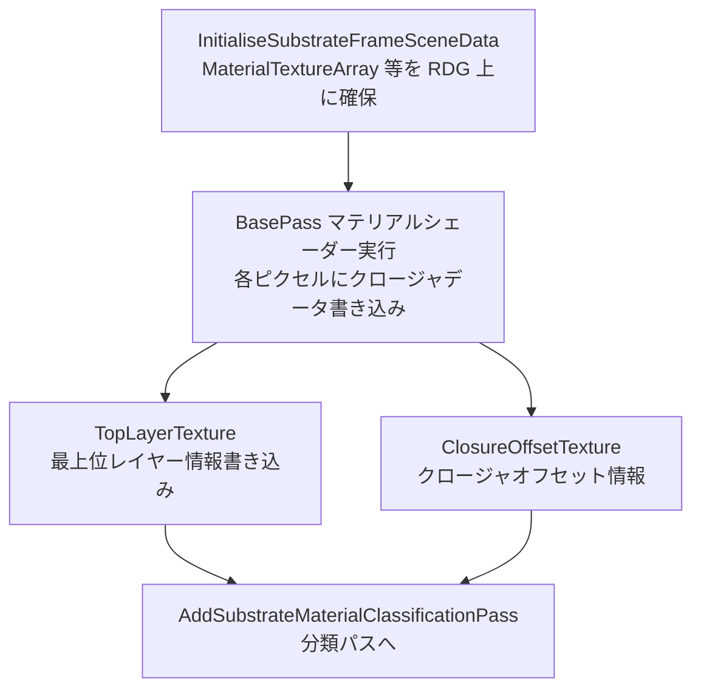

# Substrate マテリアルクロージャとデータ構造

- 上位: [[08_substrate_overview]]
- 関連: [[b_substrate_classify]] | [[c_substrate_lighting]]

## 概要

Substrate では各マテリアルが **クロージャ（Closure）** の集合として定義される。  
BasePass でマテリアルシェーダーが実行されると、クロージャデータが  
**MaterialTextureArray**（Texture2DArray&lt;uint&gt;）に書き込まれ、  
後段のライティングパスがこれを読み込んで評価する。

---

## 全体フロー



---

## クロージャ・レイヤー構造

```cpp
// 1ピクセルに複数クロージャを格納
struct PixelClosure
{
    // MaterialTextureArray の 1スライス = 1ピクセルのクロージャデータ
    // スライス数 = EffectiveMaxBytesPerPixel / 4 （RGBA uint）
};
```

### 主要リソース

| リソース | 型 | 説明 |
|---------|-----|------|
| `MaterialTextureArray` | `FRDGTextureRef` (Texture2DArray&lt;uint&gt;) | 全クロージャデータ。スライス数がバイト数に応じて可変 |
| `TopLayerTexture` | `FRDGTextureRef` | 最上位レイヤーの要約情報（反射・ラフネス等） |
| `OpaqueRoughRefractionTexture` | `FRDGTextureRef` | 粗い屈折テクスチャ |
| `ClosureOffsetTexture` | `FRDGTextureRef` | 各ピクセルのクロージャ開始オフセット |
| `SampledMaterialTexture` | `FRDGTextureRef` | サンプリング済みマテリアル（ステンシル依存） |

---

## MaterialTextureArray への書き込み

```cpp
// BasePass UniformParameters
BEGIN_SHADER_PARAMETER_STRUCT(FSubstrateBasePassUniformParameters, )
    SHADER_PARAMETER_STRUCT_INCLUDE(FSubstrateCommonParameters, Common)
    // MRT なしモード用（BasePass と同時書き込み）
    SHADER_PARAMETER_RDG_TEXTURE_UAV(RWTexture2DArray<uint>, MaterialTextureArrayUAVWithoutRTs)
    // 粗い屈折テクスチャ
    SHADER_PARAMETER_RDG_TEXTURE_UAV(RWTexture2D<float3>, OpaqueRoughRefractionTextureUAV)
END_SHADER_PARAMETER_STRUCT()
```

### 書き込みモード

| モード | 条件 | 説明 |
|--------|------|------|
| MRT モード | `r.Substrate.UseMRT=1` | RenderTarget スロットとして出力 |
| UAV モード | デフォルト | `MaterialTextureArrayUAVWithoutRTs` へ直接書き込み |

---

## FSubstrateSceneData（シーン単位データ）

```cpp
struct FSubstrateSceneData
{
    // フレーム内の全ビューの最大値を追跡
    uint32 ViewsMaxBytesPerPixel = 0;
    uint32 ViewsMaxClosurePerPixel = 0;

    // シーン作成以来の累積最大値（リソース再割り当てを最小化）
    uint32 PersistentMaxBytesPerPixel = 0;
    uint32 PersistentMaxClosurePerPixel = 0;

    // 実際に使用中の最大値
    uint32 EffectiveMaxBytesPerPixel = 0;
    uint32 EffectiveMaxClosurePerPixel = 0;

    // デバッグ・特殊機能フラグ
    bool bRoughDiffuse = false;
    bool bRoughnessTracking = false;
    bool bStochasticLighting = false;

    // フレームごとに確保されるリソース
    FRDGTextureRef MaterialTextureArray = nullptr;
    FRDGTextureRef TopLayerTexture = nullptr;
    FRDGTextureRef OpaqueRoughRefractionTexture = nullptr;
    FRDGTextureRef ClosureOffsetTexture = nullptr;
    FRDGTextureRef SampledMaterialTexture = nullptr;

    // SubSurface 分離バッファ
    FRDGTextureRef SeparatedSubSurfaceSceneColor = nullptr;
    FRDGTextureRef SeparatedOpaqueRoughRefractionSceneColor = nullptr;
};
```

---

## FSubstrateViewData（ビュー単位データ）

```cpp
struct FSubstrateViewData
{
    uint32 MaxClosurePerPixel = 0;   // このビューの最大クロージャ数
    uint32 MaxBytesPerPixel = 0;     // このビューの最大バイト数
    uint8  UsesTileTypeMask = 0;     // 使用中のタイル種別ビットマスク
    bool   bUsesAnisotropy = false;  // 異方性マテリアルを含むか

    FIntPoint TileCount = FIntPoint(0, 0);
    uint32    TileEncoding = SUBSTRATE_TILE_ENCODING_16BITS;

    // タイルリストバッファ（分類パスで生成、ライティングパスで消費）
    FRDGBufferRef ClassificationTileListBuffer = nullptr;
    FRDGBufferRef ClassificationTileDrawIndirectBuffer = nullptr;
    FRDGBufferRef ClassificationTileDispatchIndirectBuffer = nullptr;
    FRDGBufferRef ClosureTileBuffer = nullptr;
    FRDGBufferRef ClosureTileCountBuffer = nullptr;
    FRDGBufferRef ClosureTileDispatchIndirectBuffer = nullptr;
};
```

---

## 主要 CVar

| CVar | デフォルト | 説明 |
|------|----------|------|
| `r.Substrate` | 0 | Substrate 全体の有効化（プロジェクト設定） |
| `r.Substrate.BytesPerPixel` | 80 | ピクセルあたりの最大バイト数 |
| `r.Substrate.ClosurePerPixel` | 2 | ピクセルあたりの最大クロージャ数 |
| `r.Substrate.AllocationMode` | 1 | 0=ビュー要件, 1=成長のみ, 2=プラットフォーム設定 |
| `r.Substrate.UseClosureCountFromMaterial` | 1 | マテリアルからクロージャ数を動的取得 |

---

## 関連ソースファイル

| ファイル | 役割 |
|---------|------|
| `Substrate.h` | FSubstrateSceneData / FSubstrateViewData 定義、主要関数宣言 |
| `Substrate.cpp` | InitialiseSubstrateFrameSceneData・分類パス実装 |
| `SubstrateDefinitions.h`（エンジン公開）| クロージャ型定義・定数 |

---

## コード実行フロー

### エントリポイント

```
FDeferredShadingSceneRenderer::Render()
  │
  └─ Substrate::InitialiseSubstrateFrameSceneData()   // Substrate.cpp
       ├─ EffectiveMaxBytesPerPixel 算出
       ├─ MaterialTextureArray を RDG 上に確保
       ├─ TopLayerTexture を確保
       └─ ClosureOffsetTexture を確保

  → BasePass 実行（各マテリアルシェーダー）
       └─ MaterialTextureArrayUAV へクロージャデータ書き込み
```

### フロー詳細

1. **InitialiseSubstrateFrameSceneData** — フレーム開始時に全リソースを RDG 上に確保
   ```cpp
   void Substrate::InitialiseSubstrateFrameSceneData(
       FRDGBuilder& GraphBuilder, FSceneRenderer& SceneRenderer);
   ```
   - `EffectiveMaxBytesPerPixel` = `max(各ビューのMaxBytesPerPixel, PersistentMax)`
   - `r.Substrate.AllocationMode=1` の場合は `PersistentMax` 以下にはリサイズしない

2. **BasePass マテリアルシェーダー** — `FSubstrateBasePassUniformParameters` 経由でバインド
   ```cpp
   void Substrate::BindSubstrateBasePassUniformParameters(
       FRDGBuilder& GraphBuilder,
       const FViewInfo& View,
       FSubstrateBasePassUniformParameters& OutSubstrateUniformParameters);
   ```

3. **クロージャデータ書き込み** — 各ピクセルでシェーダーが MaterialTextureArray の UAV に書き込む

### 関与クラス・関数一覧

| クラス / 関数 | ファイル | 役割 |
|------------|--------|------|
| `Substrate::InitialiseSubstrateFrameSceneData()` | `Substrate.cpp` | フレームリソース確保 |
| `FSubstrateSceneData` | `Substrate.h` | シーン単位データホルダー |
| `FSubstrateViewData` | `Substrate.h` | ビュー単位データホルダー |
| `Substrate::BindSubstrateBasePassUniformParameters()` | `Substrate.cpp` | BasePass バインド |

## 関連リファレンス

| リファレンス | 対象ソース |
|------------|----------|
| [[ref_substrate_data]] | `Substrate.h`（FSubstrateSceneData / FSubstrateViewData） |
| [[ref_substrate_params]] | `Substrate.h`（FSubstrateGlobalUniformParameters） |
