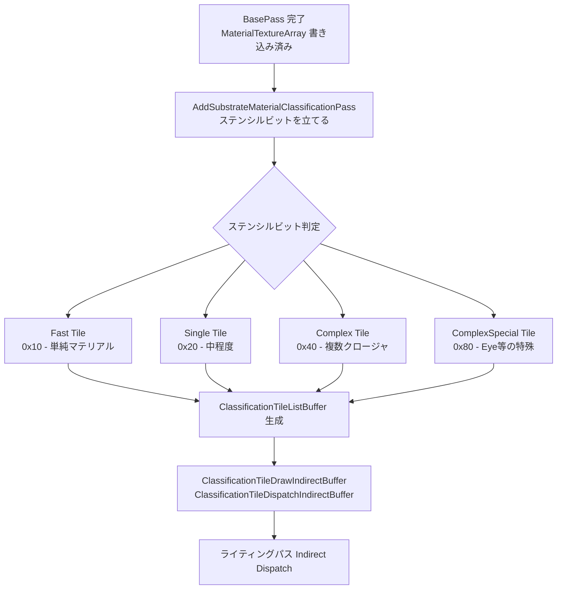

# Substrate タイル分類パス

- 上位: [[08_substrate_overview]]
- 関連: [[a_substrate_material]] | [[c_substrate_lighting]]

## 概要

BasePass 完了後、`AddSubstrateMaterialClassificationPass()` がステンシルバッファを読み取り、  
各タイルを **Fast / Single / Complex** の3種類に分類してタイルリストバッファを生成する。  
後段のライティングパスはこのタイルリストを使って Indirect Dispatch を行うことで、  
不要なタイルのシェーダー実行を回避し GPU パフォーマンスを最適化する。

---

## 全体フロー



---

## ステンシルビット定義

```cpp
namespace Substrate
{
    // SceneRenderTargets.h の STENCIL_SUBSTRATE_* マクロと同期
    constexpr uint32 StencilBit_Fast           = 0x10; // Fast パス（単純マテリアル）
    constexpr uint32 StencilBit_Single         = 0x20; // Single パス（中程度）
    constexpr uint32 StencilBit_Complex        = 0x40; // Complex パス（複数クロージャ）
    constexpr uint32 StencilBit_ComplexSpecial = 0x80; // Complex Special（Eye/Hair 等）
}
```

各ビットは排他的ではなく、複数ビットが立つこともある。  
ライティングパスは最も上位のビットに対応するシェーダーパスを選択する。

---

## 主要関数

### `AddSubstrateMaterialClassificationPass`

```cpp
void Substrate::AddSubstrateMaterialClassificationPass(
    FRDGBuilder& GraphBuilder,
    const FMinimalSceneTextures& SceneTextures,
    const FDBufferTextures& DBufferTextures,
    const TArray<FViewInfo>& Views);
```

| 引数 | 説明 |
|------|------|
| `SceneTextures` | DepthStencil を含むシーンテクスチャ群 |
| `DBufferTextures` | DBuffer デカールテクスチャ（Substrate DBuffer パスにも使用） |
| `Views` | 全ビュー（ビューごとに分類を実行） |

処理内容:
1. MaterialTextureArray のクロージャ情報を読み取り
2. ステンシルバッファにタイル種別ビットを書き込み
3. タイルリストバッファ（`ClassificationTileListBuffer`）を生成
4. Indirect Args バッファ（Draw/Dispatch）を生成

### `AddSubstrateMaterialClassificationIndirectArgsPass`

```cpp
void Substrate::AddSubstrateMaterialClassificationIndirectArgsPass(
    FRDGBuilder& GraphBuilder,
    const FViewInfo& View,
    ERDGPassFlags ComputePassFlags);
```

分類後に Indirect Draw/Dispatch 用の引数バッファを更新するパス。  
`r.Substrate.AsyncClassification=1` のとき Shadow パスと並行実行される。

### `AddSubstrateStencilPass`

```cpp
void Substrate::AddSubstrateStencilPass(
    FRDGBuilder& GraphBuilder,
    const TArray<FViewInfo>& Views,
    const FMinimalSceneTextures& SceneTextures);
```

ステンシルパスのみを分離して追加。DBuffer パス前に呼ばれることがある。

---

## タイルパラメータ取得

```cpp
// タイルリストバッファへの SRV と Indirect Args をまとめた構造体
BEGIN_SHADER_PARAMETER_STRUCT(FSubstrateTileParameter, )
    SHADER_PARAMETER_RDG_BUFFER_SRV(Buffer<uint>, TileListBuffer)
    SHADER_PARAMETER(uint32, TileListBufferOffset)
    SHADER_PARAMETER(uint32, TileEncoding)
    RDG_BUFFER_ACCESS(TileIndirectBuffer, ERHIAccess::IndirectArgs)
END_SHADER_PARAMETER_STRUCT()

// タイル種別を指定してパラメータを取得
FSubstrateTileParameter Substrate::SetTileParameters(
    FRDGBuilder& GraphBuilder,
    const FViewInfo& View,
    const ESubstrateTileType Type);
```

ライティングパスは `SetTileParameters()` でタイル種別を指定し、  
`FSubstrateTilePassVS` と組み合わせて Indirect Draw を発行する。

---

## 非同期実行

```cpp
static TAutoConsoleVariable<int32> CVarSubstrateAsyncClassification(
    TEXT("r.Substrate.AsyncClassification"),
    1, // Shadow パスと並行実行（デフォルト有効）
    ...);
```

分類パスは Shadow パスのコンピュートと並行実行することで GPU レイテンシを隠蔽できる。

---

## 主要 CVar

| CVar | デフォルト | 説明 |
|------|----------|------|
| `r.Substrate.AsyncClassification` | 1 | Shadow パスと並行分類 |
| `r.Substrate.TileCoord8bits` | 1 | タイル座標の圧縮形式（16bit vs 8bit） |
| `r.Substrate.UseStochasticLightingClassification` | 1 | Stochastic Lighting 分類を分類パス内で実行 |
| `r.Substrate.DBufferPass.DedicatedTiles` | 0 | DBuffer 用に専用タイルを確保するか |

---

## 関連ソースファイル

| ファイル | 役割 |
|---------|------|
| `Substrate.h` | 分類パス関数宣言・ステンシルビット定数 |
| `Substrate.cpp` | AddSubstrateMaterialClassificationPass 実装 |

---

## コード実行フロー

### エントリポイント

```
FDeferredShadingSceneRenderer::Render()
  │
  └─ Substrate::AddSubstrateMaterialClassificationPass()   // Substrate.cpp
       │
       ├─ ステンシルビット書き込みパス（ComputeShader）
       │    └─ MaterialTextureArray を読み取り → ステンシルへ書き込み
       │
       └─ タイルリスト生成パス（ComputeShader）
            ├─ ClassificationTileListBuffer へタイル座標書き込み
            └─ ClassificationTileDrawIndirectBuffer 更新

  → Substrate::AddSubstrateMaterialClassificationIndirectArgsPass()
       └─ Indirect Args バッファ確定
```

### フロー詳細

1. **ステンシルビット書き込み** — MaterialTextureArray を読み取り、クロージャの複雑さに応じてステンシルに書き込む
   - クロージャ数 == 1 かつ単純マテリアル → Fast (0x10)
   - クロージャ数 == 1 → Single (0x20)
   - クロージャ数 > 1 → Complex (0x40)
   - Eye / Hair 等 → ComplexSpecial (0x80)

2. **タイルリスト生成** — ステンシルビットを参照し `ClassificationTileListBuffer` にタイル座標を追記

3. **Indirect Args 更新** — `ClassificationTileDrawIndirectBuffer` / `ClassificationTileDispatchIndirectBuffer` に引数をパック

### 関与クラス・関数一覧

| クラス / 関数 | ファイル | 役割 |
|------------|--------|------|
| `Substrate::AddSubstrateMaterialClassificationPass()` | `Substrate.cpp` | メインエントリ |
| `Substrate::AddSubstrateMaterialClassificationIndirectArgsPass()` | `Substrate.cpp` | Indirect Args 更新 |
| `FSubstrateTileParameter` | `Substrate.h` | タイルパラメータ構造体 |
| `Substrate::SetTileParameters()` | `Substrate.h` | タイルパラメータ取得ヘルパー |
| `Substrate::TileTypeDrawIndirectArgOffset()` | `Substrate.h` | タイル種別ごとの IndirectArgs オフセット |

## 関連リファレンス

| リファレンス | 対象ソース |
|------------|----------|
| [[ref_substrate_classify]] | `Substrate.h`（分類パス関数群・FSubstrateTilePassVS） |
| [[ref_substrate_data]] | `Substrate.h`（FSubstrateViewData のタイルバッファ） |
