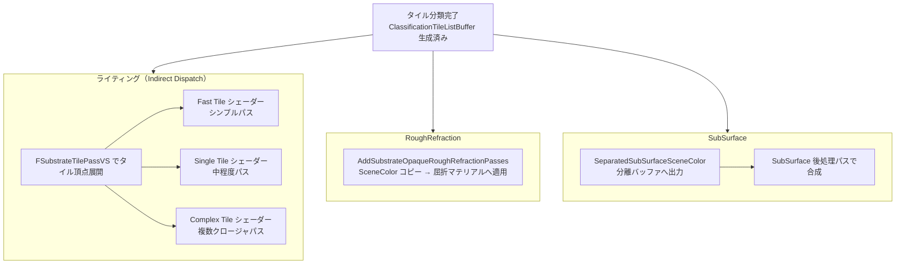

# Substrate ライティングパス・RoughRefraction・SubSurface

- 上位: [[08_substrate_overview]]
- 関連: [[a_substrate_material]] | [[b_substrate_classify]]

## 概要

タイル分類後、各タイル種別に対応したライティングシェーダーを **Indirect Dispatch** で実行する。  
さらに **RoughRefraction（粗い屈折）** と **SubSurface（サブサーフェス散乱）** のパスが続く。

| パス | 関数 | 条件 |
|------|------|------|
| 通常ライティング | DeferredLighting パス内（Substrate 専用コードパス） | 常時 |
| RoughRefraction | `AddSubstrateOpaqueRoughRefractionPasses()` | 屈折マテリアルがある場合 |
| SubSurface | `SeparatedSubSurfaceSceneColor` バッファ経由 | SubSurface クロージャがある場合 |
| デバッグ | `AddSubstrateDebugPasses()` | `r.Substrate.Debug.*` 有効時 |

---

## 全体フロー



---

## タイル単位 Indirect Dispatch

Substrate の DeferredLighting パスは `FSubstrateTilePassVS` を使ってタイルをジオメトリとして描画する：

```cpp
// タイルパスの Vertex Shader
class FSubstrateTilePassVS : public FGlobalShader
{
    DECLARE_GLOBAL_SHADER(FSubstrateTilePassVS)

    class FEnableDebug : SHADER_PERMUTATION_BOOL("PERMUTATION_ENABLE_DEBUG");
    class FEnableTexCoordScreenVector : SHADER_PERMUTATION_BOOL("PERMUTATION_ENABLE_TEXCOORD_SCREENVECTOR");
    using FPermutationDomain = TShaderPermutationDomain<FEnableDebug, FEnableTexCoordScreenVector>;

    BEGIN_SHADER_PARAMETER_STRUCT(FParameters, )
        SHADER_PARAMETER_STRUCT_REF(FViewUniformShaderParameters, View)
        SHADER_PARAMETER_RDG_BUFFER_SRV(Buffer<uint>, TileListBuffer)    // タイル座標リスト
        SHADER_PARAMETER(uint32, TileListBufferOffset)                   // このタイル種別の開始オフセット
        SHADER_PARAMETER(uint32, TileEncoding)                           // 座標のエンコーディング
        RDG_BUFFER_ACCESS(TileIndirectBuffer, ERHIAccess::IndirectArgs)  // Indirect Draw 引数
    END_SHADER_PARAMETER_STRUCT()
};
```

### タイル種別ごとの Dispatch

```cpp
// ライティングパス内でタイル種別を選択してディスパッチ
FSubstrateTileParameter TileParams = Substrate::SetTileParameters(
    GraphBuilder, View, ESubstrateTileType::Fast);   // Fast / Single / Complex を切り替え

// Indirect Draw で Fast タイルのみをレンダリング
DrawIndirectArgs(TileParams.TileIndirectBuffer, ...);
```

---

## RoughRefraction（粗い屈折）

```cpp
// SubstrateRoughRefraction.cpp
void Substrate::AddSubstrateOpaqueRoughRefractionPasses(
    FRDGBuilder& GraphBuilder,
    FSceneTextures& SceneTextures,
    TArrayView<const FViewInfo> Views);
```

処理の流れ:
1. `OpaqueRoughRefractionTexture` の内容から屈折ベクトルを読み取り
2. SceneColor をサンプリングして屈折先のカラーを取得
3. 屈折結果を SceneColor に合成

`SeparatedOpaqueRoughRefractionSceneColor` がある場合はそちらを経由する。

---

## SubSurface

```cpp
// FSubstrateSceneData
FRDGTextureRef SeparatedSubSurfaceSceneColor = nullptr;
```

- SubSurface クロージャを含むピクセルは `SeparatedSubSurfaceSceneColor` に輝度を分離出力
- Temporal Anti-Aliasing や後処理パスで最終的に SceneColor に合成される

---

## DBuffer 対応

```cpp
void Substrate::AddSubstrateDBufferPass(
    FRDGBuilder& GraphBuilder,
    const FSceneTextures& SceneTextures,
    const FDBufferTextures& DBufferTextures,
    const TArray<FViewInfo>& Views);

void Substrate::AddSubstrateDBufferBasePass(
    FRDGBuilder& GraphBuilder,
    TArray<FViewInfo>& Views,
    const FSceneTextures& InSceneTextures,
    FDBufferTextures& DBufferTextures,
    FDecalVisibilityTaskData* DecalVisibility,
    FInstanceCullingManager& InstanceCullingManager,
    const FSubstrateSceneData& SubstrateSceneData);
```

DBuffer デカールを Substrate マテリアルデータに適用するパス。  
`r.Substrate.DBufferPass.DedicatedTiles=1` のとき専用タイルを使って高速化する。

---

## サンプルマテリアルパス

```cpp
void Substrate::AddSubstrateSampleMaterialPass(
    FRDGBuilder& GraphBuilder,
    const FScene* Scene,
    const FMinimalSceneTextures& SceneTextures,
    const TArray<FViewInfo>& Views);
```

Stochastic Lighting や特定のライティングモードで  
MaterialTextureArray から代表値をサンプリングして `SampledMaterialTexture` に書き込む。

---

## 主要 CVar

| CVar | デフォルト | 説明 |
|------|----------|------|
| `r.Substrate.Debug.ClearMaterialBuffer` | 0 | デバッグ用 MaterialTextureArray クリア |
| `r.Substrate.Debug.PeelLayersAboveDepth` | 0 | レイヤーを段階的に剥がすデバッグ |
| `r.Substrate.Debug.RoughnessTracking` | 1 | ラフネストラッキング有効（上位レイヤーのラフネスが下位に影響） |
| `r.Substrate.StochasticLighting.Active` | 0 | Stochastic Lighting 有効化 |
| `r.Substrate.UseCmaskClear` | 0 | CMASK クリア（テスト機能） |

---

## 関連ソースファイル

| ファイル | 役割 |
|---------|------|
| `Substrate.cpp` | ライティング関連パス呼び出し・DBuffer パス実装 |
| `SubstrateRoughRefraction.cpp` | 粗い屈折パス本体 |
| `SubstrateVisualize.cpp` | デバッグビジュアライゼーション |

---

## コード実行フロー

### エントリポイント

```
FDeferredShadingSceneRenderer::Render()
  │
  ├─ DeferredLighting パス（Substrate 専用コードパス）
  │    ├─ SetTileParameters(Fast)  → FSubstrateTilePassVS → Fast タイルライティング
  │    ├─ SetTileParameters(Single) → Single タイルライティング
  │    └─ SetTileParameters(Complex) → Complex タイルライティング
  │
  ├─ Substrate::AddSubstrateOpaqueRoughRefractionPasses()
  │    └─ OpaqueRoughRefractionTexture → SceneColor 合成
  │
  ├─ SubSurface 後処理（SeparatedSubSurfaceSceneColor → SceneColor）
  │
  └─ Substrate::AddSubstrateDebugPasses()   // デバッグ時のみ
```

### フロー詳細

1. **Fast Tile ライティング** — Indirect Draw で Fast タイルのみを描画
   ```cpp
   FSubstrateTileParameter TileParams = SetTileParameters(GraphBuilder, View, ESubstrateTileType::Fast);
   // DrawIndirect(TileParams.TileIndirectBuffer, ...)
   ```

2. **Complex Tile ライティング** — 複数クロージャを展開して全クロージャを評価
   - `EffectiveMaxClosurePerPixel` 回ループして全クロージャを処理

3. **RoughRefraction** — `OpaqueRoughRefractionTexture` を読み取り、屈折方向で SceneColor をサンプリング

4. **SubSurface 合成** — `SeparatedSubSurfaceSceneColor` を PostProcess パスで SceneColor に合成

### 関与クラス・関数一覧

| クラス / 関数 | ファイル | 役割 |
|------------|--------|------|
| `FSubstrateTilePassVS` | `Substrate.h` | タイルを頂点として展開する VS |
| `Substrate::SetTileParameters()` | `Substrate.h` | タイルパラメータ取得 |
| `Substrate::AddSubstrateOpaqueRoughRefractionPasses()` | `SubstrateRoughRefraction.cpp` | 屈折パス |
| `Substrate::AddSubstrateDebugPasses()` | `SubstrateVisualize.cpp` | デバッグパス |

## 関連リファレンス

| リファレンス | 対象ソース |
|------------|----------|
| [[ref_substrate_classify]] | `Substrate.h`（FSubstrateTilePassVS・SetTileParameters） |
| [[ref_substrate_params]] | `Substrate.h`（FSubstrateGlobalUniformParameters） |
