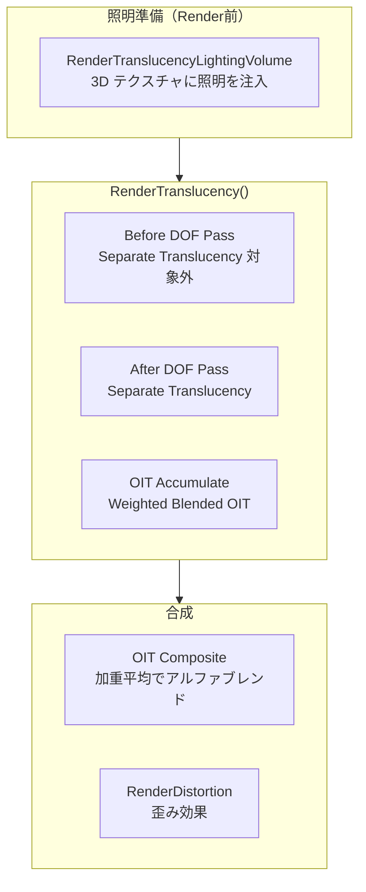

# Translucency 全体概要

- 取得日: 2026-04-12
- 対象: `D:\UnrealEngine\Engine\Source\Runtime\Renderer\Private\TranslucentRendering.h/.cpp`
- 上位: [[01_rendering_overview]]
- Details: [[a_translucent_rendering]] | [[b_translucent_lighting]] | [[c_oit]]
- Reference: [[ref_translucent_rendering]] | [[ref_translucent_lighting]]
- GPU 対応: [[GPU/Translucency/TASK_CHECKLIST]]

---

## Translucency とは

**アルファブレンドが必要な半透明オブジェクトを描画するパス**。  
Deferred Shading では GBuffer を使えないため、Forward Shading で照明計算を行いつつ  
深度ソート順に Back→Front で加算合成する。

| 課題 | 解法 |
|-----|------|
| GBuffer 不使用 → 照明計算が困難 | TranslucencyVolume（3D テクスチャに照明を格納）|
| 深度ソートが困難（大量オブジェクト）| OIT（Order-Independent Translucency）|
| DOF（被写界深度）との干渉 | Separate Translucency（DOF 前後でパスを分割）|

---

## 全体アーキテクチャ



---

## ETranslucencyPass（パス種別）

```cpp
// TranslucentRendering.h
namespace ETranslucencyPass
{
    enum Type : int
    {
        TPT_StandardTranslucency,         // 通常の半透明（Before DOF）
        TPT_TranslucencyAfterDOF,         // DOF 後の半透明（Separate Translucency）
        TPT_TranslucencyAfterDOFModulate, // DOF 後の乗算半透明
        TPT_TranslucencyAfterMotionBlur,  // Motion Blur 後
        TPT_AllTranslucency,              // 全パス（内部分類用）
        TPT_MAX
    };
}
// Separate Translucency は r.SeparateTranslucency=1（デフォルト）で有効
```

---

## フレームの流れ（概略）

```
FDeferredShadingSceneRenderer::Render()
  │
  ├─ RenderTranslucencyLightingVolume()           TranslucentLightingShaders.cpp
  │   → InjectTranslucencyLighting() × 各ライスト
  │   → FilterTranslucencyVolume() でブラー
  │
  └─ RenderTranslucency()                         TranslucentRendering.cpp
      │
      ├─ [TPT_StandardTranslucency]
      │   → SceneColor RT に直接加算（Before DOF）
      │   → OIT 有効時: AccumulateOIT → CompositeOIT
      │
      ├─ [DOF 適用]
      │
      ├─ [TPT_TranslucencyAfterDOF]
      │   → Separate Translucency RT に描画
      │   → DOF 後の SceneColor に合成
      │
      └─ RenderDistortion()                       歪みエフェクト
```

---

## 主要 CVar

| CVar | デフォルト | 説明 |
|------|----------|------|
| `r.SeparateTranslucency` | 1 | Separate Translucency（DOF 後パス）有効 |
| `r.SeparateTranslucencyScreenPercentage` | 100 | Separate RT の解像度 % |
| `r.TranslucencyVolumeBlur` | 1 | TranslucencyVolume のブラー有効 |
| `r.TranslucencyLightingVolumeDim` | 64 | TranslucencyVolume の解像度 |
| `r.OIT.SortedPixels` | 0 | OIT（Pixel Linked List）有効 |
| `r.OIT.WeightedBlended` | 0 | Weighted Blended OIT 有効 |
| `r.ParallelTranslucency` | 1 | 並列 Translucency 描画 |

---

## 主要ソースファイル

| ファイル | 役割 |
|---------|------|
| `TranslucentRendering.h/.cpp` | `RenderTranslucency()` メインパス |
| `TranslucentLightingShaders.h/.cpp` | 照明ボリューム注入・フィルタ |
| `BasePassRendering.cpp` | 半透明マテリアルの Forward Shading BasePass |
| `OIT/OITParameters.h` | OIT パラメータ構造体 |

---

## RenderTranslucency() → Composite 詳細フロー

```
FDeferredShadingSceneRenderer::RenderTranslucency()
  │
  ├─ [A] 照明ボリューム準備
  │   RenderTranslucencyLightingVolume()
  │     for each Local Light (影響範囲内のもの):
  │       InjectTranslucencyLightingVolume() → 3D Volume に注入
  │     FilterTranslucencyVolume() → 3D Gaussian ブラー
  │
  ├─ [B] TPT_StandardTranslucency パス
  │   RenderTranslucencyInner(..., TPT_StandardTranslucency)
  │     → 深度ソート済みプリミティブを Back→Front 順に描画
  │     → FTranslucentBasePassMeshProcessor
  │         → Forward Shading（GBuffer なし）で照明評価
  │         → TranslucencyVolume テクスチャをサンプルして間接光を加算
  │     → [OIT有効] AccumulateOIT: 累積テクスチャに書き込み
  │     → [OIT無効] SceneColor RT に直接アルファブレンド
  │
  ├─ [C] DOF / Motion Blur 適用（この間は SceneColor 操作）
  │
  ├─ [D] TPT_TranslucencyAfterDOF パス
  │   RenderTranslucencyInner(..., TPT_TranslucencyAfterDOF)
  │     → Separate Translucency RT（低解像度可）に描画
  │     → DOF 後の SceneColor に Composite
  │
  └─ [E] OIT Composite（OIT 有効時）
      CompositeOIT()
        → Weighted Blended: AccumRT / RevealageRT から最終色を計算
        → SceneColor に書き込み
```
