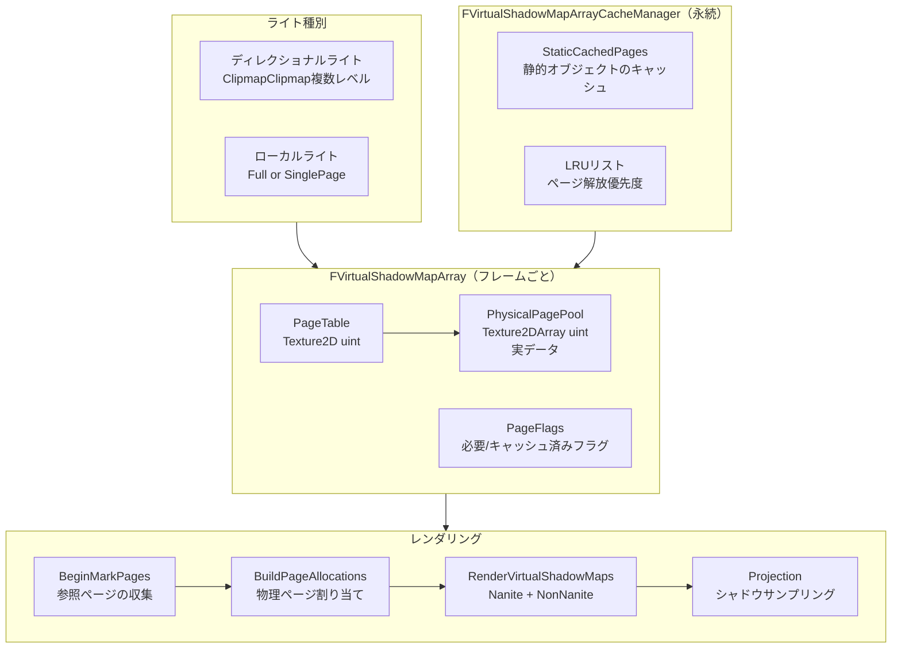

# Virtual Shadow Maps 全体概要

- 取得日: 2026-04-10
- 対象: `D:\UnrealEngine\Engine\Source\Runtime\Renderer\Private\VirtualShadowMaps\`
- 上位: [[01_rendering_overview]]
- Details: [[a_vsm_array]] | [[b_vsm_cache_manager]] | [[c_vsm_clipmap]] | [[d_vsm_projection]]
- Reference: [[ref_vsm_array]] | [[ref_vsm_cache_manager]] | [[ref_vsm_clipmap]] | [[ref_vsm_projection]] | [[ref_vsm_shaders]]

---

## Virtual Shadow Maps とは

**仮想化シャドウマップ（VSM）** システム。  
16K×16K 相当の仮想アドレス空間を持つシャドウマップをページング方式で管理し、  
実際にカメラから参照される部分のみを実際にレンダリングする。

| 従来の問題 | VSM の解法 |
|-----------|-----------|
| 固定解像度では近景がぼける・遠景が無駄に高解像度 | ページ単位で必要な部分だけ高解像度 |
| 動的シーンで毎フレーム全シャドウを再描画 | 静的ページをキャッシュして差分のみ更新 |
| カスケードシャドウマップは境界が目立つ | ディレクショナルライト用クリップマップで連続的に |
| 多数のローカルライトのシャドウが重い | シングルページモードで小さいライトを効率化 |

---

## 全体アーキテクチャ



---

## フレームの流れ（概略）

```
[A] Initialize         → FVirtualShadowMapArray::Initialize()
                          ページテーブル・物理プールを CacheManager から取得

[B] ライト登録         → AllocateDirectional() / AllocateLocal()
                          ライトごとに VirtualShadowMapId を割り当て

[C] BeginMarkPages     → GBuffer / Shadow Receiver からページ要求フラグを立てる
                          Froxel / 半透明フロントレイヤーも参照

[D] BuildPageAllocations → 要求フラグ → 物理ページ割り当て
                           静的キャッシュページはスキップ（差分のみ更新）

[E] RenderVirtualShadowMapsNanite
                       → Nanite ジオメトリを VSM 用ビューとしてラスタライズ

[F] RenderVirtualShadowMapsNonNanite
                       → 通常メッシュを VSM 深度パスで描画

[G] UpdateHZB          → 物理プールの HZB 再構築（次フレームのオクルージョンカリング用）

[H] Projection Pass    → ライティングパスでシャドウをサンプリング（SMRT）
```

---

## コード実行フロー

### エントリポイント

```
FDeferredShadingSceneRenderer::Render()
  │
  ├─[A] FVirtualShadowMapArray::Initialize()          VirtualShadowMapArray.cpp:815
  │      └─ CacheManager から物理ページプール・前フレームデータを受け取る
  │
  ├─[B] AllocateDirectional() / AllocateLocal()
  │      └─ ライトごとに VirtualShadowMapId を割り当て
  │
  ├─[C] FVirtualShadowMapArray::BeginMarkPages()      VirtualShadowMapArray.cpp:2106
  │      └─ GBuffer・シャドウレシーバーから必要ページのフラグを立てる
  │
  ├─[D] FVirtualShadowMapArray::BuildPageAllocations() VirtualShadowMapArray.cpp:2818
  │      └─ 要求フラグ → 物理ページ割り当て（静的キャッシュ済みはスキップ）
  │
  ├─[E] FVirtualShadowMapArray::RenderVirtualShadowMapsNanite()  :3789
  │      └─ Nanite::IRenderer::Create → DrawGeometry (EPipeline::Shadows)
  │
  ├─[F] FVirtualShadowMapArray::RenderVirtualShadowMapsNonNanite()  :3956
  │      └─ 通常メッシュを深度専用パスで描画
  │
  ├─[G] FVirtualShadowMapArray::UpdateHZB()           VirtualShadowMapArray.cpp:4395
  │      └─ 物理ページプールの HZB を再構築（次フレームカリング用）
  │
  ├─[H] RenderVirtualShadowMapProjection()            VirtualShadowMapProjection.cpp:437
  │      └─ SMRT でシャドウマスクを生成し ShadowMaskTexture に書き込む
  │
  └─[I] FVirtualShadowMapArray::PostRender()          VirtualShadowMapArray.cpp:1729
         └─ ExtractFrameData() で CacheManager にフレームデータを引き渡す
```

### 関与クラス・関数一覧

| クラス/関数 | ファイル:行 | 役割 |
|------------|-----------|------|
| `FVirtualShadowMapArray::Initialize()` | `VirtualShadowMapArray.cpp:815` | フレーム初期化・リソース受け取り |
| `FVirtualShadowMapArray::BeginMarkPages()` | `VirtualShadowMapArray.cpp:2106` | 必要ページのフラグ生成 |
| `FVirtualShadowMapArray::BuildPageAllocations()` | `VirtualShadowMapArray.cpp:2818` | 物理ページ割り当て |
| `FVirtualShadowMapArray::RenderVirtualShadowMapsNanite()` | `VirtualShadowMapArray.cpp:3789` | Nanite ジオメトリ描画 |
| `FVirtualShadowMapArray::RenderVirtualShadowMapsNonNanite()` | `VirtualShadowMapArray.cpp:3956` | 非Nanite メッシュ描画 |
| `FVirtualShadowMapArray::UpdateHZB()` | `VirtualShadowMapArray.cpp:4395` | 物理ページ HZB 再構築 |
| `RenderVirtualShadowMapProjection()` | `VirtualShadowMapProjection.cpp:437` | SMRT 投影パス |
| `FVirtualShadowMapArray::PostRender()` | `VirtualShadowMapArray.cpp:1729` | フレームデータを CacheManager に引き渡し |
| `FVirtualShadowMapArrayCacheManager::ProcessInvalidations()` | `VirtualShadowMapCacheManager.cpp:1883` | シーン変更によるキャッシュ無効化 |
| `FVirtualShadowMapArrayCacheManager::ExtractFrameData()` | `VirtualShadowMapCacheManager.cpp:1456` | フレームデータ永続化 |

---

## 主要クラス・構造体

```cpp
// ページサイズ定数（VirtualShadowMapDefinitions.h から）
FVirtualShadowMap::PageSize            = 128  // テクセル
FVirtualShadowMap::Level0DimPagesXY    = 128  // → 仮想解像度 16K×16K
FVirtualShadowMap::MaxMipLevels        = 8

// フレームごとのアレイ管理（FDeferredShadingRenderer が保持）
class FVirtualShadowMapArray
{
    FRDGTextureRef PhysicalPagePoolRDG;    // 実データテクスチャアレイ
    FRDGTextureRef PageTableRDG;           // 仮想→物理マッピング
    FRDGTextureRef PageFlagsRDG;           // ページ状態フラグ
    FRDGTextureRef PageRequestFlagsRDG;    // マーキング中の要求フラグ
    FVirtualShadowMapUniformParameters UniformParameters;
};

// 投影シェーダーデータ（ライトごと）
struct FVirtualShadowMapProjectionShaderData
{
    FMatrix44f ShadowViewToClipMatrix;
    FMatrix44f TranslatedWorldToShadowUVMatrix;
    FVector3f  LightDirection;
    int32      ClipmapLevel_ClipmapLevelCountRemaining;  // -1 = ローカルライト
};

// Nanite との統合
struct FNaniteVirtualShadowMapRenderPass
{
    Nanite::FPackedViewArray* VirtualShadowMapViews;  // Nanite ビュー配列として渡す
    TArray<FProjectedShadowInfo*> Shadows;
};
```

---

## 主要 CVar 一覧

| CVar | デフォルト | 説明 |
|------|----------|------|
| `r.Shadow.Virtual.Enable` | 1 | VSM 有効/無効 |
| `r.Shadow.Virtual.ResolutionLodBias` | 0 | 解像度 LOD バイアス（正=低解像度） |
| `r.Shadow.Virtual.Cache.StaticSeparate` | 1 | 静的ページを動的と分けてキャッシュ |
| `r.Shadow.Virtual.SMRT.RayCountLocal` | 7 | ローカルライトの SMRT レイ数 |
| `r.Shadow.Virtual.SMRT.RayCountDirectional` | 7 | ディレクショナルライトの SMRT レイ数 |
| `r.Shadow.Virtual.NonNanite.IncludeInCoarsePages` | 1 | 非Naniteを粗ページに含めるか |
| `r.Shadow.Virtual.MaxPhysicalPages` | 4096 | 物理ページ上限 |

---

## 主要ソースファイル一覧

| ファイル | 役割 |
|---------|------|
| `VirtualShadowMapArray.h/.cpp` | フレームごとのアレイ管理・ページ割り当て・レンダリング統括 |
| `VirtualShadowMapCacheManager.h/.cpp` | フレーム間キャッシュ（静的ページ保持・LRU管理） |
| `VirtualShadowMapClipmap.h/.cpp` | ディレクショナルライト用クリップマップ（複数レベルの仮想SM） |
| `VirtualShadowMapProjection.h/.cpp` | シャドウサンプリング（SMRT: Stochastic Micro Ray Tracing） |
| `VirtualShadowMapShaders.h` | 共通シェーダー定義・定数 |
