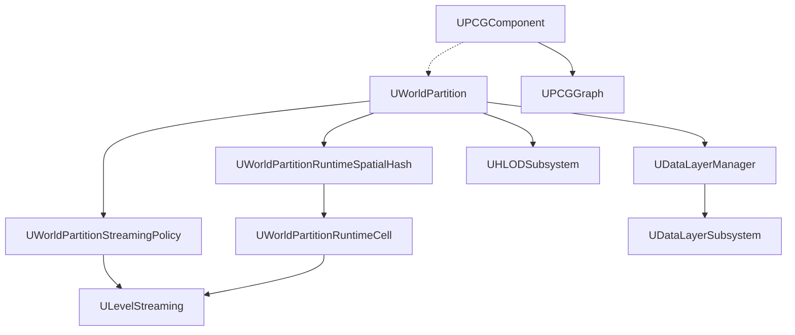

# WorldBuilding システム全体概要

- 取得対象: `Engine/Source/Runtime/Engine/Public/WorldPartition/`, `Engine/Plugins/PCG/`
- 上位: [[00_engine_overview]]
- ソースマップ: [[_source_map]]

---

## UE5 WorldBuilding システムの構成

UE5 の大規模ワールド構築は **World Partition** を中心に、ストリーミング・HLOD・DataLayer・PCG を統合的に運用する。UE4 の World Composition / サブレベル手動管理から、自動化されたセルベースのストリーミングへ移行した。



| サブシステム | 主要クラス | 説明 |
|------------|----------|------|
| [[WorldPartition/01_overview\|World Partition]] | `UWorldPartition` | ワールドのグリッド分割・自動ストリーミング |
| [[HLOD/01_overview\|HLOD]] | `AWorldPartitionHLOD` / `UHLODLayer` | 遠距離の低解像度メッシュ自動生成 |
| [[DataLayer/01_overview\|DataLayer]] | `UDataLayerSubsystem` / `UDataLayerAsset` | レイヤー別のランタイム表示切り替え |
| [[LevelStreaming/01_overview\|LevelStreaming]] | `ULevelStreaming` | レベル単位の非同期ロード（旧来方式・WP 内部でも使用） |
| [[PCG/01_overview\|PCG]] | `UPCGComponent` / `UPCGGraph` | プロシージャルコンテンツ生成グラフ |

---

## World Partition ストリーミングフロー

```
UWorld::Tick()
  └─ UWorldPartitionSubsystem::UpdateStreamingStateInternal()
      └─ UWorldPartitionStreamingPolicy::UpdateStreamingState()
          ├─ ストリーミングソース（カメラ等）の位置を取得
          ├─ UWorldPartitionRuntimeSpatialHash で該当セルを決定
          │   ├─ ActivatedCells → ULevelStreaming::RequestLevel()
          │   └─ DeactivatedCells → Unload
          └─ UHLODSubsystem が LOD 切り替えを処理
              └─ DataLayerSubsystem がレイヤー状態を反映
```

---

## ソース規模

| モジュール | ヘッダ | 実装 | 備考 |
|-----------|-------|------|------|
| WorldPartition コア | 64 h | 60+ cpp | ストリーミング・セル管理 |
| DataLayer | 26 h | 22 cpp | WP サブディレクトリ |
| HLOD | 27 h | 23 cpp | WP サブディレクトリ |
| ContentBundle | 15 h | 13 cpp | UE5.3+ の新機能 |
| RuntimeHashSet | 7 h | 10 cpp | 新方式ランタイムハッシュ |
| LevelStreaming | 6 h | 3 cpp | Engine コア |
| PCG | 400 h | 547 cpp | 独立プラグイン |

---

## 主要ソースファイル

| ファイル | 役割 |
|---------|------|
| `WorldPartition.h/.cpp` | WP 管理の中核 |
| `WorldPartitionRuntimeSpatialHash.h/.cpp` | 空間ハッシュによるセル管理 |
| `WorldPartitionRuntimeCell.h` | ランタイムセル基底 |
| `WorldPartitionStreamingPolicy.h` | ストリーミングポリシー |
| `WorldPartitionStreamingSource.h` | ストリーミングソース定義 |
| `DataLayerSubsystem.h` | DataLayer ランタイム API |
| `DataLayerManager.h` | DataLayer 管理 |
| `HLODActor.h` | HLOD アクタ |
| `HLODLayer.h` | HLOD レイヤー設定 |
| `LevelStreaming.h` | レベルストリーミング基底 |
| `PCGComponent.h` | PCG コンポーネント |
| `PCGGraph.h` | PCG グラフ |

---

## サブシステムドキュメント

| サブフォルダ | 概要 | 内容 |
|------------|------|------|
| `WorldPartition/` | [[WorldPartition/01_overview]] | 空間ハッシュ・セル・ストリーミングポリシー・ActorDesc |
| `HLOD/` | [[HLOD/01_overview]] | HLOD ビルド・HLODLayer・ランタイム切り替え |
| `DataLayer/` | [[DataLayer/01_overview]] | DataLayer 定義・ランタイム状態管理・エディタ連携 |
| `LevelStreaming/` | [[LevelStreaming/01_overview]] | ULevelStreaming・動的ストリーミング・Seamless Travel |
| `PCG/` | [[PCG/01_overview]] | PCG グラフ・標準ノード・データ型・カスタム拡張 |
