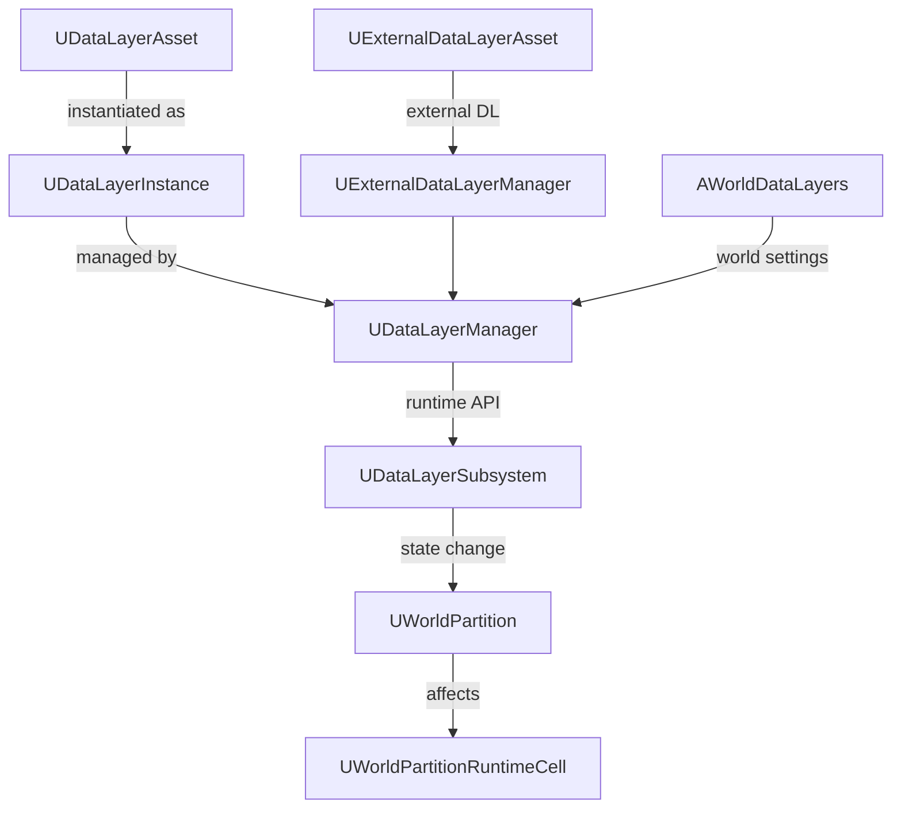

# DataLayer 概要

- 上位: [[01_worldbuilding_overview]]
- 関連: [[WorldPartition/01_overview]] | [[HLOD/01_overview]]
- ソース: `Engine/Source/Runtime/Engine/Public/WorldPartition/DataLayer/`（26 h / 22 cpp）

---

## DataLayer とは

ワールド内のアクタを **論理レイヤーでグループ化** し、ランタイムで Loaded / Unloaded / Activated 状態を切り替えるシステム。昼/夜バリアント、ゲームフェーズ別コンテンツ、マルチプレイヤーの条件付きロードなどに使用する。

---

## アーキテクチャ



---

## 主要クラス

| クラス | 役割 | BP公開 |
|-------|------|--------|
| `UDataLayerAsset` | データレイヤーの定義アセット | Yes |
| `UDataLayerInstance` | ワールド内のレイヤーインスタンス | No |
| `UDataLayerInstanceWithAsset` | アセットベースのインスタンス | No |
| `UDataLayerManager` | レイヤー管理（インスタンス作成・検索） | No |
| `UDataLayerSubsystem` | ランタイムサブシステム。状態変更 API を BP に公開 | Yes |
| `EDataLayerType` | `Runtime` / `Editor` の列挙 | — |
| `EDataLayerRuntimeState` | `Unloaded` / `Loaded` / `Activated` の状態列挙 | — |
| `UDataLayerLoadingPolicy` | ロードポリシー（カスタマイズ可能） | No |
| `UExternalDataLayerAsset` | 外部データレイヤー（DLC 等） | No |
| `AWorldDataLayers` | ワールド設定アクタ（レイヤー定義を保持） | No |

---

## Details

| ドキュメント | 内容 |
|------------|------|
| [[Details/a_data_layer_asset]] | UDataLayerAsset 定義・DataLayerType |
| [[Details/b_runtime_toggle]] | ランタイム状態切り替え・Loaded/Unloaded/Activated |
| [[Details/c_editor_integration]] | エディタ UI・WorldPartition 連携 |

---

## コード実行フロー

### エントリポイント（状態変更）

```
[BP / C++]
UDataLayerManager::SetDataLayerRuntimeState(Asset, State)  [DataLayerManager.cpp:296]
  └─ DataLayerInstance = GetDataLayerInstanceFromAsset(Asset)
       └─ DataLayerInstance->GetOuterWorldDataLayers()
            └─ AWorldDataLayers::SetDataLayerRuntimeState()  [WorldDataLayers.cpp:210]
                 ├─ CanChangeDataLayerRuntimeState()         ← Runtime 型か / Net モード妥当性チェック
                 ├─ LoadedDataLayerNames / ActiveDataLayerNames を更新
                 ├─ FlushNetDormancy()                        ← レプリケーション強制更新
                 ├─ AWORLDDATALAYERS_UPDATE_REPLICATED_DATALAYERS()  ← RepNotify でクライアント同期
                 ├─ ++DataLayersStateEpoch                   ← ストリーミング再評価トリガ
                 ├─ ResolveEffectiveRuntimeState()           ← 親子伝搬・依存解決
                 └─ BroadcastOnDataLayerInstanceRuntimeStateChanged()  [DataLayerManager.cpp:305]

[ストリーミングへの波及（次フレーム）]
UWorldPartitionStreamingPolicy::UpdateStreamingState()      [WorldPartitionStreamingPolicy.cpp:273]
  └─ ComputeUpdateStreamingHash()  ← DataLayersStateEpoch が含まれる
       └─ ハッシュ変化を検知
            └─ UpdateStreamingStateInternal()
                 └─ FWorldPartitionStreamingContext に EffectiveDataLayerStates を渡して再計算
```

### フロー詳細

1. **BP 呼び出し** — Blueprint から `UDataLayerManager::SetDataLayerRuntimeState()` を呼ぶ。引数は `UDataLayerAsset` と `EDataLayerRuntimeState`（[[Details/b_runtime_toggle]]）。
2. **権限チェック** — `CanChangeDataLayerRuntimeState()` が以下を検証（`WorldDataLayers.cpp:86`）: レイヤーが Runtime 型か / ClientOnly レイヤーをサーバーが変更しようとしていないか / AuthoritativeFromClient 違反していないか。
3. **状態保存** — ClientOnly / ServerOnly なら `LocalLoadedDataLayerNames`、それ以外は `LoadedDataLayerNames` を更新（`WorldDataLayers.cpp:256–269`）。
4. **レプリケーション** — サーバー側なら `FlushNetDormancy()` で休眠を解除し、`RepActiveDataLayerNames` / `RepLoadedDataLayerNames` を更新。クライアントは `OnRep_` で反映（`WorldDataLayers.cpp:272–277`）。
5. **Epoch 更新** — `DataLayersStateEpoch` をインクリメント。これが次フレームの `ComputeUpdateStreamingHash()` で検知され、ストリーミング再評価が走る（`WorldDataLayers.cpp:279`）。
6. **親子伝搬** — `bInIsRecursive=true` なら子 DataLayer にも同じ状態を再帰的に設定（`WorldDataLayers.cpp:291–298`）。
7. **ストリーミング再計算** — WorldPartition の `FWorldPartitionStreamingContext` が `EffectiveDataLayerStates` を使ってセルのフィルタを更新。Activated なレイヤーに属するアクタのみがセルロード対象となる（[[WorldPartition/Details/b_streaming_policy]]）。

### 関与クラス・関数一覧

| クラス / 関数 | ファイル | 役割 |
|-------------|---------|------|
| `UDataLayerManager::SetDataLayerRuntimeState` | `DataLayerManager.cpp:296` | BP/C++ 公開 API |
| `AWorldDataLayers::SetDataLayerRuntimeState` | `WorldDataLayers.cpp:210` | コア状態変更・レプリケーション |
| `AWorldDataLayers::CanChangeDataLayerRuntimeState` | `WorldDataLayers.cpp:86` | 権限・ネットモードチェック |
| `AWorldDataLayers::ResolveEffectiveRuntimeState` | `WorldDataLayers.cpp` | 親子・依存関係の整合解決 |
| `UDataLayerManager::BroadcastOnDataLayerInstanceRuntimeStateChanged` | `DataLayerManager.cpp:305` | 変更イベントの BP 配信 |
| `FWorldPartitionStreamingContext` | `WorldPartitionStreamingGeneration*` | セル評価時の DataLayer フィルタ |
