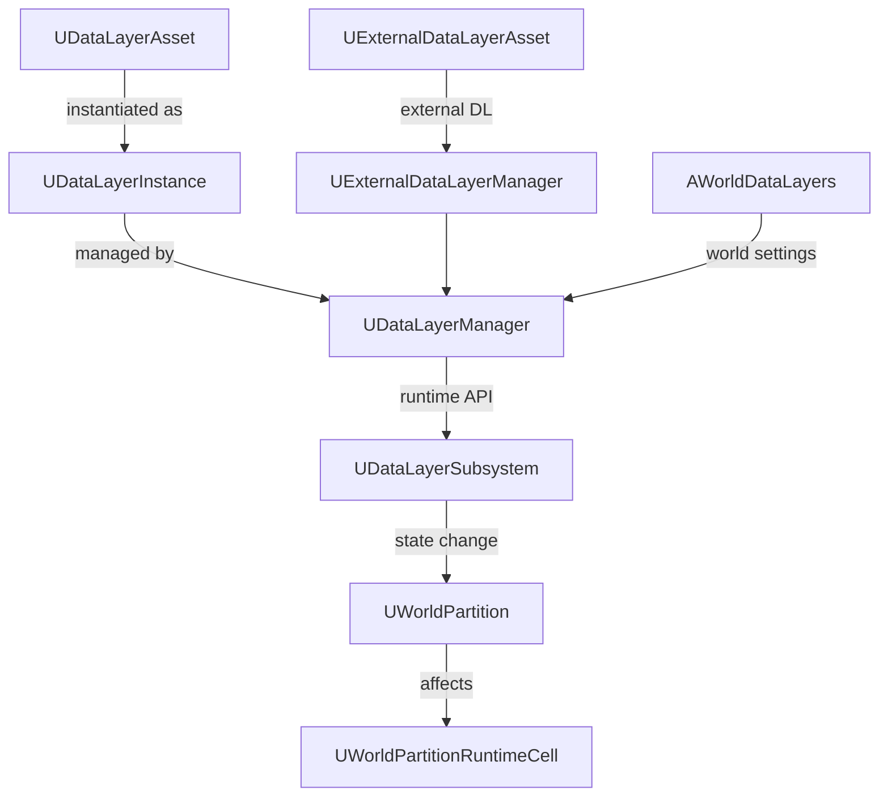

# DataLayer 概要

- 上位: [[01_worldbuilding_overview]]
- 関連: [[WorldPartition/01_overview]] | [[HLOD/01_overview]]
- ソース: `Engine/Source/Runtime/Engine/Public/WorldPartition/DataLayer/`（26 h / 22 cpp）

---

## DataLayer とは

ワールド内のアクタを **論理レイヤーでグループ化** し、ランタイムで Loaded / Unloaded / Activated 状態を切り替えるシステム。昼/夜バリアント、ゲームフェーズ別コンテンツ、マルチプレイヤーの条件付きロードなどに使用する。

---

## アーキテクチャ

---

## 主要クラス

| クラス | 役割 | BP公開 |
|-------|------|--------|
| `UDataLayerAsset` | データレイヤーの定義アセット | Yes |
| `UDataLayerInstance` | ワールド内のレイヤーインスタンス | No |
| `UDataLayerInstanceWithAsset` | アセットベースのインスタンス | No |
| `UDataLayerManager` | レイヤー管理（インスタンス作成・検索） | No |
| `UDataLayerSubsystem` | ランタイムサブシステム。状態変更 API を BP に公開 | Yes |
| `EDataLayerType` | `Runtime` / `Editor` の列挙 | — |
| `EDataLayerRuntimeState` | `Unloaded` / `Loaded` / `Activated` の状態列挙 | — |
| `UDataLayerLoadingPolicy` | ロードポリシー（カスタマイズ可能） | No |
| `UExternalDataLayerAsset` | 外部データレイヤー（DLC 等） | No |
| `AWorldDataLayers` | ワールド設定アクタ（レイヤー定義を保持） | No |

---

## Details

| ドキュメント | 内容 |
|------------|------|
| [[Details/a_data_layer_asset]] | UDataLayerAsset 定義・DataLayerType |
| [[Details/b_runtime_toggle]] | ランタイム状態切り替え・Loaded/Unloaded/Activated |
| [[Details/c_editor_integration]] | エディタ UI・WorldPartition 連携 |
