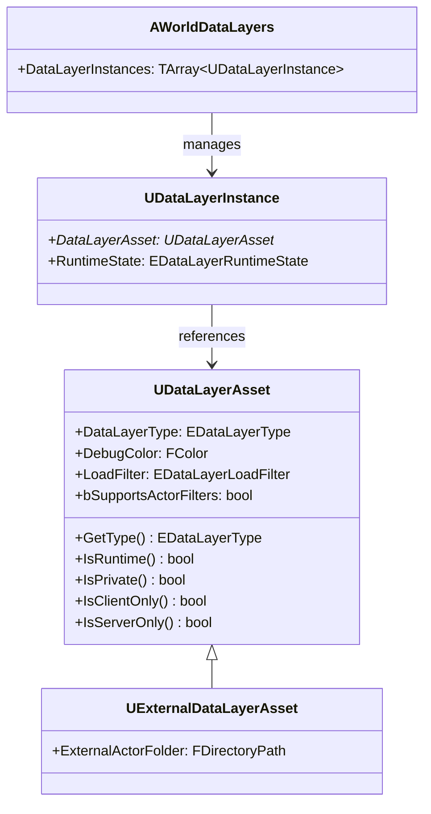

# UDataLayerAsset・DataLayerType

- 上位: [[DataLayer/01_overview]]
- ソース: `Engine/Source/Runtime/Engine/Public/WorldPartition/DataLayer/DataLayerAsset.h`
          `Engine/Source/Runtime/Engine/Public/WorldPartition/DataLayer/DataLayerType.h`

---

## 概要

**UDataLayerAsset** はデータレイヤーの設定を定義するデータアセット。`EDataLayerType` でランタイム用かエディタ用かを区別し、`EDataLayerLoadFilter` でクライアント/サーバーのロード対象を制御する。

---

## クラス構造



---

## EDataLayerType

```cpp
UENUM(BlueprintType)
enum class EDataLayerType : uint8
{
    // エディタ専用レイヤー（ランタイムに影響しない）
    Editor,

    // ランタイムでロード/アンロード可能なレイヤー
    Runtime,
};
```

| タイプ | 用途 | ランタイム状態制御 |
|-------|------|---------------|
| `Editor` | エディタでのアクタグループ管理・フィルタリング | 不可 |
| `Runtime` | ゲーム中のコンテンツ切り替え（昼/夜・DLC 等） | 可 |

---

## EDataLayerLoadFilter

ランタイム DataLayer のロードをどのネットワーク対象に適用するか。

```cpp
UENUM(BlueprintType)
enum class EDataLayerLoadFilter : uint8
{
    None,        // クライアント・サーバー両方（状態はサーバーが持ちレプリケーション）
    ClientOnly,  // クライアントのみ（クライアントで状態を独自管理）
    ServerOnly,  // サーバーのみ
};
```

### 状態変更のネットワーク規則

| LoadFilter | 状態変更を行う側 | レプリケーション |
|-----------|--------------|--------------|
| `None` | サーバーのみ | サーバー → クライアントへレプリケート |
| `ClientOnly` | クライアントのみ | なし |
| `ServerOnly` | サーバーのみ | なし |

---

## UDataLayerAsset のプロパティ

```cpp
UCLASS(BlueprintType, editinlinenew, MinimalAPI)
class UDataLayerAsset : public UDataAsset
{
    // ランタイム / エディタの区別
    UPROPERTY(Category = "Data Layer", EditAnywhere)
    EDataLayerType DataLayerType;

    // アクターフィルタリングのサポート（EHLODActorFilter 等と連携）
    UPROPERTY(Category = "Actor Filter", EditAnywhere)
    bool bSupportsActorFilters;

    // デバッグ表示色（Data Layer ウィンドウでの色分け）
    UPROPERTY(Category = "Runtime", EditAnywhere)
    FColor DebugColor;

    // クライアント/サーバーのロードフィルタ
    UPROPERTY(Category = "Runtime", EditAnywhere)
    EDataLayerLoadFilter LoadFilter;

public:
    // BP 公開メソッド
    UFUNCTION(BlueprintCallable)
    virtual EDataLayerType GetType() const { return DataLayerType; }

    UFUNCTION(BlueprintCallable)
    bool IsRuntime() const;      // Runtime タイプかつ Private でないか

    UFUNCTION(BlueprintCallable)
    bool IsClientOnly() const;   // Runtime かつ LoadFilter == ClientOnly

    UFUNCTION(BlueprintCallable)
    bool IsServerOnly() const;   // Runtime かつ LoadFilter == ServerOnly

    bool IsPrivate() const;      // Private フラグ（内部管理用）
};
```

---

## UExternalDataLayerAsset — 外部データレイヤー

DLC や ContentBundle に付随するデータレイヤー。メインワールドとは別のパッケージで管理される。

```cpp
class UExternalDataLayerAsset : public UDataLayerAsset
{
    // 外部アクタの格納フォルダ（パッケージルートからの相対パス）
    UPROPERTY(EditAnywhere, Category = "External Data Layer")
    FDirectoryPath ExternalActorFolder;
};
```

---

## アセット作成手順（エディタ）

1. Content Browser → 右クリック → **World Partition → Data Layer**
2. 作成した `UDataLayerAsset` を開いて `DataLayerType = Runtime` に設定
3. **Window → Levels → DataLayers** パネルで「+」ボタンからワールドにインスタンスを追加
4. アクタを選択して DataLayer パネルにドラッグ → アクタをレイヤーに登録

---

## アクタ側の DataLayer 登録

```cpp
// アクタのプロパティ（エディタでのみ設定）
UPROPERTY(EditAnywhere, Category = "Data Layer")
TArray<FActorDataLayer> DataLayerAssets;

// FActorDataLayer
USTRUCT(BlueprintType)
struct FActorDataLayer
{
    UPROPERTY(EditAnywhere, BlueprintReadOnly, Category = "Data Layer")
    TSoftObjectPtr<UDataLayerAsset> Name; // DataLayerAsset への参照
};
```

---

## EDataLayerRuntimeState — ランタイム状態

```cpp
UENUM(BlueprintType)
enum class EDataLayerRuntimeState : uint8
{
    Unloaded,   // メモリからアンロード（非表示）
    Loaded,     // メモリにロード（非表示）
    Activated,  // ロードかつ表示
};
```

`Loaded` と `Activated` の違い：`Loaded` はアクタがメモリにあるが `BeginPlay` は呼ばれない（`AddToWorld` されていない）。`Activated` は `AddToWorld` まで完了して完全にアクティブな状態。
