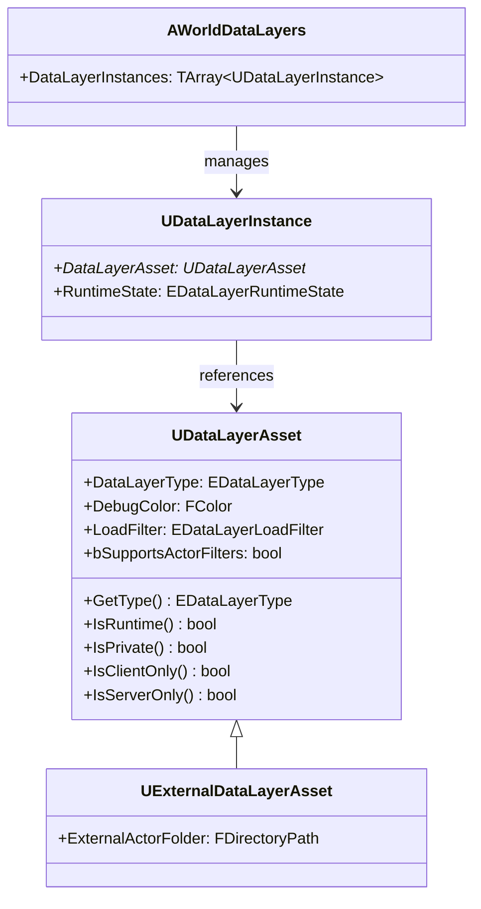

# UDataLayerAsset・DataLayerType

- 上位: [[DataLayer/01_overview]]
- ソース: `Engine/Source/Runtime/Engine/Public/WorldPartition/DataLayer/DataLayerAsset.h`
          `Engine/Source/Runtime/Engine/Public/WorldPartition/DataLayer/DataLayerType.h`

---

## 概要

**UDataLayerAsset** はデータレイヤーの設定を定義するデータアセット。`EDataLayerType` でランタイム用かエディタ用かを区別し、`EDataLayerLoadFilter` でクライアント/サーバーのロード対象を制御する。

---

## クラス構造



---

## EDataLayerType

```cpp
UENUM(BlueprintType)
enum class EDataLayerType : uint8
{
    // エディタ専用レイヤー（ランタイムに影響しない）
    Editor,

    // ランタイムでロード/アンロード可能なレイヤー
    Runtime,
};
```

| タイプ | 用途 | ランタイム状態制御 |
|-------|------|---------------|
| `Editor` | エディタでのアクタグループ管理・フィルタリング | 不可 |
| `Runtime` | ゲーム中のコンテンツ切り替え（昼/夜・DLC 等） | 可 |

---

## EDataLayerLoadFilter

ランタイム DataLayer のロードをどのネットワーク対象に適用するか。

```cpp
UENUM(BlueprintType)
enum class EDataLayerLoadFilter : uint8
{
    None,        // クライアント・サーバー両方（状態はサーバーが持ちレプリケーション）
    ClientOnly,  // クライアントのみ（クライアントで状態を独自管理）
    ServerOnly,  // サーバーのみ
};
```

### 状態変更のネットワーク規則

| LoadFilter | 状態変更を行う側 | レプリケーション |
|-----------|--------------|--------------|
| `None` | サーバーのみ | サーバー → クライアントへレプリケート |
| `ClientOnly` | クライアントのみ | なし |
| `ServerOnly` | サーバーのみ | なし |

---

## UDataLayerAsset のプロパティ

```cpp
UCLASS(BlueprintType, editinlinenew, MinimalAPI)
class UDataLayerAsset : public UDataAsset
{
    // ランタイム / エディタの区別
    UPROPERTY(Category = "Data Layer", EditAnywhere)
    EDataLayerType DataLayerType;

    // アクターフィルタリングのサポート（EHLODActorFilter 等と連携）
    UPROPERTY(Category = "Actor Filter", EditAnywhere)
    bool bSupportsActorFilters;

    // デバッグ表示色（Data Layer ウィンドウでの色分け）
    UPROPERTY(Category = "Runtime", EditAnywhere)
    FColor DebugColor;

    // クライアント/サーバーのロードフィルタ
    UPROPERTY(Category = "Runtime", EditAnywhere)
    EDataLayerLoadFilter LoadFilter;

public:
    // BP 公開メソッド
    UFUNCTION(BlueprintCallable)
    virtual EDataLayerType GetType() const { return DataLayerType; }

    UFUNCTION(BlueprintCallable)
    bool IsRuntime() const;      // Runtime タイプかつ Private でないか

    UFUNCTION(BlueprintCallable)
    bool IsClientOnly() const;   // Runtime かつ LoadFilter == ClientOnly

    UFUNCTION(BlueprintCallable)
    bool IsServerOnly() const;   // Runtime かつ LoadFilter == ServerOnly

    bool IsPrivate() const;      // Private フラグ（内部管理用）
};
```

---

## UExternalDataLayerAsset — 外部データレイヤー

DLC や ContentBundle に付随するデータレイヤー。メインワールドとは別のパッケージで管理される。

```cpp
class UExternalDataLayerAsset : public UDataLayerAsset
{
    // 外部アクタの格納フォルダ（パッケージルートからの相対パス）
    UPROPERTY(EditAnywhere, Category = "External Data Layer")
    FDirectoryPath ExternalActorFolder;
};
```

---

## アセット作成手順（エディタ）

1. Content Browser → 右クリック → **World Partition → Data Layer**
2. 作成した `UDataLayerAsset` を開いて `DataLayerType = Runtime` に設定
3. **Window → Levels → DataLayers** パネルで「+」ボタンからワールドにインスタンスを追加
4. アクタを選択して DataLayer パネルにドラッグ → アクタをレイヤーに登録

---

## アクタ側の DataLayer 登録

```cpp
// アクタのプロパティ（エディタでのみ設定）
UPROPERTY(EditAnywhere, Category = "Data Layer")
TArray<FActorDataLayer> DataLayerAssets;

// FActorDataLayer
USTRUCT(BlueprintType)
struct FActorDataLayer
{
    UPROPERTY(EditAnywhere, BlueprintReadOnly, Category = "Data Layer")
    TSoftObjectPtr<UDataLayerAsset> Name; // DataLayerAsset への参照
};
```

---

## EDataLayerRuntimeState — ランタイム状態

```cpp
UENUM(BlueprintType)
enum class EDataLayerRuntimeState : uint8
{
    Unloaded,   // メモリからアンロード（非表示）
    Loaded,     // メモリにロード（非表示）
    Activated,  // ロードかつ表示
};
```

`Loaded` と `Activated` の違い：`Loaded` はアクタがメモリにあるが `BeginPlay` は呼ばれない（`AddToWorld` されていない）。`Activated` は `AddToWorld` まで完了して完全にアクティブな状態。

---

## コード実行フロー

### エントリポイント

```
[エディタ — アセット作成]
Content Browser → Right-click → World Partition → Data Layer
  └─ UDataLayerAsset の .uasset を生成
       └─ DataLayerType / DebugColor / LoadFilter を設定

[エディタ — アクタへの登録]
AActor::AddDataLayer(UDataLayerAsset*)
  └─ FActorDataLayer 構造体を Actor::DataLayerAssets に追加
       └─ WorldPartition が ActorDesc を再生成
            └─ FWorldPartitionActorDesc::DataLayerAssets にシリアライズ  ← [[WorldPartition/Details/c_actor_desc]]

[ワールドロード時 — インスタンス解決]
UWorldPartition::Initialize()
  └─ AWorldDataLayers::Initialize()
       └─ for each UDataLayerInstance in DataLayerInstances:
            └─ UDataLayerInstance->GetAsset() で UDataLayerAsset を解決
                 └─ UDataLayerAsset::IsRuntime() で Runtime/Editor 判定
                      ├─ Runtime → UDataLayerManager に登録
                      └─ Editor  → エディタ UI でのみ表示

[IsRuntime 判定]
UDataLayerAsset::IsRuntime()
  └─ return (DataLayerType == EDataLayerType::Runtime) && !IsPrivate()

[LoadFilter チェック（ランタイム状態変更時）]
AWorldDataLayers::CanChangeDataLayerRuntimeState()
  └─ UDataLayerAsset->IsClientOnly() / IsServerOnly()
       ├─ ClientOnly → 非クライアントは状態変更不可
       └─ ServerOnly → 非サーバーは状態変更不可
```

### フロー詳細

1. **アセット永続化** — `UDataLayerAsset` は `UDataAsset` を継承したシリアライザブルアセット。`.uasset` として保存され、`UDataLayerInstance` から `TSoftObjectPtr` で参照される（即時ロード不要）。
2. **アクタへの登録** — アクタは `TArray<FActorDataLayer>` で所属レイヤーを保持。エディタでの Data Layer ウィンドウからのドラッグ操作で登録され、`FWorldPartitionActorDesc::DataLayerAssets` にシリアライズされる。
3. **ActorDesc 連携** — アクタ本体をロードせずとも ActorDesc から所属 DataLayer を判定できるため、WP のストリーミング計算に組み込める（[[WorldPartition/Details/c_actor_desc]]）。
4. **ワールド初期化** — ワールドロード時に `AWorldDataLayers` が `UDataLayerInstance` 群を走査し、参照先 `UDataLayerAsset` を解決。`IsRuntime()` が true のものだけ `UDataLayerManager` に登録される。
5. **LoadFilter 判定** — 状態変更要求時に `IsClientOnly()` / `IsServerOnly()` を評価。許可されないネットワーク側からの変更は `CanChangeDataLayerRuntimeState()` で拒否される（[[b_runtime_toggle]]）。
6. **ExternalDataLayer** — `UExternalDataLayerAsset` は `ExternalActorFolder` を持ち、ContentBundle や DLC から注入されたアクタをまとめて管理する専用レイヤー。通常レイヤーと同じ API だが、パッケージ境界で分離される（[[WorldPartition/Details/d_runtime_cell]]）。
7. **bSupportsActorFilters** — HLOD ビルド時に `UHLODLayer` がフィルタ対象を判断する。`false` のアクタはフィルタリング対象外となり、常時 HLOD に含まれる。
8. **IsPrivate フラグ** — 内部的に使用される非公開レイヤー（Subobject 的）。`IsRuntime()` は `IsPrivate()` を除外するため、ゲームプレイには露出しない。

### 関与クラス・関数一覧

| クラス / 関数 | ファイル | 役割 |
|-------------|---------|------|
| `UDataLayerAsset::IsRuntime` | `DataLayer/DataLayerAsset.cpp` | Runtime 判定 |
| `UDataLayerAsset::IsClientOnly/IsServerOnly` | `DataLayer/DataLayerAsset.cpp` | LoadFilter 評価 |
| `UExternalDataLayerAsset` | `DataLayer/ExternalDataLayerAsset.cpp` | DLC/ContentBundle 用 |
| `FActorDataLayer` | `DataLayer/ActorDataLayer.h` | アクタ側参照 |
| `AWorldDataLayers::Initialize` | `DataLayer/WorldDataLayers.cpp` | インスタンス登録 |
| `FWorldPartitionActorDesc::DataLayerAssets` | `WorldPartitionActorDesc.h` | ActorDesc シリアライズ |
