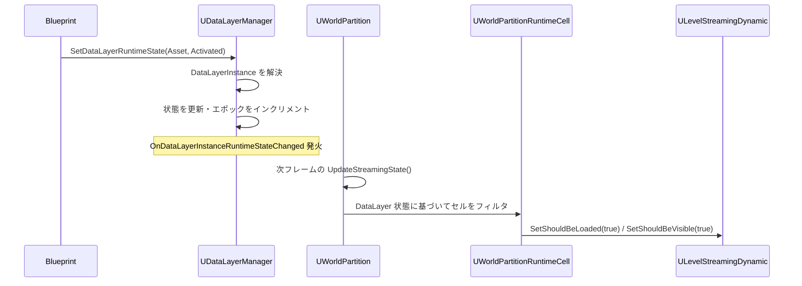

# DataLayer ランタイム状態切り替え

- 上位: [[DataLayer/01_overview]]
- ソース: `Engine/Source/Runtime/Engine/Public/WorldPartition/DataLayer/DataLayerManager.h`

---

## 概要

UE5.3 以降、DataLayer のランタイム状態制御は **UDataLayerManager** を使う。旧 `UDataLayerSubsystem` は UE5.3 で deprecated となった。`UDataLayerManager` は `UWorldPartition` の内部オブジェクトとして管理される。

---

## UDataLayerManager の取得

```cpp
// 推奨: 任意のオブジェクトから取得
UDataLayerManager* DLM = UDataLayerManager::GetDataLayerManager(this);

// World から取得（旧来の方法）
UDataLayerManager* DLM = GetWorld()
    ->GetWorldPartition()
    ->GetDataLayerManager();
```

---

## 状態変更 API（BP 公開）

```cpp
// DataLayerInstance を指定して状態変更
UFUNCTION(BlueprintCallable, Category = DataLayers)
bool SetDataLayerInstanceRuntimeState(
    const UDataLayerInstance* InDataLayerInstance,
    EDataLayerRuntimeState InState,
    bool bInIsRecursive = false);

// DataLayerAsset を指定して状態変更（インスタンスを内部で解決）
UFUNCTION(BlueprintCallable, Category = DataLayers)
bool SetDataLayerRuntimeState(
    const UDataLayerAsset* InDataLayerAsset,
    EDataLayerRuntimeState InState,
    bool bInIsRecursive = false);

// 現在の要求状態を取得
UFUNCTION(BlueprintCallable, Category = DataLayers)
EDataLayerRuntimeState GetDataLayerInstanceRuntimeState(
    const UDataLayerInstance* InDataLayerInstance) const;

// 実効状態（親レイヤーの状態を考慮した最終状態）を取得
UFUNCTION(BlueprintCallable, Category = DataLayers)
EDataLayerRuntimeState GetDataLayerInstanceEffectiveRuntimeState(
    const UDataLayerInstance* InDataLayerInstance) const;
```

### RuntimeState と EffectiveRuntimeState の違い

- **RuntimeState**: `SetDataLayerInstanceRuntimeState()` で設定した値（要求状態）
- **EffectiveRuntimeState**: 親レイヤーの状態との最小値。親が `Unloaded` なら子は `Activated` 要求でも実効は `Unloaded`

---

## ランタイム状態遷移フロー



---

## デリゲート

```cpp
// DataLayerInstance の状態変更イベント（BP アサイン可能）
UPROPERTY(BlueprintAssignable)
FOnDataLayerInstanceRuntimeStateChanged OnDataLayerInstanceRuntimeStateChanged;

// シグネチャ
DECLARE_DYNAMIC_MULTICAST_DELEGATE_TwoParams(
    FOnDataLayerInstanceRuntimeStateChanged,
    const UDataLayerInstance*, DataLayer,
    EDataLayerRuntimeState, State
);
```

---

## インスタンス取得 API

```cpp
// アセットからインスタンスを取得
UFUNCTION(BlueprintCallable, Category = DataLayers)
const UDataLayerInstance* GetDataLayerInstanceFromAsset(
    const UDataLayerAsset* InDataLayerAsset) const;

// 名前からインスタンスを取得
UFUNCTION(BlueprintCallable, Category = DataLayers)
const UDataLayerInstance* GetDataLayerInstanceFromName(
    const FName& InDataLayerInstanceName) const;

// 全インスタンスを取得
UFUNCTION(BlueprintCallable, Category = DataLayers)
TArray<UDataLayerInstance*> GetDataLayerInstances() const;

// ラムダで全インスタンスを走査
void ForEachDataLayerInstance(TFunctionRef<bool(UDataLayerInstance*)> Func);
```

---

## ネットワーク考慮事項

### 通常の Runtime DataLayer（LoadFilter = None）

```
Server: SetDataLayerRuntimeState(Asset, Activated)
  → レプリケーションで Client にも状態が伝達
Client: 独自に呼んでも効果なし（無視される）
```

### ClientOnly DataLayer（LoadFilter = ClientOnly）

```
Client: SetDataLayerRuntimeState(Asset, Activated)  ← クライアントのみで有効
Server: 呼んでも効果なし
```

### 実装上の注意点

`SetDataLayerRuntimeState` はサーバーのみが呼べる（`BlueprintAuthorityOnly` 属性）。マルチプレイヤーゲームでは GameMode や GameState から呼び出すこと。

---

## BP 実装パターン

```
EventBeginPlay → DataLayerManager::GetDataLayerManager(Self)
             → SetDataLayerRuntimeState(NightDataLayer, Unloaded)
             → SetDataLayerRuntimeState(DayDataLayer, Activated)

EventDayCycleChanged(bIsNight) →
    if bIsNight:
        SetDataLayerRuntimeState(DayDataLayer, Unloaded)
        SetDataLayerRuntimeState(NightDataLayer, Activated)
    else:
        SetDataLayerRuntimeState(NightDataLayer, Unloaded)
        SetDataLayerRuntimeState(DayDataLayer, Activated)
```

---

## 後方互換 API（deprecated）

UE5.3 以前は `UDataLayerSubsystem` を使っていたが、完全に非推奨になった。

```cpp
// 非推奨（UE5.3+）
UDataLayerSubsystem* DLS = GetWorld()->GetSubsystem<UDataLayerSubsystem>();
DLS->SetDataLayerInstanceRuntimeState(Asset, State); // deprecated

// 推奨（UE5.3+）
UDataLayerManager* DLM = UDataLayerManager::GetDataLayerManager(this);
DLM->SetDataLayerRuntimeState(Asset, State);
```
