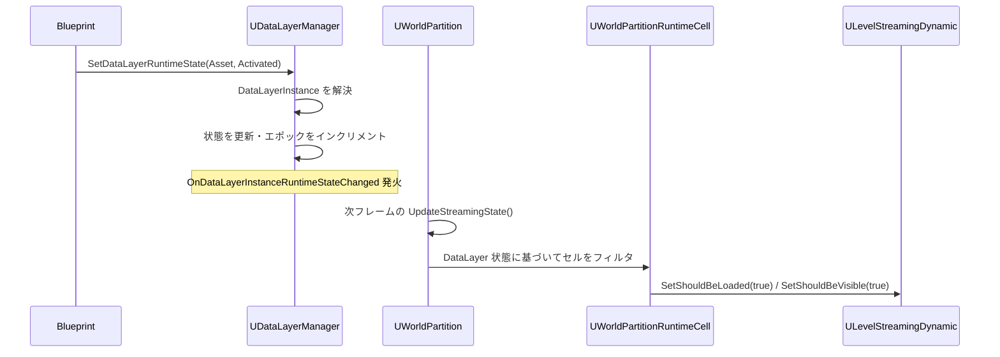

# DataLayer ランタイム状態切り替え

- 上位: [[DataLayer/01_overview]]
- ソース: `Engine/Source/Runtime/Engine/Public/WorldPartition/DataLayer/DataLayerManager.h`

---

## 概要

UE5.3 以降、DataLayer のランタイム状態制御は **UDataLayerManager** を使う。旧 `UDataLayerSubsystem` は UE5.3 で deprecated となった。`UDataLayerManager` は `UWorldPartition` の内部オブジェクトとして管理される。

---

## UDataLayerManager の取得

```cpp
// 推奨: 任意のオブジェクトから取得
UDataLayerManager* DLM = UDataLayerManager::GetDataLayerManager(this);

// World から取得（旧来の方法）
UDataLayerManager* DLM = GetWorld()
    ->GetWorldPartition()
    ->GetDataLayerManager();
```

---

## 状態変更 API（BP 公開）

```cpp
// DataLayerInstance を指定して状態変更
UFUNCTION(BlueprintCallable, Category = DataLayers)
bool SetDataLayerInstanceRuntimeState(
    const UDataLayerInstance* InDataLayerInstance,
    EDataLayerRuntimeState InState,
    bool bInIsRecursive = false);

// DataLayerAsset を指定して状態変更（インスタンスを内部で解決）
UFUNCTION(BlueprintCallable, Category = DataLayers)
bool SetDataLayerRuntimeState(
    const UDataLayerAsset* InDataLayerAsset,
    EDataLayerRuntimeState InState,
    bool bInIsRecursive = false);

// 現在の要求状態を取得
UFUNCTION(BlueprintCallable, Category = DataLayers)
EDataLayerRuntimeState GetDataLayerInstanceRuntimeState(
    const UDataLayerInstance* InDataLayerInstance) const;

// 実効状態（親レイヤーの状態を考慮した最終状態）を取得
UFUNCTION(BlueprintCallable, Category = DataLayers)
EDataLayerRuntimeState GetDataLayerInstanceEffectiveRuntimeState(
    const UDataLayerInstance* InDataLayerInstance) const;
```

### RuntimeState と EffectiveRuntimeState の違い

- **RuntimeState**: `SetDataLayerInstanceRuntimeState()` で設定した値（要求状態）
- **EffectiveRuntimeState**: 親レイヤーの状態との最小値。親が `Unloaded` なら子は `Activated` 要求でも実効は `Unloaded`

---

## ランタイム状態遷移フロー



---

## デリゲート

```cpp
// DataLayerInstance の状態変更イベント（BP アサイン可能）
UPROPERTY(BlueprintAssignable)
FOnDataLayerInstanceRuntimeStateChanged OnDataLayerInstanceRuntimeStateChanged;

// シグネチャ
DECLARE_DYNAMIC_MULTICAST_DELEGATE_TwoParams(
    FOnDataLayerInstanceRuntimeStateChanged,
    const UDataLayerInstance*, DataLayer,
    EDataLayerRuntimeState, State
);
```

---

## インスタンス取得 API

```cpp
// アセットからインスタンスを取得
UFUNCTION(BlueprintCallable, Category = DataLayers)
const UDataLayerInstance* GetDataLayerInstanceFromAsset(
    const UDataLayerAsset* InDataLayerAsset) const;

// 名前からインスタンスを取得
UFUNCTION(BlueprintCallable, Category = DataLayers)
const UDataLayerInstance* GetDataLayerInstanceFromName(
    const FName& InDataLayerInstanceName) const;

// 全インスタンスを取得
UFUNCTION(BlueprintCallable, Category = DataLayers)
TArray<UDataLayerInstance*> GetDataLayerInstances() const;

// ラムダで全インスタンスを走査
void ForEachDataLayerInstance(TFunctionRef<bool(UDataLayerInstance*)> Func);
```

---

## ネットワーク考慮事項

### 通常の Runtime DataLayer（LoadFilter = None）

```
Server: SetDataLayerRuntimeState(Asset, Activated)
  → レプリケーションで Client にも状態が伝達
Client: 独自に呼んでも効果なし（無視される）
```

### ClientOnly DataLayer（LoadFilter = ClientOnly）

```
Client: SetDataLayerRuntimeState(Asset, Activated)  ← クライアントのみで有効
Server: 呼んでも効果なし
```

### 実装上の注意点

`SetDataLayerRuntimeState` はサーバーのみが呼べる（`BlueprintAuthorityOnly` 属性）。マルチプレイヤーゲームでは GameMode や GameState から呼び出すこと。

---

## BP 実装パターン

```
EventBeginPlay → DataLayerManager::GetDataLayerManager(Self)
             → SetDataLayerRuntimeState(NightDataLayer, Unloaded)
             → SetDataLayerRuntimeState(DayDataLayer, Activated)

EventDayCycleChanged(bIsNight) →
    if bIsNight:
        SetDataLayerRuntimeState(DayDataLayer, Unloaded)
        SetDataLayerRuntimeState(NightDataLayer, Activated)
    else:
        SetDataLayerRuntimeState(NightDataLayer, Unloaded)
        SetDataLayerRuntimeState(DayDataLayer, Activated)
```

---

## 後方互換 API（deprecated）

UE5.3 以前は `UDataLayerSubsystem` を使っていたが、完全に非推奨になった。

```cpp
// 非推奨（UE5.3+）
UDataLayerSubsystem* DLS = GetWorld()->GetSubsystem<UDataLayerSubsystem>();
DLS->SetDataLayerInstanceRuntimeState(Asset, State); // deprecated

// 推奨（UE5.3+）
UDataLayerManager* DLM = UDataLayerManager::GetDataLayerManager(this);
DLM->SetDataLayerRuntimeState(Asset, State);
```

---

## コード実行フロー

### エントリポイント

```
[BP/C++ エントリ]
UDataLayerManager::SetDataLayerRuntimeState(Asset, NewState, bRecursive)  [DataLayerManager.cpp:296]
  └─ GetDataLayerInstanceFromAsset(Asset) でインスタンス解決
       └─ UDataLayerManager::SetDataLayerInstanceRuntimeState(Instance, NewState)
            └─ AWorldDataLayers::SetDataLayerRuntimeState(Instance, NewState)  [WorldDataLayers.cpp:210]
                 ├─ CanChangeDataLayerRuntimeState() でLoadFilter/権限チェック
                 │    ├─ HasAuthority() 確認（通常 Runtime はサーバー権限必須）
                 │    └─ IsClientOnly()/IsServerOnly() でネット整合性
                 ├─ CurrentRuntimeState を更新
                 ├─ DataLayersStateEpoch を +1
                 ├─ if (bRecursive):
                 │    └─ for each ChildInstance:
                 │         └─ 子にも再帰適用
                 └─ BroadcastOnDataLayerInstanceRuntimeStateChanged(Instance, NewState)

[ストリーミングへの波及]
UWorldPartitionStreamingPolicy::ComputeUpdateStreamingHash()
  └─ AWorldDataLayers::GetDataLayersStateEpoch() をハッシュに組み込む
       └─ Epoch 変化検知 → UpdateStreamingStateInternal() が非スキップ
            └─ UWorldPartitionRuntimeCell::GetCellEffectiveWantedState()
                 └─ EffectiveRuntimeState = min(Parent.State, Self.State)
                 └─ Unloaded ならセルロード抑止、Loaded/Activated なら進行

[ネットワーク同期]
AWorldDataLayers::OnRep_DataLayerInstances()
  └─ クライアント側でレプリケート値を適用
       └─ 同じく Epoch が +1 されストリーミング更新がトリガー
```

### フロー詳細

1. **マネージャ取得** — `UDataLayerManager::GetDataLayerManager(WorldContextObject)` は `UWorld::GetWorldPartition()->GetDataLayerManager()` を内部で解決。BP/C++ どちらからも統一インターフェース。
2. **インスタンス解決** — `SetDataLayerRuntimeState(Asset,...)` が `GetDataLayerInstanceFromAsset()` で `UDataLayerInstance` を引く。アセットが未登録なら `nullptr` で早期 return。
3. **権限/LoadFilter チェック** — `CanChangeDataLayerRuntimeState()` で `HasAuthority()` と `LoadFilter`（`None`/`ClientOnly`/`ServerOnly`）を評価。許可されないネット側からの変更は拒否し警告ログを出す。
4. **状態更新** — 承認された変更は `CurrentRuntimeState` に反映され `DataLayersStateEpoch` をインクリメント。このエポックはストリーミングポリシーの差分検知ハッシュに使われる（[[WorldPartition/Details/b_streaming_policy]]）。
5. **再帰適用** — `bInIsRecursive=true` なら親の変更を子 DataLayerInstance にも伝播。階層的 DataLayer（例: `World/Combat/PhaseA`）で便利。
6. **デリゲート通知** — `OnDataLayerInstanceRuntimeStateChanged` が BP アサイン可能。UI 更新やゲームロジックの同期点として利用。
7. **ストリーミング連携** — 次フレームの `ComputeUpdateStreamingHash()` で Epoch 変化が検知され、`UpdateStreamingStateInternal()` がセルリストを再評価。`GetCellEffectiveWantedState()` は親子階層の最小状態を計算するため、親が `Unloaded` なら子の設定は無視される。
8. **ネットワーク複製** — `LoadFilter=None` の Runtime DataLayer はサーバー専用書込で `AWorldDataLayers` の `RepReplicatedDataLayerInstances` 経由でクライアントへ同期。クライアント側は `OnRep_` 契機で自分のエポックを更新。
9. **Activate vs Loaded** — `Activated` は `Loaded` + `AddToWorld` 完了状態。BeginPlay が必要な場合は必ず `Activated` を指定、メモリに乗せるだけで良ければ `Loaded` で十分。

### 関与クラス・関数一覧

| クラス / 関数 | ファイル | 役割 |
|-------------|---------|------|
| `UDataLayerManager::SetDataLayerRuntimeState` | `DataLayer/DataLayerManager.cpp:296` | BP/C++ エントリ |
| `UDataLayerManager::GetDataLayerManager` | `DataLayer/DataLayerManager.cpp` | マネージャ取得 |
| `AWorldDataLayers::SetDataLayerRuntimeState` | `DataLayer/WorldDataLayers.cpp:210` | 実処理 |
| `AWorldDataLayers::CanChangeDataLayerRuntimeState` | `DataLayer/WorldDataLayers.cpp` | 権限/フィルタ判定 |
| `AWorldDataLayers::GetDataLayersStateEpoch` | `DataLayer/WorldDataLayers.cpp` | 差分検知用エポック |
| `UWorldPartitionRuntimeCell::GetCellEffectiveWantedState` | `WorldPartitionRuntimeCell.cpp` | セル側の実効判定 |
| `FOnDataLayerInstanceRuntimeStateChanged` | `DataLayerManager.h` | 状態変更デリゲート |
