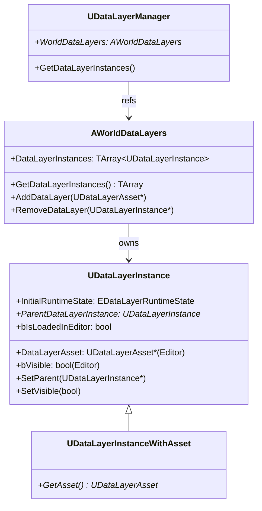
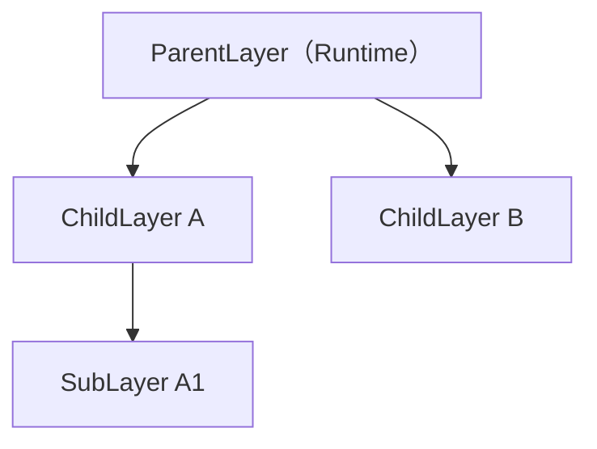

# DataLayer エディタ統合・WorldPartition 連携

- 上位: [[DataLayer/01_overview]]
- ソース: `Engine/Source/Runtime/Engine/Public/WorldPartition/DataLayer/DataLayerInstance.h`
          `Engine/Source/Runtime/Engine/Public/WorldPartition/DataLayer/WorldDataLayers.h`

---

## 概要

エディタでは **DataLayers パネル**（Window → Levels → DataLayers）でレイヤーの可視性・ロード状態を管理する。レイヤーの定義は `AWorldDataLayers` アクタに保存され、各レイヤーインスタンスは `UDataLayerInstance` として管理される。

---

## クラス構造



---

## UDataLayerInstance — レイヤーインスタンス

```cpp
UCLASS(Config = Engine, PerObjectConfig, BlueprintType, MinimalAPI)
class UDataLayerInstance : public UObject
{
    // エディタ専用プロパティ
#if WITH_EDITORONLY_DATA
    // 親レイヤー（階層構造）
    UPROPERTY(EditAnywhere, Category = "Data Layer|Advanced")
    TObjectPtr<UDataLayerInstance> ParentDataLayerInstance;

    // エディタでの初期可視性
    bool bIsInitiallyVisible;

    // エディタでアクタをロードするか（エディタパフォーマンス用）
    bool bIsLoadedInEditor;
#endif

    // ゲーム開始時の初期ランタイム状態
    UPROPERTY(EditAnywhere, Category = "Data Layer|Runtime")
    EDataLayerRuntimeState InitialRuntimeState;

public:
    // エディタ可視性切り替え
    void SetVisible(bool bIsVisible);

    // エディタのロード状態切り替え
    void SetIsLoadedInEditor(bool bIsLoadedInEditor, bool bFromUserChange);

    // 初期ランタイム状態の設定（エディタ）
    void SetInitialRuntimeState(EDataLayerRuntimeState InInitialRuntimeState);

    // 親レイヤーの設定（階層化）
    bool SetParent(UDataLayerInstance* InParent);
};
```

---

## AWorldDataLayers — ワールド設定アクタ

WP ワールドに自動配置される特殊アクタ。DataLayer インスタンスの定義を保持する。

```cpp
UCLASS(NotPlaceable, MinimalAPI, HideCategories = (...))
class AWorldDataLayers : public AInfo
{
    // 全 DataLayer インスタンスのリスト
    UPROPERTY()
    TArray<TObjectPtr<UDataLayerInstance>> WorldDataLayerInstances;

public:
    // インスタンス取得
    const TArray<UDataLayerInstance*>& GetDataLayerInstances() const;

    // 追加・削除（エディタ操作）
    UDataLayerInstance* AddDataLayer(const UDataLayerAsset* InDataLayerAsset);
    bool RemoveDataLayer(const UDataLayerInstance* InDataLayerInstance);

    // ワールドの AWorldDataLayers を取得（static）
    static AWorldDataLayers* Get(const UWorld* InWorld);
};
```

---

## エディタでのワークフロー

### レイヤーの作成と割り当て

```
1. Content Browser → 右クリック → World Partition/Data Layer
   → "NightContent" UDataLayerAsset を作成
   → DataLayerType = Runtime に設定

2. Window → Levels → Data Layers
   → ＋ボタン → "NightContent" アセットを選択
   → UDataLayerInstance がワールドに追加される

3. World Partition エディタでアクタを選択
   → DataLayers パネルで "NightContent" に割り当て
```

### InitialRuntimeState の設定

| 設定 | 意味 |
|-----|------|
| `Unloaded` | ゲーム開始時は非ロード（デフォルト） |
| `Loaded` | ゲーム開始時にロード済み（不可視） |
| `Activated` | ゲーム開始時に有効（可視） |

---

## DataLayer の階層化



親レイヤーが `Unloaded` の場合、子レイヤーを `Activated` に設定しても実効状態は `Unloaded`。`SetDataLayerInstanceRuntimeState(..., bInIsRecursive=true)` で子レイヤーも一括変更できる。

---

## WorldPartition エディタとの連携

**World Partition エディタ**（Window → World Partition）では DataLayer ごとのフィルタリングができる。

- DataLayer チェックボックスでセルのフィルタリング
- アクタのプレビューマップで DataLayer 別の分布確認
- デバッグカラー（`UDataLayerAsset::DebugColor`）でセルを色分け表示

---

## EOverrideBlockOnSlowStreaming

DataLayer インスタンスがストリーミングの「遅い場合にブロックするか」をオーバーライドできる。

```cpp
UENUM(BlueprintType)
enum class EOverrideBlockOnSlowStreaming : uint8
{
    NoOverride, // ランタイムパーティションのデフォルト設定を使用
    Blocking,   // スロー時にブロック（キャラクターが空中に浮かぶ等を防ぐ）
    NotBlocking, // スロー時でもブロックしない
};
```

重要なゲームプレイコンテンツの DataLayer に `Blocking` を設定すると、ロード完了を待ってからシーン遷移できる。

---

## デバッグコマンド

```
wp.Layer.Show <LayerName>       — 指定レイヤーを表示
wp.Layer.Hide <LayerName>       — 指定レイヤーを非表示
wp.Layer.Load <LayerName>       — 指定レイヤーをロード
wp.Layer.Unload <LayerName>     — 指定レイヤーをアンロード
```
