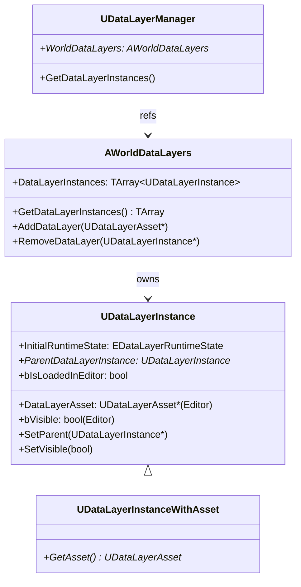
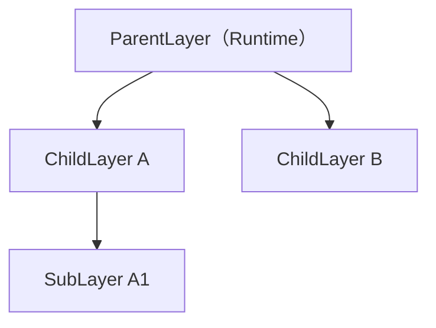

# DataLayer エディタ統合・WorldPartition 連携

- 上位: [[DataLayer/01_overview]]
- ソース: `Engine/Source/Runtime/Engine/Public/WorldPartition/DataLayer/DataLayerInstance.h`
          `Engine/Source/Runtime/Engine/Public/WorldPartition/DataLayer/WorldDataLayers.h`

---

## 概要

エディタでは **DataLayers パネル**（Window → Levels → DataLayers）でレイヤーの可視性・ロード状態を管理する。レイヤーの定義は `AWorldDataLayers` アクタに保存され、各レイヤーインスタンスは `UDataLayerInstance` として管理される。

---

## クラス構造



---

## UDataLayerInstance — レイヤーインスタンス

```cpp
UCLASS(Config = Engine, PerObjectConfig, BlueprintType, MinimalAPI)
class UDataLayerInstance : public UObject
{
    // エディタ専用プロパティ
#if WITH_EDITORONLY_DATA
    // 親レイヤー（階層構造）
    UPROPERTY(EditAnywhere, Category = "Data Layer|Advanced")
    TObjectPtr<UDataLayerInstance> ParentDataLayerInstance;

    // エディタでの初期可視性
    bool bIsInitiallyVisible;

    // エディタでアクタをロードするか（エディタパフォーマンス用）
    bool bIsLoadedInEditor;
#endif

    // ゲーム開始時の初期ランタイム状態
    UPROPERTY(EditAnywhere, Category = "Data Layer|Runtime")
    EDataLayerRuntimeState InitialRuntimeState;

public:
    // エディタ可視性切り替え
    void SetVisible(bool bIsVisible);

    // エディタのロード状態切り替え
    void SetIsLoadedInEditor(bool bIsLoadedInEditor, bool bFromUserChange);

    // 初期ランタイム状態の設定（エディタ）
    void SetInitialRuntimeState(EDataLayerRuntimeState InInitialRuntimeState);

    // 親レイヤーの設定（階層化）
    bool SetParent(UDataLayerInstance* InParent);
};
```

---

## AWorldDataLayers — ワールド設定アクタ

WP ワールドに自動配置される特殊アクタ。DataLayer インスタンスの定義を保持する。

```cpp
UCLASS(NotPlaceable, MinimalAPI, HideCategories = (...))
class AWorldDataLayers : public AInfo
{
    // 全 DataLayer インスタンスのリスト
    UPROPERTY()
    TArray<TObjectPtr<UDataLayerInstance>> WorldDataLayerInstances;

public:
    // インスタンス取得
    const TArray<UDataLayerInstance*>& GetDataLayerInstances() const;

    // 追加・削除（エディタ操作）
    UDataLayerInstance* AddDataLayer(const UDataLayerAsset* InDataLayerAsset);
    bool RemoveDataLayer(const UDataLayerInstance* InDataLayerInstance);

    // ワールドの AWorldDataLayers を取得（static）
    static AWorldDataLayers* Get(const UWorld* InWorld);
};
```

---

## エディタでのワークフロー

### レイヤーの作成と割り当て

```
1. Content Browser → 右クリック → World Partition/Data Layer
   → "NightContent" UDataLayerAsset を作成
   → DataLayerType = Runtime に設定

2. Window → Levels → Data Layers
   → ＋ボタン → "NightContent" アセットを選択
   → UDataLayerInstance がワールドに追加される

3. World Partition エディタでアクタを選択
   → DataLayers パネルで "NightContent" に割り当て
```

### InitialRuntimeState の設定

| 設定 | 意味 |
|-----|------|
| `Unloaded` | ゲーム開始時は非ロード（デフォルト） |
| `Loaded` | ゲーム開始時にロード済み（不可視） |
| `Activated` | ゲーム開始時に有効（可視） |

---

## DataLayer の階層化



親レイヤーが `Unloaded` の場合、子レイヤーを `Activated` に設定しても実効状態は `Unloaded`。`SetDataLayerInstanceRuntimeState(..., bInIsRecursive=true)` で子レイヤーも一括変更できる。

---

## WorldPartition エディタとの連携

**World Partition エディタ**（Window → World Partition）では DataLayer ごとのフィルタリングができる。

- DataLayer チェックボックスでセルのフィルタリング
- アクタのプレビューマップで DataLayer 別の分布確認
- デバッグカラー（`UDataLayerAsset::DebugColor`）でセルを色分け表示

---

## EOverrideBlockOnSlowStreaming

DataLayer インスタンスがストリーミングの「遅い場合にブロックするか」をオーバーライドできる。

```cpp
UENUM(BlueprintType)
enum class EOverrideBlockOnSlowStreaming : uint8
{
    NoOverride, // ランタイムパーティションのデフォルト設定を使用
    Blocking,   // スロー時にブロック（キャラクターが空中に浮かぶ等を防ぐ）
    NotBlocking, // スロー時でもブロックしない
};
```

重要なゲームプレイコンテンツの DataLayer に `Blocking` を設定すると、ロード完了を待ってからシーン遷移できる。

---

## デバッグコマンド

```
wp.Layer.Show <LayerName>       — 指定レイヤーを表示
wp.Layer.Hide <LayerName>       — 指定レイヤーを非表示
wp.Layer.Load <LayerName>       — 指定レイヤーをロード
wp.Layer.Unload <LayerName>     — 指定レイヤーをアンロード
```

---

## コード実行フロー

### エントリポイント

```
[ワールド作成 — AWorldDataLayers 自動配置]
UWorldPartition::Initialize()
  └─ AWorldDataLayers::Get(World)
       └─ if (!Exists) → World->SpawnActor<AWorldDataLayers>()
            └─ WorldDataLayerInstances 配列を空で初期化

[エディタ操作 — レイヤー追加]
DataLayerOutliner → UI "+" ボタン
  └─ FDataLayerEditorModule::AddDataLayer(Asset)
       └─ AWorldDataLayers::AddDataLayer(DataLayerAsset)
            ├─ NewObject<UDataLayerInstanceWithAsset>() を生成
            ├─ WorldDataLayerInstances に追加
            └─ FDataLayersBroadcast::OnActorDataLayersChanged 発火

[エディタ操作 — 階層化]
D&D で ParentInstance 変更
  └─ UDataLayerInstance::SetParent(NewParent)
       ├─ 循環参照チェック
       ├─ ParentDataLayerInstance = NewParent
       └─ WorldPartition->OnActorDescAddedEvent で ActorDesc 再生成トリガー

[エディタ可視性トグル]
DataLayerOutliner → Eye アイコン
  └─ UDataLayerInstance::SetVisible(bVisible)
       └─ WorldPartition::OnDataLayerEditorVisibilityChanged
            └─ for each Actor in DataLayer:
                 └─ Actor->SetIsTemporarilyHiddenInEditor(!bVisible)

[エディタロード状態]
DataLayerOutliner → Load チェックボックス
  └─ UDataLayerInstance::SetIsLoadedInEditor(bLoaded, bFromUserChange)
       └─ WorldPartition::LoadActors / UnloadActors
            └─ AActor の実体を生成/解放（エディタパフォーマンス調整）

[ゲーム開始時 — InitialRuntimeState 適用]
AWorldDataLayers::BeginPlay()
  └─ for each UDataLayerInstance:
       └─ UDataLayerManager::SetDataLayerInstanceRuntimeState(Instance, InitialRuntimeState)
            └─ [[b_runtime_toggle]] のランタイム切替フローへ

[デバッグコマンド]
wp.Layer.Show <Name>
  └─ FWorldPartitionConsoleCommands::ShowDataLayer(Name)
       └─ UDataLayerInstance を名前で解決 → SetVisible(true)
```

### フロー詳細

1. **AWorldDataLayers の自動生成** — WP ワールド初期化時、`AWorldDataLayers::Get(World)` が存在しなければ自動スポーン。`NotPlaceable` 指定で手動配置は不可。
2. **インスタンス追加** — エディタの DataLayers パネルから追加操作は `AddDataLayer(Asset)` が `UDataLayerInstanceWithAsset` を生成し `WorldDataLayerInstances` に追加、変更通知を発火。
3. **階層化** — `SetParent(NewParent)` は循環参照（親が自分の子孫になる）を検出して拒否。設定後は Outliner の表示順も更新される。
4. **可視性トグル** — `SetVisible()` はエディタ専用で、所属アクタを一時非表示化。ゲーム実行とは独立（ランタイム状態に影響しない）。
5. **IsLoadedInEditor** — 広大なワールドのエディタ作業負荷を下げる機能。該当アクタの実体を解放してメモリとビューポート描画を節約。再有効化で再ロード。
6. **InitialRuntimeState 適用** — `AWorldDataLayers::BeginPlay()` が各インスタンスの `InitialRuntimeState` を `SetDataLayerInstanceRuntimeState` 経由で適用。これによりゲーム開始時に自動でロード/アクティブ化。
7. **WorldPartition エディタ連携** — DataLayer フィルタは `FWorldPartitionEditor::FilterByDataLayer` で実装。セルのプレビュー描画で `DebugColor` を重ねることで分布を視覚化。
8. **BlockOnSlowStreaming オーバーライド** — `EOverrideBlockOnSlowStreaming` はセルの `bBlockOnSlowLoading` を DataLayer 単位で上書き。重要セルのみブロック、その他はノンブロックという設計が可能。
9. **コンソールコマンド** — `wp.Layer.Show/Hide/Load/Unload` は `FWorldPartitionConsoleCommands` で登録され、名前解決後に `UDataLayerInstance` の対応メソッドへ転送。

### 関与クラス・関数一覧

| クラス / 関数 | ファイル | 役割 |
|-------------|---------|------|
| `AWorldDataLayers::AddDataLayer` | `DataLayer/WorldDataLayers.cpp` | インスタンス追加 |
| `AWorldDataLayers::Get` | `DataLayer/WorldDataLayers.cpp` | ワールド内取得 |
| `UDataLayerInstance::SetParent` | `DataLayer/DataLayerInstance.cpp` | 階層設定 |
| `UDataLayerInstance::SetVisible` | `DataLayer/DataLayerInstance.cpp` | エディタ可視性 |
| `UDataLayerInstance::SetIsLoadedInEditor` | `DataLayer/DataLayerInstance.cpp` | エディタロード |
| `AWorldDataLayers::BeginPlay` | `DataLayer/WorldDataLayers.cpp` | 初期状態適用 |
| `FDataLayerEditorModule` | `Editor/DataLayerEditor/...` | UI 実装 |
| `FWorldPartitionConsoleCommands` | `WorldPartition/WorldPartitionConsoleCommands.cpp` | CVar/コマンド |
