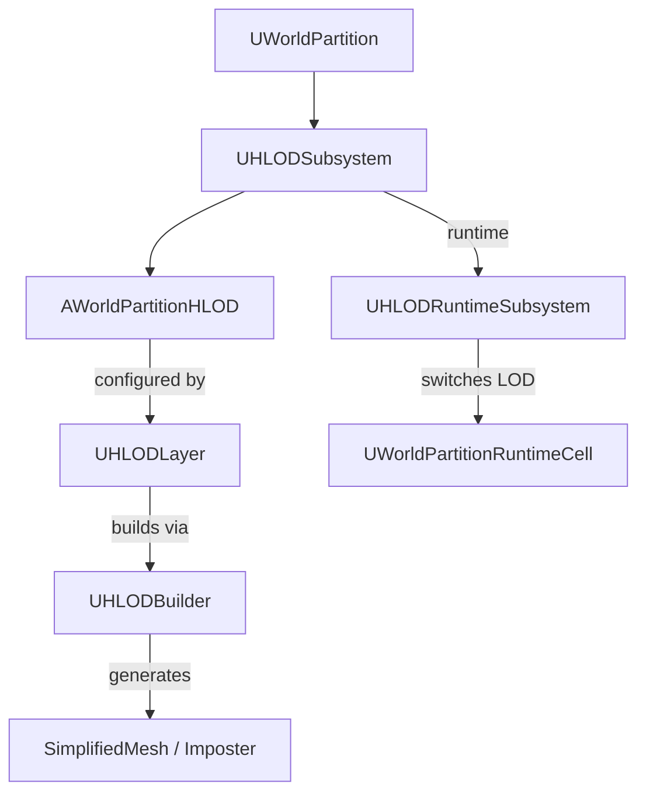

# HLOD（Hierarchical Level of Detail）概要

- 上位: [[01_worldbuilding_overview]]
- 関連: [[WorldPartition/01_overview]] | [[LevelStreaming/01_overview]]
- ソース: `Engine/Source/Runtime/Engine/Public/WorldPartition/HLOD/`（27 h / 23 cpp）

---

## HLOD とは

World Partition のセルが **遠距離にある場合に、フルメッシュの代わりに簡略化されたメッシュ（HLOD）を表示** するシステム。セル単位で自動生成され、ストリーミングと連動して LOD 切り替えが行われる。

---

## アーキテクチャ

---

## 主要クラス

| クラス | 役割 |
|-------|------|
| `AWorldPartitionHLOD` | HLOD アクタ。セルの簡略表現を保持 |
| `UHLODLayer` | HLOD 設定アセット。LOD 距離・ビルダータイプ・セルサイズ |
| `UHLODBuilder` | HLOD ビルド処理の基底。MeshMerge / Imposter / Custom |
| `UHLODSubsystem` | World Subsystem。HLOD のライフサイクル管理 |
| `UHLODRuntimeSubsystem` | ランタイム LOD 切り替え管理 |
| `FHLODActorDesc` | HLOD アクタの ActorDesc |
| `UDestructibleHLODComponent` | 破壊可能 HLOD コンポーネント |

---

## Details

| ドキュメント | 内容 |
|------------|------|
| [[Details/a_hlod_generation]] | HLOD ビルドパイプライン・MeshMerge/Imposter |
| [[Details/b_hlod_layer]] | UHLODLayer 設定・LOD 距離・パフォーマンス |
| [[Details/c_hlod_runtime]] | ランタイム HLOD 切り替え・ストリーミング連携 |
