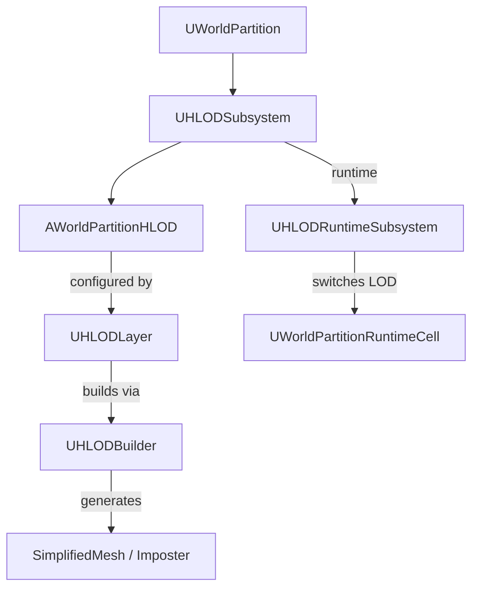

# HLOD（Hierarchical Level of Detail）概要

- 上位: [[01_worldbuilding_overview]]
- 関連: [[WorldPartition/01_overview]] | [[LevelStreaming/01_overview]]
- ソース: `Engine/Source/Runtime/Engine/Public/WorldPartition/HLOD/`（27 h / 23 cpp）

---

## HLOD とは

World Partition のセルが **遠距離にある場合に、フルメッシュの代わりに簡略化されたメッシュ（HLOD）を表示** するシステム。セル単位で自動生成され、ストリーミングと連動して LOD 切り替えが行われる。

---

## アーキテクチャ



---

## 主要クラス

| クラス | 役割 |
|-------|------|
| `AWorldPartitionHLOD` | HLOD アクタ。セルの簡略表現を保持 |
| `UHLODLayer` | HLOD 設定アセット。LOD 距離・ビルダータイプ・セルサイズ |
| `UHLODBuilder` | HLOD ビルド処理の基底。MeshMerge / Imposter / Custom |
| `UHLODSubsystem` | World Subsystem。HLOD のライフサイクル管理 |
| `UHLODRuntimeSubsystem` | ランタイム LOD 切り替え管理 |
| `FHLODActorDesc` | HLOD アクタの ActorDesc |
| `UDestructibleHLODComponent` | 破壊可能 HLOD コンポーネント |

---

## Details

| ドキュメント | 内容 |
|------------|------|
| [[Details/a_hlod_generation]] | HLOD ビルドパイプライン・MeshMerge/Imposter |
| [[Details/b_hlod_layer]] | UHLODLayer 設定・LOD 距離・パフォーマンス |
| [[Details/c_hlod_runtime]] | ランタイム HLOD 切り替え・ストリーミング連携 |

---

## コード実行フロー

### エントリポイント（ランタイム）

```
[セル可視化時]
UWorldPartition::OnCellShown()                             [WorldPartition.cpp:1974]
  └─ UWorldPartitionHLODRuntimeSubsystem::OnCellShown()    [HLODRuntimeSubsystem.cpp:578]
       └─ FCellData::LoadedHLODs を取得
            └─ for each IWorldPartitionHLODObject:
                 └─ HLODObject->SetVisibility(false)       ← セルのフルメッシュが見えるので HLOD を隠す

[セル非可視化時]
UWorldPartition::OnCellHidden()                            [WorldPartition.cpp:1988]
  └─ UWorldPartitionHLODRuntimeSubsystem::OnCellHidden()   [HLODRuntimeSubsystem.cpp:597]
       └─ for each IWorldPartitionHLODObject:
            ├─ HLODObject->SetVisibility(true)             ← HLOD を表示
            └─ RemoveHLODObjectFromWarmup()                ← VT / Nanite プリフェッチ要求解除

[HLOD 登録（セルロード時）]
AWorldPartitionHLOD::BeginPlay()
  └─ HLODRuntimeSubsystem::RegisterHLODActor()
       └─ FCellData::LoadedHLODs に追加
```

### エントリポイント（ビルド時・エディタ）

```
UWorldPartition::GenerateHLOD()  (Commandlet / メニュー)
  └─ for each HLOD レイヤー (UHLODLayer):
       └─ UHLODBuilder::Build()
            ├─ MeshMerge（メッシュ結合）
            ├─ MeshSimplify（簡略化）
            ├─ Imposter（4方向ビルボード）
            └─ Instancing（ISM 生成）
```

### フロー詳細

1. **HLOD 登録** — `AWorldPartitionHLOD` がセルロード時に `BeginPlay` で `UWorldPartitionHLODRuntimeSubsystem` に自身を登録。セル→HLOD の対応は `FCellData::LoadedHLODs` に保持（[[Details/c_hlod_runtime]]）。
2. **可視性切り替え（隠す側）** — セルの実メッシュがロード完了して `OnCellShown` が呼ばれると、対応 HLOD を `SetVisibility(false)` で非表示化（`HLODRuntimeSubsystem.cpp:582–593`）。
3. **可視性切り替え（出す側）** — セルアンロードで `OnCellHidden` が呼ばれると HLOD を `SetVisibility(true)` で表示化。さらに warmup リスト（プリフェッチ中）からも削除（`HLODRuntimeSubsystem.cpp:601–613`）。
4. **Warmup 機構** — HLOD 切り替え前に VT（Virtual Texture）や Nanite リソースを事前要求しておき、切り替え時のポップを緩和（`HLODRuntimeSubsystem.cpp:618+` の `PrepareVTRequests` / `PrepareNaniteRequests`）。
5. **階層的 HLOD** — `UHLODLayer::ParentLayer` で複数階層を定義可能。HLOD0（近距離）→ HLOD1（中距離）→ HLOD2（遠距離）のピラミッド構造（[[Details/b_hlod_layer]]）。
6. **CVar 制御** — `wp.Runtime.HLOD` でランタイム HLOD の ON/OFF 全体制御（`UWorldPartitionHLODRuntimeSubsystem::WorldPartitionHLODEnabled`）。

### 関与クラス・関数一覧

| クラス / 関数 | ファイル | 役割 |
|-------------|---------|------|
| `UWorldPartitionHLODRuntimeSubsystem::OnCellShown` | `HLODRuntimeSubsystem.cpp:578` | HLOD 隠蔽 |
| `UWorldPartitionHLODRuntimeSubsystem::OnCellHidden` | `HLODRuntimeSubsystem.cpp:597` | HLOD 表示 |
| `IWorldPartitionHLODObject::SetVisibility` | `HLODProviderInterface.cpp` | 個別 HLOD の可視切り替え |
| `UHLODBuilder::Build` | `HLODBuilder.cpp` | HLOD ビルドパイプライン |
| `AWorldPartitionHLOD::BeginPlay` | `HLODActor.cpp` | ランタイム登録 |
| `PrepareVTRequests` / `PrepareNaniteRequests` | `HLODRuntimeSubsystem.cpp:618+` / `636+` | Warmup 処理 |
