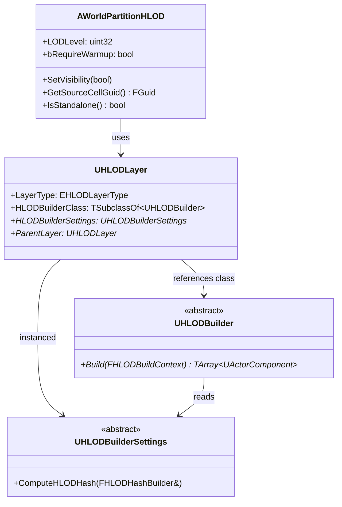
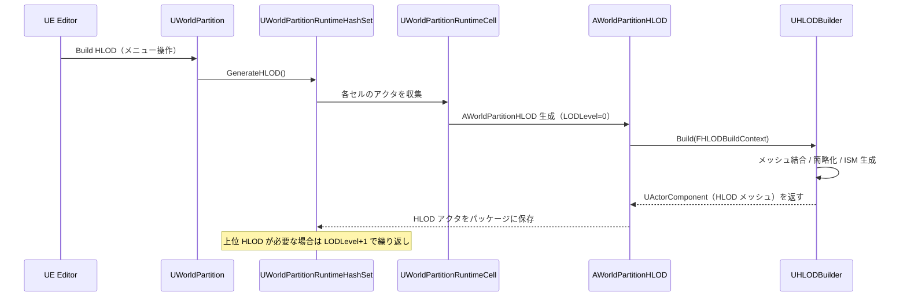

# HLOD 生成・AWorldPartitionHLOD・MeshMerge/Imposter

- 上位: [[HLOD/01_overview]]
- ソース: `Engine/Source/Runtime/Engine/Public/WorldPartition/HLOD/HLODActor.h`
          `Engine/Source/Runtime/Engine/Public/WorldPartition/HLOD/HLODBuilder.h`

---

## 概要

World Partition HLOD は、遠距離で表示するための**低詳細度の代替メッシュ**をビルド時に自動生成する。カメラが遠ざかると元のアクタを非表示にして HLOD アクタを表示し、描画コストを削減する。

---

## クラス構造



---

## EHLODLayerType — HLOD 生成方式

```cpp
enum class EHLODLayerType : uint8
{
    Instancing,       // インスタンシング（ISM でまとめて描画）
    MeshMerge,        // メッシュ結合（単一スタティックメッシュ）
    MeshSimplify,     // メッシュ簡略化（ポリゴン削減）
    MeshApproximate,  // メッシュ近似（ボリュームベース近似）
    Custom,           // カスタムビルダー（UHLODBuilder の派生クラスを指定）
    CustomHLODActor,  // カスタム HLOD アクタ
};
```

| 方式 | 特徴 | 推奨シーン |
|------|------|---------|
| Instancing | 高速・元マテリアル保持 | 繰り返し配置のオブジェクト（木・岩等） |
| MeshMerge | 単一ドローコール | 建物・構造物の近距離 HLOD |
| MeshSimplify | ポリゴン削減 | 中程度の距離 |
| MeshApproximate | ビルド速度重視の近似 | 遠距離・広域 |
| Custom | 完全カスタマイズ | 特殊要件 |

---

## AWorldPartitionHLOD

```cpp
UCLASS(NotPlaceable, MinimalAPI)
class AWorldPartitionHLOD : public AActor, public IWorldPartitionHLODObject
{
    // HLOD 階層レベル（0 = アクタを直接まとめた HLOD、1 = HLOD0 をまとめた HLOD）
    UPROPERTY()
    uint32 LODLevel;

    // ウォームアップ（Nanite 等の事前ロード）が必要か
    bool bRequireWarmup;

    // 表示切り替え
    virtual void SetVisibility(bool bIsVisible) override;

    // 元セルの GUID（どのセルを代替しているか）
    virtual const FGuid& GetSourceCellGuid() const override;

    // スタンドアロン HLOD（セルに紐づかない独立した HLOD）
    virtual bool IsStandalone() const override;
};
```

---

## UHLODLayer — HLOD レイヤー設定アセット

**Content Browser** で作成するデータアセット（`.uasset`）。各アクタの `HLODLayer` プロパティで参照する。

```cpp
UCLASS(Blueprintable, MinimalAPI)
class UHLODLayer : public UObject
{
    // 生成方式
    EHLODLayerType LayerType;

    // カスタムビルダークラス（LayerType == Custom 時）
    TSubclassOf<UHLODBuilder> HLODBuilderClass;

    // ビルダー固有の設定
    TObjectPtr<UHLODBuilderSettings> HLODBuilderSettings;

    // 親レイヤー（HLOD 階層の次レベル）
    TObjectPtr<UHLODLayer> ParentLayer;
};
```

### ParentLayer による階層 HLOD

```
アクタ群 → HLOD0（LODLevel=0, HLODLayer=A）
                → HLOD1（LODLevel=1, HLODLayer=A.ParentLayer=B）
                         → HLOD2（LODLevel=2, ...）
```

遠距離になるほど上位 LOD レベルの HLOD が表示される。

---

## UHLODBuilder — ビルド処理

```cpp
UCLASS(Abstract, MinimalAPI)
class UHLODBuilder : public UObject
{
public:
    // ソースアクタのコンポーネントから HLOD コンポーネントを生成
    virtual TArray<UActorComponent*> Build(
        const FHLODBuildContext& InHLODBuildContext,
        const TArray<UActorComponent*>& InSourceComponents) const PURE_VIRTUAL(...);
};
```

### FHLODBuildContext

```cpp
struct FHLODBuildContext
{
    UWorld* World;                           // 対象ワールド
    TArray<UActorComponent*> SourceComponents; // 対象コンポーネント群
    UObject* AssetsOuter;                   // 生成アセットの外部オブジェクト
    FString AssetsBaseName;                 // 生成アセットのベース名
    FVector WorldPosition;                  // HLOD アクタのワールド位置
    double MinVisibleDistance;              // 最小表示距離
};
```

---

## HLOD ビルドフロー（エディタ）



---

## アクタ側の設定

```cpp
// BP でも設定可能なアクタプロパティ
UPROPERTY(EditAnywhere, Category = "HLOD")
bool bActorIsHLODRelevant = true;   // HLOD ビルドに含めるか

UPROPERTY(EditAnywhere, Category = "HLOD")
TObjectPtr<UHLODLayer> HLODLayer;   // 使用する HLOD レイヤーアセット
```

`bActorIsHLODRelevant = false` のアクタは HLOD に含まれない（透明なボリューム・トリガー等に使用）。

---

## コード実行フロー

### エントリポイント

```
[エディタメニュー → Build → Build HLODs]
FWorldPartitionHLODUtilities::BuildHLODs()
  └─ UWorldPartition::GenerateHLOD(bCreateActorsOnly)
       └─ UWorldPartitionRuntimeHashSet::SetupHLODActors()
            └─ for each FRuntimePartitionDesc.HLODSetups[LODLevel]:
                 └─ for each HLOD クラスタ（同一 HLODLayer のアクタ集合）:
                      ├─ AWorldPartitionHLOD を新規スポーン（LODLevel 設定）
                      ├─ UHLODLayer->HLODBuilderClass を解決
                      └─ UHLODBuilder::Build(FHLODBuildContext, SourceComponents)
                           ├─ EHLODLayerType::Instancing
                           │    └─ UHLODBuilderInstancing → UInstancedStaticMeshComponent 生成
                           ├─ EHLODLayerType::MeshMerge
                           │    └─ UHLODBuilderMeshMerge → FMeshMergeUtilities::MergeComponentsToStaticMesh()
                           ├─ EHLODLayerType::MeshSimplify
                           │    └─ UHLODBuilderMeshSimplify → IMeshReductionManagerModule::ReduceMeshDescription()
                           ├─ EHLODLayerType::MeshApproximate
                           │    └─ UHLODBuilderMeshApproximate → IGeometryProcessing_ApproximateActors
                           └─ EHLODLayerType::Custom
                                └─ カスタム UHLODBuilder 派生の Build() を呼ぶ
       └─ HLOD アクタをパッケージ（__ExternalActors__/_HLOD_）に保存
       └─ ParentLayer があれば LODLevel+1 で再帰呼び出し
```

### フロー詳細

1. **ビルド起動** — エディタの Build → Build HLODs または `WorldPartition.BuildHLOD` コマンドレットから `FWorldPartitionHLODUtilities::BuildHLODs` がエントリ。複数マップを一括処理可能。
2. **HLOD クラスタリング** — `SetupHLODActors()` がセル単位でアクタを走査し、同じ `HLODLayer` を持つアクタをまとめて 1 つの `AWorldPartitionHLOD` アクタに集約。`bActorIsHLODRelevant=false` は除外。
3. **ビルダー解決** — `UHLODLayer::HLODBuilderClass` からビルダークラスを取得し、`HLODBuilderSettings`（`InstancingSettings` / `MeshMergeSettings` 等）を渡して `Build()` 実行。
4. **Build 実装分岐** — `LayerType` ごとに異なるビルダーが処理。Instancing は高速（ISM のみ）、MeshMerge/Simplify は `MeshUtilities`/`MeshReductionManager` を利用、MeshApproximate は `GeometryProcessing` プラグインを使用。
5. **アセット生成** — 各ビルダーは生成したコンポーネント群（`UStaticMeshComponent` or `UInstancedStaticMeshComponent`）と裏で生成した `UStaticMesh`/`UMaterialInstance` を返す。アセットは `AssetsOuter` 以下に保存。
6. **階層 HLOD** — `ParentLayer` が設定されていれば LODLevel を 1 つ上げて再度 `GenerateHLOD` を呼び、HLOD0 をまとめた HLOD1 を生成。距離に応じて段階的に低詳細化。
7. **永続化** — 生成された `AWorldPartitionHLOD` は `__ExternalActors__/_HLOD_/...` に `.uasset` として保存され、次回ロード時に ActorDesc 経由で認識される（[[c_actor_desc]]）。
8. **ハッシュキャッシュ** — `UHLODBuilderSettings::ComputeHLODHash()` で設定ハッシュを計算し、前回ビルドから変更がなければスキップ（インクリメンタルビルド）。

### 関与クラス・関数一覧

| クラス / 関数 | ファイル | 役割 |
|-------------|---------|------|
| `FWorldPartitionHLODUtilities::BuildHLODs` | `WorldPartition/HLOD/HLODUtilities.cpp` | ビルドエントリ |
| `UWorldPartition::GenerateHLOD` | `WorldPartition.cpp` | HLOD 生成統括 |
| `UWorldPartitionRuntimeHashSet::SetupHLODActors` | `RuntimeHashSet/WorldPartitionRuntimeHashSet.cpp` | クラスタリング |
| `UHLODBuilder::Build` | `HLOD/HLODBuilder.cpp` | ビルダー基底 |
| `UHLODBuilderInstancing` | `HLOD/HLODBuilderInstancing.cpp` | ISM 生成 |
| `UHLODBuilderMeshMerge` | `HLOD/HLODBuilderMeshMerge.cpp` | メッシュ結合 |
| `UHLODBuilderMeshSimplify` | `HLOD/HLODBuilderMeshSimplify.cpp` | ポリゴン削減 |
| `UHLODBuilderMeshApproximate` | `HLOD/HLODBuilderMeshApproximate.cpp` | ボリューム近似 |
| `AWorldPartitionHLOD` | `HLOD/HLODActor.cpp` | 生成 HLOD アクタ |
