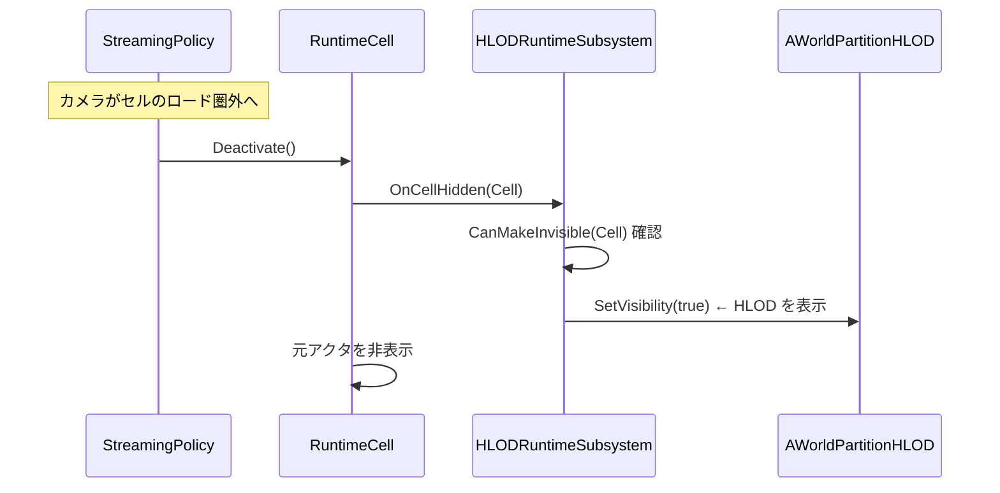

# UHLODLayer 設定・LOD 切り替え距離

- 上位: [[HLOD/01_overview]]
- ソース: `Engine/Source/Runtime/Engine/Public/WorldPartition/HLOD/HLODLayer.h`

---

## 概要

**UHLODLayer** は HLOD の生成方式・ビルダー設定・階層構造（親レイヤー）を定義するデータアセット。Content Browser で `WorldPartition/HLOD Layer` として作成し、各アクタやデフォルト設定に割り当てる。

---

## EHLODLayerType — 生成方式の詳細

```cpp
enum class EHLODLayerType : uint8
{
    Instancing,       // ISM（Instanced Static Mesh）でバッチ描画
    MeshMerge,        // StaticMesh を 1 つに結合（UV も再ベイク）
    MeshSimplify,     // ProxyLOD でポリゴン削減
    MeshApproximate,  // ボリューム近似（高速ビルド）
    Custom,           // UHLODBuilder 派生クラスで完全カスタマイズ
    CustomHLODActor,  // カスタム AWorldPartitionHLOD 派生クラスを使用
};
```

---

## UHLODLayer の主要プロパティ

```cpp
UCLASS(Blueprintable, MinimalAPI)
class UHLODLayer : public UObject
{
#if WITH_EDITORONLY_DATA
    // 生成方式
    UPROPERTY(EditAnywhere, Category=General)
    EHLODLayerType LayerType;

    // カスタムビルダークラス（LayerType == Custom 時のみ有効）
    UPROPERTY(EditAnywhere, Category=General,
              meta=(EditCondition="LayerType==EHLODLayerType::Custom"))
    TSubclassOf<UHLODBuilder> HLODBuilderClass;

    // ビルダー設定（各 LayerType ごとに異なる設定クラス）
    UPROPERTY(VisibleAnywhere, Instanced, NoClear, Category=General)
    TObjectPtr<UHLODBuilderSettings> HLODBuilderSettings;

    // 空間ロード有効か（UE5.7 以降は RuntimePartition 側で設定）
    UPROPERTY(EditAnywhere, Category=General)
    uint32 bIsSpatiallyLoaded : 1;

    // HLOD セルのサイズ（cm）
    UPROPERTY(EditAnywhere, Category=General)
    int32 CellSize;

    // HLOD のロード距離（cm）
    UPROPERTY(EditAnywhere, Category=General)
    double LoadingRange;

    // 親 HLOD レイヤー（次の HLOD 階層）
    UPROPERTY(EditAnywhere, Category=General)
    TObjectPtr<UHLODLayer> ParentLayer;
#endif
};
```

> **UE5.7 変更点**: `CellSize` / `LoadingRange` / `bIsSpatiallyLoaded` は `FRuntimePartitionDesc.HLODSetups` 側で管理するよう移行。既存プロパティは `UE_DEPRECATED` 宣言済み。

---

## 階層 HLOD の設定例

### レイヤー構成

```
HLODLayer_L0 (MeshSimplify, LODLevel=0)
  └── ParentLayer → HLODLayer_L1 (MeshApproximate, LODLevel=1)
```

### エディタ設定手順

1. Content Browser → 右クリック → **World Partition/HLOD Layer** で `HLODLayer_L0` 作成
2. `LayerType = MeshSimplify`、`LoadingRange = 200000`（2km）
3. `ParentLayer = HLODLayer_L1`（別途作成）
4. `HLODLayer_L1` の `LayerType = MeshApproximate`、`LoadingRange = 600000`（6km）
5. アクタの `HLODLayer` プロパティに `HLODLayer_L0` を設定

---

## UHLODBuilderSettings — ビルダー設定の派生クラス

| 設定クラス | 対応する LayerType | 主な設定項目 |
|-----------|------------------|------------|
| `UHLODBuilderInstancingSettings` | Instancing | ピボット設定・カリングレベル |
| `UHLODBuilderMeshMergeSettings` | MeshMerge | `FMeshMergingSettings`（LOD 数・UV チャンネル等） |
| `UHLODBuilderMeshSimplifySettings` | MeshSimplify | `FMeshProxySettings`（ポリゴン削減率・法線計算等） |
| `UHLODBuilderMeshApproximateSettings` | MeshApproximate | `FMeshApproximationSettings`（ボクセルサイズ等） |

---

## HLOD 切り替えの仕組み（ランタイム）

セル（`UWorldPartitionRuntimeCell`）の表示状態が変化するとき、`UWorldPartitionHLODRuntimeSubsystem` が HLOD の可視性を制御する。



セルが表示されると HLOD は非表示、セルが非表示になると HLOD が表示に切り替わる。

---

## IsHLODEnabled（デバッグ制御）

```cpp
// CVar: wp.Runtime.HLOD（デフォルト = 1）
static bool IsHLODEnabled();
```

`wp.Runtime.HLOD 0` でゲーム中に HLOD を全て非表示にできる（デバッグ用）。

---

## エンジンデフォルト HLOD レイヤー

```cpp
// プロジェクト全体のデフォルト HLOD レイヤーを取得
static UHLODLayer* GetEngineDefaultHLODLayersSetup();
```

**Project Settings → World Partition** で「Default HLOD Layer」を設定すると、`HLODLayer` が未設定のアクタに自動適用される。

---

## コード実行フロー

### エントリポイント

```
[エディタ — レイヤー割り当て解決]
UWorldPartitionRuntimeHashSet::SetupHLODActors()  （ビルド時）
  └─ for each Actor:
       └─ Actor->HLODLayer ?? UHLODLayer::GetEngineDefaultHLODLayersSetup()
            └─ UHLODLayer::LayerType で処理分岐
                 └─ UHLODLayer::HLODBuilderSettings をビルダーへ渡す

[ランタイム — LOD 切替]
UWorldPartitionHLODRuntimeSubsystem::OnCellShown(Cell)
  └─ for each AWorldPartitionHLOD referencing Cell:
       └─ HLOD->SetVisibility(false)  ← セルが見えるので HLOD 隠す

UWorldPartitionHLODRuntimeSubsystem::OnCellHidden(Cell)
  └─ if (CanMakeInvisible(Cell)):
       └─ for each AWorldPartitionHLOD referencing Cell:
            └─ HLOD->SetVisibility(true)   ← セルが消えたので HLOD 表示
            └─ if (HLOD->bRequireWarmup):
                 └─ NaniteStreamingManager->RequestWarmup()

[CVar 制御]
wp.Runtime.HLOD 変更
  └─ UHLODLayer::IsHLODEnabled() が false に
       └─ 全 AWorldPartitionHLOD を強制非表示
```

### フロー詳細

1. **レイヤー解決** — ビルド時に各アクタの `HLODLayer` プロパティを確認。未設定なら `GetEngineDefaultHLODLayersSetup()` がプロジェクト設定のデフォルトを返す。これにより HLOD が未指定でも自動フォールバック。
2. **LayerType 分岐** — `SetupHLODActors()` から呼ばれるビルダー選択は `UHLODLayer::LayerType` を switch し、対応する `UHLODBuilder` 派生クラスで `Build()` を実行（[[a_hlod_generation]]）。
3. **階層再帰** — `ParentLayer` が設定されていると、親レイヤーの設定で次 LODLevel の HLOD を生成。子 HLOD 群を入力として親 HLOD を構築することで段階的詳細化。
4. **ロード距離** — UE5.7 以降は `FRuntimePartitionHLODSetup::LoadingRange` が主導。旧 `UHLODLayer::LoadingRange` は deprecated だが後方互換のためフォールバック経路が残る。
5. **ランタイム切替** — `UWorldPartitionHLODRuntimeSubsystem` が `OnCellShown`/`OnCellHidden` デリゲートを購読（[[c_hlod_runtime]]）。セルとそれに対応する `AWorldPartitionHLOD` を逆引きし、`SetVisibility()` で切り替え。
6. **Nanite ウォームアップ** — `bRequireWarmup=true` の HLOD は表示前に Nanite ストリーミングページを事前要求。ポップインを防ぐ。
7. **デバッグ無効化** — `wp.Runtime.HLOD 0` で `IsHLODEnabled()` が `false` になり、全 HLOD が強制非表示。元アクタの表示確認に使用。
8. **HLODBuilderSettings ハッシュ** — `ComputeHLODHash()` が設定変更を検知。`FMeshProxySettings` の削減率変更等があれば再ビルドをトリガー。

### 関与クラス・関数一覧

| クラス / 関数 | ファイル | 役割 |
|-------------|---------|------|
| `UHLODLayer::GetEngineDefaultHLODLayersSetup` | `HLOD/HLODLayer.cpp` | プロジェクトデフォルト解決 |
| `UHLODLayer::IsHLODEnabled` | `HLOD/HLODLayer.cpp` | CVar 制御 |
| `UWorldPartitionHLODRuntimeSubsystem::OnCellShown/Hidden` | `HLOD/HLODRuntimeSubsystem.cpp` | セル連動切替 |
| `UHLODBuilderSettings::ComputeHLODHash` | `HLOD/HLODBuilder.cpp` | 再ビルド判定 |
| `FRuntimePartitionHLODSetup` | `RuntimeHashSet/RuntimePartition.h` | UE5.7+ 設定格納 |
