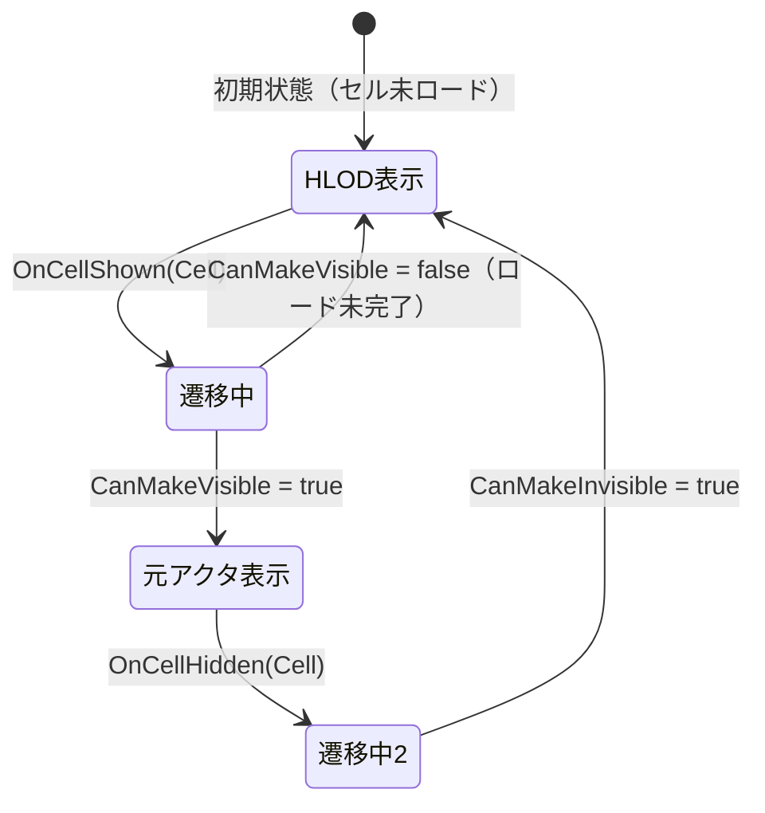

# HLOD ランタイム切り替え・ストリーミング連携

- 上位: [[HLOD/01_overview]]
- ソース: `Engine/Source/Runtime/Engine/Public/WorldPartition/HLOD/HLODRuntimeSubsystem.h`

---

## 概要

ランタイム HLOD 管理は **UWorldPartitionHLODRuntimeSubsystem**（旧 `UHLODSubsystem`）が担当する。ストリーミングセルの表示状態変化を監視し、HLOD オブジェクトの可視性を自動制御する。

---

## UWorldPartitionHLODRuntimeSubsystem

```cpp
UCLASS(MinimalAPI)
class UWorldPartitionHLODRuntimeSubsystem : public UWorldSubsystem
{
public:
    // 初期化・解放
    virtual void Initialize(FSubsystemCollectionBase& Collection) override;
    virtual void Deinitialize() override;

    // HLOD オブジェクトの登録・解除
    void RegisterHLODObject(IWorldPartitionHLODObject* InHLODObject);
    void UnregisterHLODObject(IWorldPartitionHLODObject* InHLODObject);

    // セルの表示状態変化コールバック（StreamingPolicy から呼ばれる）
    void OnCellShown(const UWorldPartitionRuntimeCell* InCell);
    void OnCellHidden(const UWorldPartitionRuntimeCell* InCell);

    // HLOD ↔ 元セルの切り替え可否判定
    bool CanMakeVisible(const UWorldPartitionRuntimeCell* InCell);
    bool CanMakeInvisible(const UWorldPartitionRuntimeCell* InCell);

    // セルに対応する HLOD オブジェクト一覧
    const TArray<IWorldPartitionHLODObject*>& GetHLODObjectsForCell(
        const UWorldPartitionRuntimeCell* InCell) const;

    // HLOD グローバル有効化フラグ（CVar: wp.Runtime.HLOD）
    static bool IsHLODEnabled();
};
```

---

## IWorldPartitionHLODObject — HLOD インターフェース

`AWorldPartitionHLOD` が実装するインターフェース。カスタム HLOD 表現も同一インターフェースで扱える。

```cpp
class IWorldPartitionHLODObject
{
public:
    virtual UObject* GetUObject() const = 0;
    virtual ULevel* GetHLODLevel() const = 0;
    virtual FString GetHLODNameOrLabel() const = 0;

    // ウォームアップ（Nanite/VSM の事前キャッシュ等）が必要か
    virtual bool DoesRequireWarmup() const = 0;
    virtual TSet<UObject*> GetAssetsToWarmup() const = 0;

    // 可視性制御
    virtual void SetVisibility(bool bIsVisible) = 0;

    // ソースセルの GUID（どのセルの HLOD か）
    virtual const FGuid& GetSourceCellGuid() const = 0;

    // スタンドアロン HLOD（セルに紐づかない）
    virtual bool IsStandalone() const = 0;
};
```

---

## セル ↔ HLOD 切り替えフロー



### CanMakeVisible / CanMakeInvisible の判定

```cpp
// セルの全アクタがロード完了したときのみ true
bool CanMakeVisible(const UWorldPartitionRuntimeCell* InCell);

// HLOD が存在し、かつウォームアップ済みのとき true
bool CanMakeInvisible(const UWorldPartitionRuntimeCell* InCell);
```

ウォームアップ（`DoesRequireWarmup() = true`）が必要な HLOD の場合、Nanite メッシュ等の GPU リソースがキャッシュされるまで元セルを非表示にしない。

---

## デリゲート

```cpp
// HLOD オブジェクト登録イベント
FWorldPartitionHLODObjectRegisteredEvent& OnHLODObjectRegisteredEvent();
FWorldPartitionHLODObjectUnregisteredEvent& OnHLODObjectUnregisteredEvent();

// セルの全 HLOD を走査するイベント
FWorldPartitionHLODForEachHLODObjectInCellEvent& GetForEachHLODObjectInCellEvent();
```

---

## ExternalStreamingObject との連携

DLC / ContentBundle の外部ストリーミングオブジェクトが注入される際にも HLOD サブシステムが対応。

```cpp
// 外部ストリーミングオブジェクトの注入・削除コールバック
void OnExternalStreamingObjectInjected(URuntimeHashExternalStreamingObjectBase*);
void OnExternalStreamingObjectRemoved(URuntimeHashExternalStreamingObjectBase*);
```

---

## HLOD ウォームアップシステム

**Nanite** や **Virtual Shadow Map（VSM）** を使った HLOD は、初回表示時にGPU でのキャッシュビルドが必要。  
`UHLODResourcesResidencySceneViewExtension` がフレームごとに資産の常駐状態を監視し、準備完了まで HLOD を表示しないよう制御する。

---

## CVars

| CVar | デフォルト | 説明 |
|------|----------|------|
| `wp.Runtime.HLOD` | `1` | HLOD 全体の有効/無効 |
| `wp.Runtime.HLODWarmupEnabled` | `1` | ウォームアップシステムの有効/無効 |
| `wp.Runtime.HLODWarmupNumFrames` | `5` | ウォームアップに必要なフレーム数 |

---

## 関連クラス

| クラス | 役割 |
|-------|------|
| `AWorldPartitionHLOD` | HLOD アクタ本体 |
| `UHLODLayer` | ビルド設定アセット |
| `UHLODBuilder` | メッシュ生成ロジック |
| `UWorldPartitionRuntimeCell` | ストリーミングセル（HLOD の対象） |
