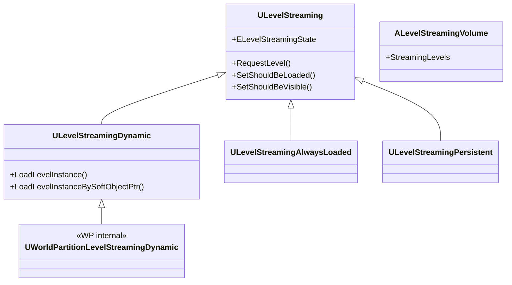

# LevelStreaming 概要

- 上位: [[01_worldbuilding_overview]]
- 関連: [[WorldPartition/01_overview]]
- ソース: `Engine/Source/Runtime/Engine/Classes/Engine/LevelStreaming*.h`、`Engine/Private/LevelStreaming.cpp`

---

## LevelStreaming とは

UE4 から存在する **レベル単位の非同期ロード/アンロード** 機能。UE5 では World Partition の内部実装としても使用される（`UWorldPartitionLevelStreamingDynamic`）。手動でサブレベルを管理する旧来方式と、WP が自動生成する動的方式の両方がある。

---

## アーキテクチャ



---

## 主要クラス

| クラス | 役割 | BP公開 |
|-------|------|--------|
| `ULevelStreaming` | レベルストリーミング基底。ロード/可視性制御 | Yes |
| `ULevelStreamingDynamic` | ランタイムでレベルをインスタンス化してロード | Yes |
| `ULevelStreamingAlwaysLoaded` | 常時ロードされるレベル | No |
| `ULevelStreamingPersistent` | PersistentLevel 用 | No |
| `UWorldPartitionLevelStreamingDynamic` | WP セルのストリーミング実装 | No |
| `ALevelStreamingVolume` | ボリュームベースのストリーミングトリガー | Yes |
| `FLevelStreamingDelegates` | ストリーミングイベントデリゲート | No |

---

## Details

| ドキュメント | 内容 |
|------------|------|
| [[Details/a_level_streaming]] | ULevelStreaming ライフサイクル・RequestLevel・非同期ロード |
| [[Details/b_seamless_travel]] | Seamless / Non-Seamless Travel・TransitionMap |
| [[Details/c_dynamic_streaming]] | ULevelStreamingDynamic・ランタイム生成・Transform |

---

## コード実行フロー

### エントリポイント

```
UWorld::Tick()
  └─ UWorld::UpdateLevelStreaming()                          [World.cpp:4932]
       └─ for each ULevelStreaming in StreamingLevels:
            └─ ULevelStreaming::UpdateStreamingState()       [LevelStreaming.cpp:992]
                 ├─ if (bShouldBeLoaded && !LoadedLevel):
                 │    └─ ULevelStreaming::RequestLevel()      [LevelStreaming.cpp:1551]
                 │         └─ LoadPackageAsync()              ← パッケージ非同期ロード
                 │              └─ AsyncLoadCallback()        ← 完了時コールバック
                 │                   └─ SetLoadedLevel()
                 ├─ if (bShouldBeVisible && !bIsVisible):
                 │    └─ AddToWorld()                          ← ULevel→UWorld 追加
                 │         └─ FStreamingLevelsToConsider 更新
                 └─ if (!bShouldBeVisible && bIsVisible):
                      └─ RemoveFromWorld()                     ← ULevel→UWorld 除去

[BP からの呼び出し]
ULevelStreamingDynamic::LoadLevelInstance(World, AssetPath, Location, Rotation, bOutSuccess)
  └─ ULevelStreamingDynamic::LoadLevelInstance_Internal()
       └─ NewLevelStreaming->SetShouldBeLoaded(true) / SetShouldBeVisible(true)
```

### フロー詳細

1. **UpdateLevelStreaming 駆動** — `UWorld::UpdateLevelStreaming()` が `UWorld::Tick` から毎フレーム呼ばれ、`StreamingLevels` を走査して各 `ULevelStreaming` の状態を更新（`World.cpp:4932`）。
2. **状態遷移判定** — `ULevelStreaming::UpdateStreamingState()` が `bShouldBeLoaded` / `bShouldBeVisible` フラグと現状（`LoadedLevel` / `bIsVisible`）の差分から次のアクション（Load/Add/Remove/Unload）を決定（`LevelStreaming.cpp:992`）。
3. **非同期ロード要求** — `RequestLevel()` が `LoadPackageAsync()` を呼び出し、パッケージのロード完了時に `AsyncLoadCallback` が `SetLoadedLevel()` を実行（`LevelStreaming.cpp:1551`、[[Details/a_level_streaming]]）。
4. **ワールド追加** — ロード完了後、`bShouldBeVisible=true` なら `ULevel::AddToWorld()` が呼ばれ、アクタ群が PersistentLevel に統合される（インクリメンタル処理対応）。
5. **WP セルとの統合** — World Partition のセルは内部で `UWorldPartitionLevelStreamingDynamic` を保持し、ストリーミングポリシーが `SetShouldBeLoaded()` / `SetShouldBeVisible()` を呼ぶ形で同じ機構を再利用（[[WorldPartition/Details/d_runtime_cell]]）。
6. **動的生成** — `ULevelStreamingDynamic::LoadLevelInstance()` でランタイムにレベルインスタンスを作成可能。Transform 指定で同じレベルを複数配置できる（[[Details/c_dynamic_streaming]]）。
7. **Travel 連携** — `Seamless Travel` 中はストリーミング状態が保存され、TransitionMap 経由で次のマップへ受け渡される（[[Details/b_seamless_travel]]）。

### 関与クラス・関数一覧

| クラス / 関数 | ファイル | 役割 |
|-------------|---------|------|
| `UWorld::UpdateLevelStreaming` | `World.cpp:4932` | ストリーミング全体駆動 |
| `ULevelStreaming::UpdateStreamingState` | `LevelStreaming.cpp:992` | 状態差分→アクション決定 |
| `ULevelStreaming::RequestLevel` | `LevelStreaming.cpp:1551` | 非同期パッケージロード起動 |
| `ULevel::AddToWorld` / `RemoveFromWorld` | `Level.cpp` | レベル統合・除去 |
| `ULevelStreamingDynamic::LoadLevelInstance` | `LevelStreamingDynamic.cpp` | ランタイムレベル生成 |
| `UEngine::TickWorldTravel` | `UnrealEngine.cpp` | Seamless Travel 駆動 |
